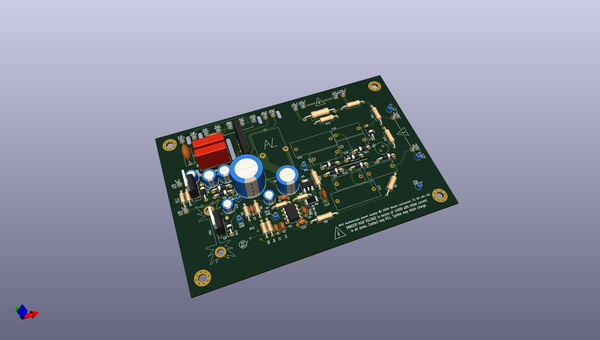
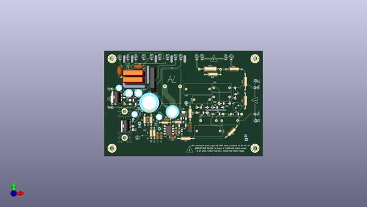
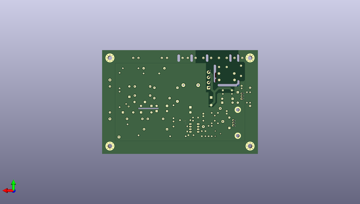

# mini_audioscope
 
## summary 
* id: alexisvl_mini_audioscope_pcb_power
* user: alexisvl
* name: mini_audioscope
* board: pcb_power
* repo: https://github.com/alexisvl/mini-audioscope
* src_file_repo_kicad_pcb: pcb-power/pcb-power.kicad_pcb
* src_file_repo_kicad_pcb_link: https://github.com/alexisvl/mini-audioscope/tree/master/pcb-power/pcb-power.kicad_pcb

* src_file_repo_sch: pcb-power/pcb-power.sch
* src_file_repo_sch_link: https://github.com/alexisvl/mini-audioscope/tree/master/pcb-power/pcb-power.sch
* full details link: https://github.com/oomlout/oomlout_oomp_project_bot_v_2/tree/main/projects/alexisvl_mini_audioscope_pcb_power/current_version/working  

## schematic  
  
[schematic (pdf)](working_schematic.pdf) 

## pcb  
 
  
  
  
[board (pdf)](working.pdf)  

## working_bom
| Id | Designator | Footprint | Quantity | Designation | Supplier and ref |  | None | 
| --- | --- | --- | --- | --- | --- | --- | --- | 
| 1 | R2,R1 | R_Axial_DIN0309_L9.0mm_D3.2mm_P15.24mm_Horizontal | 2 | 330k/½W |  |  | [''] | 
| 2 | C11,C23,C24 | CP_Radial_D6.3mm_P2.50mm | 3 | 47u |  |  | [''] | 
| 3 | D10,D2,D4,D6,D3,D11,D7 | D_DO-41_SOD81_P10.16mm_Horizontal | 7 | UF4007 |  |  | [''] | 
| 4 | R8 | R_Axial_DIN0207_L6.3mm_D2.5mm_P10.16mm_Horizontal | 1 | 1k |  |  | [''] | 
| 5 | D12,D13 | D_DO-41_SOD81_P10.16mm_Horizontal | 2 | 1N4004 |  |  | [''] | 
| 6 | D5 | Diode_Bridge_Vishay_GBU | 1 | GBU4J |  |  | [''] | 
| 7 | TP3,TP5 | TestPoint_Loop_D2.60mm_Drill1.4mm_Beaded | 2 | GND |  |  | [''] | 
| 8 | C14,C19 | C_Rect_L26.5mm_W10.5mm_P22.50mm_MKS4 | 2 | 3u3/450 |  |  | [''] | 
| 9 | X14 | Pin_D1.1mm_L8.5mm_W2.5mm_FlatFork | 1 | +400V |  |  | [''] | 
| 10 | U3 | TO-220-3_Vertical | 1 | LM337 |  |  | [''] | 
| 11 | R15,R14 | R_Axial_DIN0309_L9.0mm_D3.2mm_P15.24mm_Horizontal | 2 | 220k/HW |  |  | [''] | 
| 12 | XT1.0 | Pin_D1.1mm_L8.5mm_W2.5mm_FlatFork | 1 | BLK |  |  | [''] | 
| 13 | XT1.9 | Pin_D1.1mm_L8.5mm_W2.5mm_FlatFork | 1 | WHT |  |  | [''] | 
| 14 | R16 | R_Axial_DIN0207_L6.3mm_D2.5mm_P10.16mm_Horizontal | 1 | 750 |  |  | [''] | 
| 15 | R17 | R_Axial_DIN0207_L6.3mm_D2.5mm_P10.16mm_Horizontal | 1 | 120 |  |  | [''] | 
| 16 | XT1.8 | Pin_D1.1mm_L8.5mm_W2.5mm_FlatFork | 1 | GRY |  |  | [''] | 
| 17 | X13 | Pin_D1.1mm_L8.5mm_W2.5mm_FlatFork | 1 | -9V |  |  | [''] | 
| 18 | R11 | R_Axial_DIN0309_L9.0mm_D3.2mm_P15.24mm_Horizontal | 1 | 270k/HW |  |  | [''] | 
| 19 | L1 | L_Toroid_Vertical_L33.0mm_W17.8mm_P12.70mm_Pulse_KM-5 | 1 | 150u/5A |  |  | [''] | 
| 20 | XT1.2 | Pin_D1.1mm_L8.5mm_W2.5mm_FlatFork | 1 | RED |  |  | [''] | 
| 21 | C12,C15,C22,C18,C16 | C_Rect_L18.0mm_W8.0mm_P15.00mm_FKS3_FKP3 | 5 | 1u/450 |  |  | [''] | 
| 22 | R10 | R_Axial_DIN0309_L9.0mm_D3.2mm_P12.70mm_Horizontal | 1 | 1k5/½W |  |  | [''] | 
| 23 | C6 | CP_Radial_D12.5mm_P5.00mm | 1 | 470u |  |  | [''] | 
| 24 | R7,R5 | R_Axial_DIN0207_L6.3mm_D2.5mm_P10.16mm_Horizontal | 2 | 3k3 |  |  | [''] | 
| 25 | XSW1 | Pin_D1.1mm_L8.5mm_W2.5mm_FlatFork | 1 | PH |  |  | [''] | 
| 26 | C17,C21 | CP_Radial_D8.0mm_P3.50mm | 2 | 220u |  |  | [''] | 
| 27 | D8,D9 | D_DO-41_SOD81_P10.16mm_Horizontal | 2 | 1N4007 |  |  | [''] | 
| 28 | XT1.4 | Pin_D1.1mm_L8.5mm_W2.5mm_FlatFork | 1 | YEL |  |  | [''] | 
| 29 | TP7 | TestPoint_Loop_D2.60mm_Drill1.4mm_Beaded | 1 | V-- |  |  | [''] | 
| 30 | HS1 | Heatsink_Fischer_SK104-STCB_35x13mm__2xDrill3.5mm_ScrewM3 | 1 | 513102B02500G |  |  | [''] | 
| 31 | RV1 | stock_pot | 1 | 500 |  |  | [''] | 
| 32 | X12 | Pin_D1.1mm_L8.5mm_W2.5mm_FlatFork | 1 | +9V |  |  | [''] | 
| 33 | FB1 | L_0805_2012Metric_Pad1.15x1.40mm_HandSolder | 1 | 742792023 |  |  | [''] | 
| 34 | C4 | C_Disc_D4.7mm_W2.5mm_P5.00mm | 1 | 4n7 |  |  | [''] | 
| 35 | C8,C7 | C_Rect_L18.0mm_W5.0mm_P15.00mm_FKS3_FKP3 | 2 | 47n/X2 |  |  | [''] | 
| 36 | XR1 | Pin_D1.1mm_L8.5mm_W2.5mm_FlatFork | 1 | H1 |  |  | [''] | 
| 37 | TP1 | TestPoint_Loop_D2.60mm_Drill1.4mm_Beaded | 1 | COMP |  |  | [''] | 
| 38 | XV1.14 | Pin_D1.1mm_L8.5mm_W2.5mm_FlatFork | 1 | H2 |  |  | [''] | 
| 39 | X15 | Pin_D1.1mm_L8.5mm_W2.5mm_FlatFork | 1 | -400V |  |  | [''] | 
| 40 | TP4 | TestPoint_Loop_D2.60mm_Drill1.4mm_Beaded | 1 | VSW |  |  | [''] | 
| 41 | R4 | R_Axial_DIN0207_L6.3mm_D2.5mm_P10.16mm_Horizontal | 1 | 10k |  |  | [''] | 
| 42 | XT1.1 | Pin_D1.1mm_L8.5mm_W2.5mm_FlatFork | 1 | BRN |  |  | [''] | 
| 43 | D1 | D_SOD-123 | 1 | MBR0540 |  |  | [''] | 
| 44 | R13 | R_Axial_DIN0309_L9.0mm_D3.2mm_P15.24mm_Horizontal | 1 | 680k/HW |  |  | [''] | 
| 45 | U2 | TO-220-3_Vertical | 1 | 7809 |  |  | [''] | 
| 46 | C3,C9 | C_Disc_D4.7mm_W2.5mm_P5.00mm | 2 | 100n |  |  | [''] | 
| 47 | R12 | R_Axial_DIN0414_L11.9mm_D4.5mm_P20.32mm_Horizontal | 1 | 3R9/1W |  |  | [''] | 
| 48 | XJ2.3 | Pin_D1.1mm_L8.5mm_W2.5mm_FlatFork | 1 | G |  |  | [''] | 
| 49 | C13 | C_Disc_D7.0mm_W2.5mm_P5.00mm | 1 | 100p/500V |  |  | [''] | 
| 50 | XT1.3 | Pin_D1.1mm_L8.5mm_W2.5mm_FlatFork | 1 | ORN |  |  | [''] | 
| 51 | U1 | DIP-8_W7.62mm_LongPads | 1 | UC3843 |  |  | [''] | 
| 52 | XJ2.2 | Pin_D1.1mm_L8.5mm_W2.5mm_FlatFork | 1 | N |  |  | [''] | 
| 53 | C2 | C_Disc_D4.7mm_W2.5mm_P5.00mm | 1 | 470p |  |  | [''] | 
| 54 | C10,C1 | C_Disc_D4.7mm_W2.5mm_P5.00mm | 2 | 100p |  |  | [''] | 
| 55 | C20 | CP_Radial_D18.0mm_P7.50mm | 1 | 3300u |  |  | [''] | 
| 56 | TH1 | C_Disc_D11.0mm_W5.0mm_P7.50mm | 1 | 60/800mA |  |  | [''] | 
| 57 | TP2 | TestPoint_Loop_D2.60mm_Drill1.4mm_Beaded | 1 | ISN |  |  | [''] | 
| 58 | R9 | R_2512_6332Metric_Pad1.52x3.35mm_HandSolder | 1 | 0R27/1W |  |  | [''] | 
| 59 | XT1.6 | Pin_D1.1mm_L8.5mm_W2.5mm_FlatFork | 1 | BLU |  |  | [''] | 
| 60 | C5 | C_Disc_D11.0mm_W5.0mm_P10.00mm | 1 | 2n2/Y2 |  |  | [''] | 
| 61 | NE1 | C_Radial_D8.0mm_H11.5mm_P3.50mm | 1 | A9A |  |  | [''] | 
| 62 | R6 | R_Axial_DIN0207_L6.3mm_D2.5mm_P10.16mm_Horizontal | 1 | 150k |  |  | [''] | 
| 63 | Q1 | SOT-223-3_TabPin2 | 1 | IPN70R1K5CE |  |  | [''] | 
| 64 | R3 | R_Axial_DIN0207_L6.3mm_D2.5mm_P10.16mm_Horizontal | 1 | 3k9 |  |  | [''] | 
| 65 | TP6 | TestPoint_Loop_D2.60mm_Drill1.4mm_Beaded | 1 | V++ |  |  | [''] | 

## bom_schematic
no data

