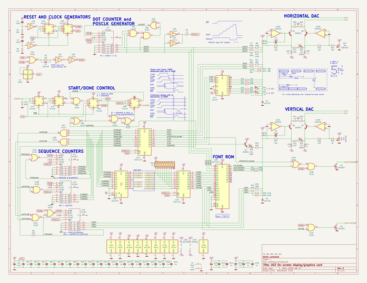
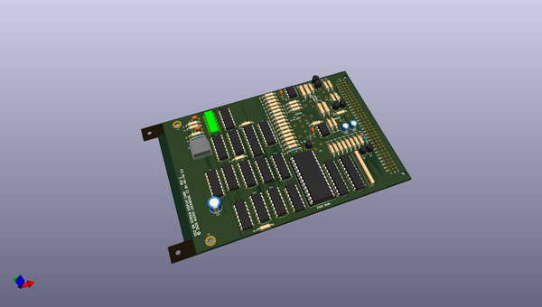
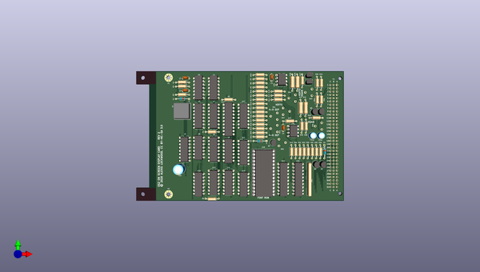
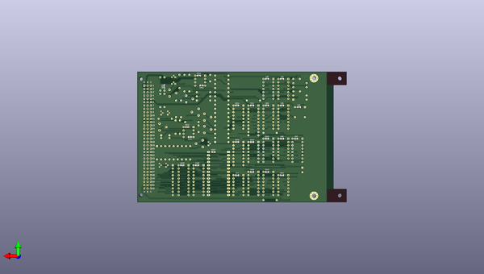

# os2
 
## summary 
* id: alexisvl_os2_gfx
* user: alexisvl
* name: os2
* board: gfx
* repo: https://github.com/alexisvl/os2
* src_file_repo_kicad_pcb: sch/gfx/gfx.kicad_pcb
* src_file_repo_kicad_pcb_link: https://github.com/alexisvl/os2/tree/trunk/sch/gfx/gfx.kicad_pcb
* src_file_repo_kicad_sch: sch/gfx/gfx.kicad_sch
* src_file_repo_kicad_sch_link: https://github.com/alexisvl/os2/tree/trunk/sch/gfx/gfx.kicad_sch

* src_file_repo_sch: sch/gfx/gfx.sch
* src_file_repo_sch_link: https://github.com/alexisvl/os2/tree/trunk/sch/gfx/gfx.sch
* full details link: https://github.com/oomlout/oomlout_oomp_project_bot_v_2/tree/main/projects/alexisvl_os2_gfx/current_version/working  

## schematic  
  
[schematic (pdf)](working_schematic.pdf) 

  
[schematic 1 (pdf)](working_1_schematic.pdf) 

## pcb  
 
  
  
  
[board (pdf)](working.pdf)  

## working_bom
| Id | Designator | Footprint | Quantity | Designation | Supplier and ref |  | None | 
| --- | --- | --- | --- | --- | --- | --- | --- | 
| 1 | R9,R33,R7,R8,R31 | R_Axial_DIN0207_L6.3mm_D2.5mm_P10.16mm_Horizontal | 5 | 499k |  |  | [''] | 
| 2 | R38,R23,R22,R37 | R_Axial_DIN0207_L6.3mm_D2.5mm_P10.16mm_Horizontal | 4 | 1k6 |  |  | [''] | 
| 3 | R18,R21 | R_Axial_DIN0207_L6.3mm_D2.5mm_P10.16mm_Horizontal | 2 | 4k99 |  |  | [''] | 
| 4 | C5,C1,C2,C3 | C_Disc_D4.7mm_W2.5mm_P5.00mm | 4 | 100p |  |  | [''] | 
| 5 | R34,R10,R36,R35,R32 | R_Axial_DIN0207_L6.3mm_D2.5mm_P10.16mm_Horizontal | 5 | 249k |  |  | [''] | 
| 6 | RV1,RV2 | stock_pot | 2 | 5k |  |  | [''] | 
| 7 | CD1 | CP_Radial_D8.0mm_P3.50mm | 1 | 470µ |  |  | [''] | 
| 8 | U18 | DIP-28_W15.24mm_Socket_LongPads | 1 | W27C512 |  |  | [''] | 
| 9 | P1 | DIN41612_B_3x32_Horizontal | 1 | DIN41612_M_3x32 |  |  | [''] | 
| 10 | CD40,CD43 | CP_Radial_D5.0mm_P2.00mm | 2 | 47µ |  |  | [''] | 
| 11 | D1,D3,D2 | D_DO-35_SOD27_P10.16mm_Horizontal | 3 | 1N4148 |  |  | [''] | 
| 12 | R2 | R_Axial_DIN0207_L6.3mm_D2.5mm_P10.16mm_Horizontal | 1 | 22k |  |  | [''] | 
| 13 | U8,U3,U7 | DIP-16_W7.62mm | 3 | 'HC109 |  |  | [''] | 
| 14 | Q4,Q6,Q1,Q7,Q5 | TO-92 | 5 | 2N3904 |  |  | [''] | 
| 15 | U11,U12,U13,U4 | DIP-16_W7.62mm | 4 | 'HC161 |  |  | [''] | 
| 16 | R30,R25 | R_Axial_DIN0207_L6.3mm_D2.5mm_P10.16mm_Horizontal | 2 | 6k2 |  |  | [''] | 
| 17 | R13,R12,R11,R14,R15 | R_Axial_DIN0207_L6.3mm_D2.5mm_P10.16mm_Horizontal | 5 | 68k |  |  | [''] | 
| 18 | RV6,RV3 | stock_pot | 2 | 50 |  |  | [''] | 
| 19 | Q3,Q2 | TO-92 | 2 | 2N7000 |  |  | [''] | 
| 20 | RV4 | stock_pot | 1 | 20k |  |  | [''] | 
| 21 | U10,U5,U9,U19 | DIP-14_W7.62mm | 4 | 'HC02 |  |  | [''] | 
| 22 | U15 | DIP-20_W7.62mm | 1 | 'AHC245 |  |  | [''] | 
| 23 | R41,R45,R26,R46 | R_Axial_DIN0207_L6.3mm_D2.5mm_P10.16mm_Horizontal | 4 | 75 |  |  | [''] | 
| 24 | U2 | DIP-14_W7.62mm | 1 | 'HC14 |  |  | [''] | 
| 25 | R3 | R_Axial_DIN0207_L6.3mm_D2.5mm_P10.16mm_Horizontal | 1 | 10k |  |  | [''] | 
| 26 | U21,U20 | DIP-8_W7.62mm | 2 | NE5532 |  |  | [''] | 
| 27 | RV5,RV7 | stock_pot | 2 | 10k |  |  | [''] | 
| 28 | R27,R42 | R_Axial_DIN0207_L6.3mm_D2.5mm_P10.16mm_Horizontal | 2 | 100 |  |  | [''] | 
| 29 | R40 | R_Axial_DIN0207_L6.3mm_D2.5mm_P10.16mm_Horizontal | 1 | 820 |  |  | [''] | 
| 30 | U14,U16 | DIP-20_W7.62mm | 2 | 'AHCT273 |  |  | [''] | 
| 31 | R20 | R_Axial_DIN0207_L6.3mm_D2.5mm_P10.16mm_Horizontal | 1 | 8k2 |  |  | [''] | 
| 32 | R4 | R_Axial_DIN0207_L6.3mm_D2.5mm_P10.16mm_Horizontal | 1 | 10 |  |  | [''] | 
| 33 | R24,R17 | R_Axial_DIN0207_L6.3mm_D2.5mm_P10.16mm_Horizontal | 2 | 7k5 |  |  | [''] | 
| 34 | R6 | R_Axial_DIN0207_L6.3mm_D2.5mm_P10.16mm_Horizontal | 1 | 3k3 |  |  | [''] | 
| 35 | R39 | R_Axial_DIN0207_L6.3mm_D2.5mm_P10.16mm_Horizontal | 1 | 3k |  |  | [''] | 
| 36 | R28,R43,R29,R44 | R_Axial_DIN0309_L9.0mm_D3.2mm_P12.70mm_Horizontal | 4 | 1k |  |  | [''] | 
| 37 | U1 | Oscillator_DIP-8 | 1 | 1MHz |  |  | [''] | 
| 38 | R1 | R_Axial_DIN0207_L6.3mm_D2.5mm_P10.16mm_Horizontal | 1 | 82k |  |  | [''] | 
| 39 | U17 | DIP-16_W7.62mm | 1 | 'HC237 |  |  | [''] | 
| 40 | U6 | DIP-14_W7.62mm | 1 | 'HC10 |  |  | [''] | 
| 41 | RN1 | R_Array_SIP10 | 1 | 1k |  |  | [''] | 
| 42 | R16 | R_Axial_DIN0207_L6.3mm_D2.5mm_P10.16mm_Horizontal | 1 | 15k |  |  | [''] | 
| 43 | R5 | R_Axial_DIN0207_L6.3mm_D2.5mm_P10.16mm_Horizontal | 1 | 6k8 |  |  | [''] | 
| 44 | R19 | R_Axial_DIN0207_L6.3mm_D2.5mm_P10.16mm_Horizontal | 1 | 18k |  |  | [''] | 
| 45 | CD18,CD45,CD17,CD15,CD11,CD21,CD2,CD12,CD4,CD41,CD20,CD3,CD10,CD14,CD7,CD8,CD13,CD6,CD9,CD44,CD16,CD5,CD19,CD42 | C_0805_2012Metric_Pad1.15x1.40mm_HandSolder | 24 | 1µ |  |  | [''] | 

## bom_schematic
no data

