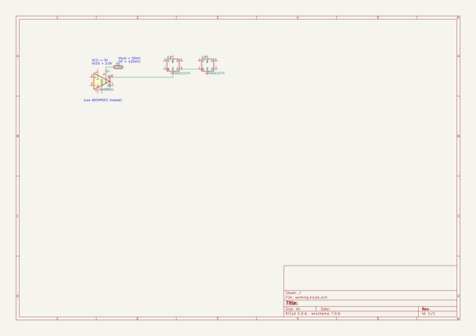

# os2
 
## summary 
* id: alexisvl_os2_sip_trig
* user: alexisvl
* name: os2
* board: sip_trig
* repo: https://github.com/alexisvl/os2
* src_file_repo_kicad_pcb: pcbs/sip_trig/sip_trig.kicad_pcb
* src_file_repo_kicad_pcb_link: https://github.com/alexisvl/os2/tree/trunk/pcbs/sip_trig/sip_trig.kicad_pcb

* src_file_repo_sch: 
* src_file_repo_sch_link: https://github.com/alexisvl/os2/tree/trunk/
* full details link: https://github.com/oomlout/oomlout_oomp_project_bot_v_2/tree/main/projects/alexisvl_os2_sip_trig/current_version/working  

## schematic  
  
[schematic (pdf)](working_schematic.pdf) 

## pcb  
 
  
  
  
[board (pdf)](working.pdf)  

## bom_schematic
| Ref | Qnty | Value | Cmp name | Footprint | Description | Vendor | DNP | 
| --- | --- | --- | --- | --- | --- | --- | --- | 
| R1 | 1 | 150k | R |  | Resistor |  |  | 
| U1 | 1 | AD8561 | AD8561 |  | Ultrafast 7 ns Single Supply Comparator, DIP-8/SOIC-8/TSSOP-8 |  |  | 
| U2, U3 | 2 | 74AUC1G74 | 74AUC1G74 |  | Single D Flip-Flop, Low-Voltage CMOS |  |  | 

