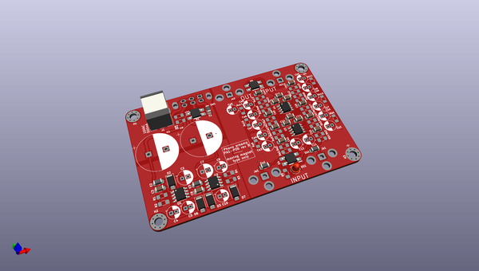
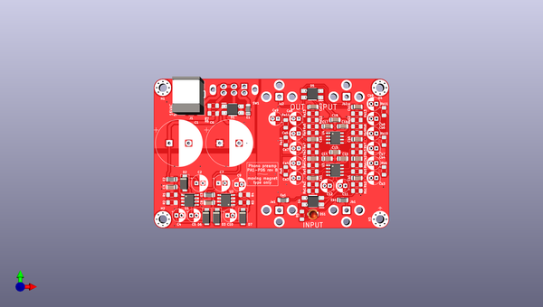
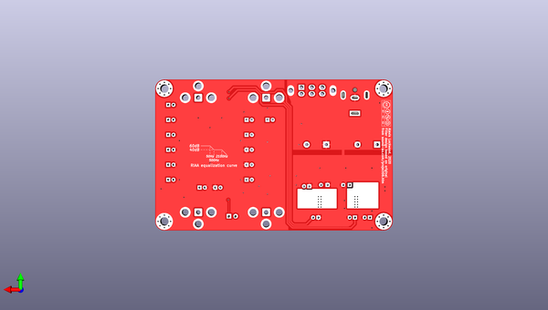

# phonopreamp
 
## summary 
* id: alexisvl_phonopreamp_phonopreamp
* user: alexisvl
* name: phonopreamp
* board: phonopreamp
* repo: https://github.com/alexisvl/phonopreamp
* src_file_repo_kicad_pcb: phonopreamp.kicad_pcb
* src_file_repo_kicad_pcb_link: https://github.com/alexisvl/phonopreamp/tree/master/phonopreamp.kicad_pcb

* src_file_repo_sch: phonopreamp.sch
* src_file_repo_sch_link: https://github.com/alexisvl/phonopreamp/tree/master/phonopreamp.sch
* full details link: https://github.com/oomlout/oomlout_oomp_project_bot_v_2/tree/main/projects/alexisvl_phonopreamp_phonopreamp/current_version/working  

## schematic  
  
[schematic (pdf)](working_schematic.pdf) 

## pcb  
 
  
  
  
[board (pdf)](working.pdf)  

## working_bom
| Id | Designator | Footprint | Quantity | Designation | Supplier and ref |  | None | 
| --- | --- | --- | --- | --- | --- | --- | --- | 
| 1 | Rb3,Ra3 | R_1206_3216Metric_Pad1.42x1.75mm_HandSolder | 2 | 10k/1% |  |  | [''] | 
| 2 | E1,Ea1,E2,E3,Eb1 | L_1206_3216Metric_Pad1.42x1.75mm_HandSolder | 5 | 600 |  |  | [''] | 
| 3 | Ra6,Ra10,Rb10,Ra11,Rb11,Rb6 | R_1206_3216Metric_Pad1.42x1.75mm_HandSolder | 6 | 470k |  |  | [''] | 
| 4 | Rb1,Ra1 | R_1206_3216Metric_Pad1.42x1.75mm_HandSolder | 2 | 47k |  |  | [''] | 
| 5 | Cb4,Ca6,Ca9,Ca7,Cb6,Cb8,Cb9,Ca8,Cb3,Ca3,Ca4,Cb7 | CP_Radial_D5.0mm_P2.00mm | 12 | 47µ |  |  | [''] | 
| 6 | Ca1,Cb1 | C_1206_3216Metric_Pad1.42x1.75mm_HandSolder | 2 | 22p |  |  | [''] | 
| 7 | D1,D4,D5 | MBxS | 3 | MB10F |  |  | [''] | 
| 8 | C13,C14,C18,C17,C16,C3,C15,C8 | C_1206_3216Metric_Pad1.42x1.75mm_HandSolder | 8 | 100n |  |  | [''] | 
| 9 | Cb2,Ca10,Ca2,Cb5,Ca5,Cb10 | C_1206_3216Metric_Pad1.42x1.75mm_HandSolder | 6 | 22n/2% |  |  | [''] | 
| 10 | Ra2,Rb2 | R_1206_3216Metric_Pad1.42x1.75mm_HandSolder | 2 | 4k7 |  |  | [''] | 
| 11 | R1,R3 | R_1206_3216Metric_Pad1.42x1.75mm_HandSolder | 2 | 240/1% |  |  | [''] | 
| 12 | Rb9,Ra9 | R_1206_3216Metric_Pad1.42x1.75mm_HandSolder | 2 | 2k7/1% |  |  | [''] | 
| 13 | Ra7,Rb7 | R_1206_3216Metric_Pad1.42x1.75mm_HandSolder | 2 | 3k4/1% |  |  | [''] | 
| 14 | C1,C6 | CP_Radial_D18.0mm_P7.50mm | 2 | 2200µ |  |  | [''] | 
| 15 | Ra12,Rb12 | R_1206_3216Metric_Pad1.42x1.75mm_HandSolder | 2 | 100k |  |  | [''] | 
| 16 | C7,C2 | CP_Radial_D6.3mm_P2.50mm | 2 | 68µ |  |  | [''] | 
| 17 | Jb1 | RCJ-01x | 1 | IN_R |  |  | [''] | 
| 18 | Jb2 | RCJ-01x | 1 | OUT_R |  |  | [''] | 
| 19 | R5 | R_1206_3216Metric_Pad1.42x1.75mm_HandSolder | 1 | 10k |  |  | [''] | 
| 20 | Ra13,Rb13 | R_1206_3216Metric_Pad1.42x1.75mm_HandSolder | 2 | 620 |  |  | [''] | 
| 21 | D2,D3,D6,D7 | D_SMA | 4 | S1G |  |  | [''] | 
| 22 | Ja2 | RCJ-01x | 1 | OUT_L |  |  | [''] | 
| 23 | R4,R2 | R_1206_3216Metric_Pad1.42x1.75mm_HandSolder | 2 | 2k43/1% |  |  | [''] | 
| 24 | Ra8,Rb8 | R_1206_3216Metric_Pad1.42x1.75mm_HandSolder | 2 | 100k/1% |  |  | [''] | 
| 25 | C4,C9 | CP_Radial_D5.0mm_P2.00mm | 2 | 10µ |  |  | [''] | 
| 26 | R6,R7 | R_1206_3216Metric_Pad1.42x1.75mm_HandSolder | 2 | 240 |  |  | [''] | 
| 27 | C12,C11,C5,C10 | CP_Radial_D5.0mm_P2.00mm | 4 | 100µ |  |  | [''] | 
| 28 | U1 | SOIC-8_3.9x4.9mm_P1.27mm | 1 | LM317LMX |  |  | [''] | 
| 29 | SW1 | MFS201N-16-Z | 1 | MFS201N-16-Z |  |  | [''] | 
| 30 | Rb5,Ra5 | R_1206_3216Metric_Pad1.42x1.75mm_HandSolder | 2 | 4k7/1% |  |  | [''] | 
| 31 | Ja1 | RCJ-01x | 1 | IN_L |  |  | [''] | 
| 32 | U4,U3 | SOIC-8_3.9x4.9mm_P1.27mm | 2 | LM4562 |  |  | [''] | 
| 33 | U2 | SOIC-8_3.9x4.9mm_P1.27mm | 1 | LM337LMX |  |  | [''] | 
| 34 | Ra4,Rb4 | R_1206_3216Metric_Pad1.42x1.75mm_HandSolder | 2 | 180k/1% |  |  | [''] | 
| 35 | DS1 | LED_D3.0mm | 1 | RED |  |  | [''] | 
| 36 | J1 | BarrelJack_CUI_PJ-063AH_Horizontal | 1 | 16VAC |  |  | [''] | 
| 37 | G1 | Logo_silk_CC-BY-NC-SA_10x3.6mm | 1 | BY-NC-SA |  |  | [''] | 

## bom_schematic
no data

