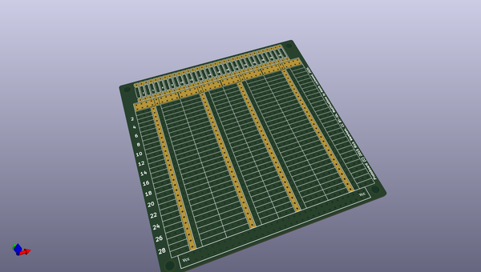
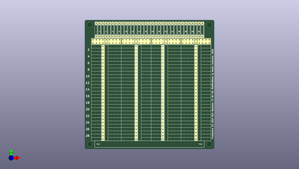
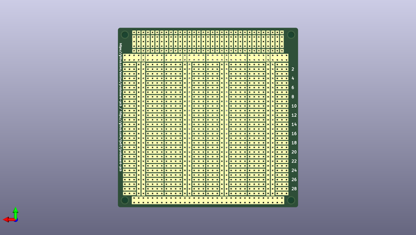

# protoboard_pcb
 
## summary 
* id: alexisvl_protoboard_pcb_generic_pcb
* user: alexisvl
* name: protoboard_pcb
* board: generic_pcb
* repo: https://github.com/alexisvl/protoboard-pcb
* src_file_repo_kicad_pcb: generic-pcb.kicad_pcb
* src_file_repo_kicad_pcb_link: https://github.com/alexisvl/protoboard-pcb/tree/master/generic-pcb.kicad_pcb

* src_file_repo_sch: 
* src_file_repo_sch_link: https://github.com/alexisvl/protoboard-pcb/tree/master/
* full details link: https://github.com/oomlout/oomlout_oomp_project_bot_v_2/tree/main/projects/alexisvl_protoboard_pcb_generic_pcb/current_version/working  

## pcb  
 
  
  
  
[board (pdf)](working.pdf)  

## working_bom
| Id | Designator | Footprint | Quantity | Designation | Supplier and ref |  | None | 
| --- | --- | --- | --- | --- | --- | --- | --- | 
| 1 | REF**,REF**,REF**,REF** | MountingHole_3-5mm | 4 | MountingHole_3-5mm |  |  | [''] | 
| 2 | REF**10,REF**11,REF**12,REF**13,REF**14,REF**15,REF**16,REF**17,REF**18,REF**19,REF**20,REF**21,REF**22,REF**23,REF**24,REF**25,REF**26,REF**27,REF**28,REF**29,REF**30,REF**31,REF**32,REF**33,REF**34,REF**34,REF**33,REF**32,REF**31,REF**30,REF**29,REF**28,REF**27,REF**26,REF**25,REF**24,REF**23,REF**22,REF**21,REF**20,REF**19,REF**18,REF**17,REF**16,REF**15,REF**14,REF**13,REF**12,REF**11,REF**10,REF**10,REF**10,REF**34,REF**34,REF**34,REF**34,REF**34,REF**34 | DIP-pads | 58 | DIP pads |  |  | [''] | 
| 3 | REF**3,REF**4,REF**5,REF**6,REF**7,REF**8,REF**9,REF**10,REF**11,REF**12,REF**13,REF**14,REF**15,REF**16,REF**17,REF**18,REF**19,REF**20,REF**21,REF**22,REF**23,REF**24,REF**25,REF**26,REF**27,REF**27,REF**26,REF**25,REF**24,REF**23,REF**22,REF**21,REF**20,REF**19,REF**18,REF**17,REF**16,REF**15,REF**14,REF**13,REF**12,REF**11,REF**10,REF**9,REF**8,REF**7,REF**6,REF**5,REF**4,REF**3,REF**3,REF**4,REF**5,REF**6,REF**7,REF**8,REF**9,REF**10,REF**11,REF**12,REF**13,REF**14,REF**15,REF**16,REF**17,REF**18,REF**19,REF**20,REF**21,REF**22,REF**23,REF**24,REF**25,REF**26,REF**27,REF**27,REF**26,REF**25,REF**24,REF**23,REF**22,REF**21,REF**20,REF**19,REF**18,REF**17,REF**16,REF**15,REF**14,REF**13,REF**12,REF**11,REF**10,REF**9,REF**8,REF**7,REF**6,REF**5,REF**4,REF**3,REF**27,REF**27,REF**27,REF**27,REF**27,REF**27,REF**22 | DIP-pads-mirror | 107 | DIP pads |  |  | [''] | 
| 4 | REF**1,REF**2,REF**3,REF**4,REF**5,REF**6,REF**7,REF**8,REF**9,REF**10,REF**11,REF**12,REF**13,REF**14,REF**15,REF**16,REF**17,REF**18,REF**19,REF**20,REF**21,REF**22,REF**23,REF**24,REF**25,REF**26,REF**27,REF**28,REF**29,REF**30,REF**31,REF**32,REF**33 | pin-connector | 33 | pin connector |  |  | [''] | 
| 5 | REF**1,REF**2,REF**3,REF**4,REF**5,REF**6,REF**7,REF**8,REF**9,REF**10,REF**11,REF**12,REF**13,REF**14,REF**15,REF**16,REF**17,REF**18,REF**19,REF**20,REF**21,REF**22,REF**23,REF**24,REF**25,REF**26,REF**27,REF**28,REF**29,REF**30,REF**30,REF**1,REF**1 | Vcc-bus | 33 | vcc bus |  |  | [''] | 
| 6 | REF**8,REF**8,REF**8,REF**8 | gnd-bus | 4 | GND bus |  |  | [''] | 

## mounting_holes
| x | y | package | value | ref | size | 
| --- | --- | --- | --- | --- | --- | 
| 0.0 | 91.44 | MountingHole_3-5mm | MountingHole_3-5mm | REF** | m3 | 
| 0.0 | 0.0 | MountingHole_3-5mm | MountingHole_3-5mm | REF** | m3 | 
| 91.44 | 0.0 | MountingHole_3-5mm | MountingHole_3-5mm | REF** | m3 | 
| 91.44 | 91.44 | MountingHole_3-5mm | MountingHole_3-5mm | REF** | m3 | 

