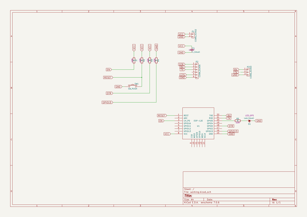

# altesprog
 
## summary 
* id: altlab_altesprog_altespprog
* user: altlab
* name: altesprog
* board: altespprog
* repo: https://github.com/altLab/altESProg
* src_file_repo_kicad_pcb: altEspPRog/altEspPRog.kicad_pcb
* src_file_repo_kicad_pcb_link: https://github.com/altLab/altESProg/tree/master/altEspPRog/altEspPRog.kicad_pcb

* src_file_repo_sch: altEspPRog/altEspPRog.sch
* src_file_repo_sch_link: https://github.com/altLab/altESProg/tree/master/altEspPRog/altEspPRog.sch
* full details link: https://github.com/oomlout/oomlout_oomp_project_bot_v_2/tree/main/projects/altlab_altesprog_altespprog/current_version/working  

## schematic  
  
[schematic (pdf)](working_schematic.pdf) 

## pcb  
 
  
  
  
[board (pdf)](working.pdf)  

## bom_schematic
| Ref | Qnty | Value | Cmp name | Footprint | Description | Vendor | DNP | 
| --- | --- | --- | --- | --- | --- | --- | --- | 
| C1 | 1 | C_Small | C_Small | 100nF |  |  |  | 
| D1 | 1 | Led_Small | Led_Small | LED_GP5 |  |  |  | 
| P1 | 1 | CONN_01X02 | CONN_01X02 |  |  |  |  | 
| P2 | 1 | CONN_01X06 | CONN_01X06 |  |  |  |  | 
| P3 | 1 | CONN_01X03 | CONN_01X03 |  |  |  |  | 
| R1, R2, R3, R4 | 4 | R | R | 10K |  |  |  | 
| R5 | 1 | R | R | 220 |  |  |  | 
| SW1 | 1 | SW_PUSH | SW_PUSH |  |  |  |  | 
| U1 | 1 | ESP-12E | ESP-12E |  |  |  |  | 

