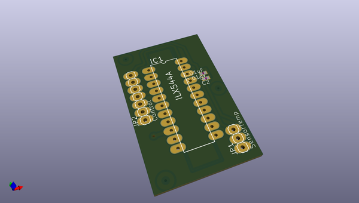
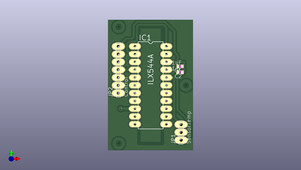
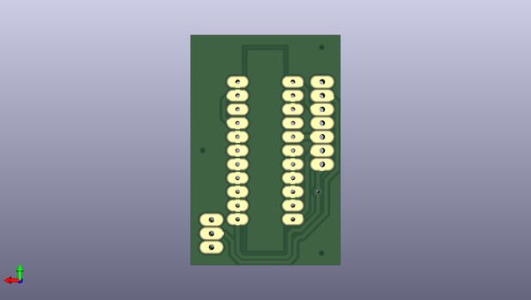

# altoespectro
 
## summary 
* id: altlab_altoespectro_ilx544a_v2
* user: altlab
* name: altoespectro
* board: ilx544a_v2
* repo: https://github.com/altLab/AltoEspectro
* src_file_repo_kicad_pcb: PCB/V2_0/Kicad/ILX544A_V2.kicad_pcb
* src_file_repo_kicad_pcb_link: https://github.com/altLab/AltoEspectro/tree/master/PCB/V2_0/Kicad/ILX544A_V2.kicad_pcb

* src_file_repo_sch: 
* src_file_repo_sch_link: https://github.com/altLab/AltoEspectro/tree/master/
* full details link: https://github.com/oomlout/oomlout_oomp_project_bot_v_2/tree/main/projects/altlab_altoespectro_ilx544a_v2/current_version/working  

## pcb  
 
  
  
  
[board (pdf)](working.pdf)  

## working_bom
| Id | Designator | Footprint | Quantity | Designation | Supplier and ref |  | None | 
| --- | --- | --- | --- | --- | --- | --- | --- | 
| 1 | C1,C2 | C0402 | 2 | 0.01uF |  |  | [''] | 
| 2 | IC1 | DIL22-4 | 1 | ILX544A |  |  | [''] | 
| 3 | JP1 | 1X03 | 1 | SensorTemp |  |  | [''] | 
| 4 | JP2 | 1X07 | 1 | Control |  |  | [''] | 
| 5 | @HOLE2,@HOLE1,@HOLE0 |  | 3 |  |  |  | [''] | 

