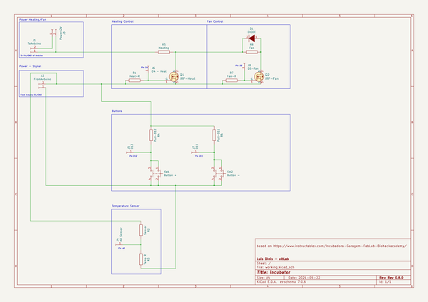
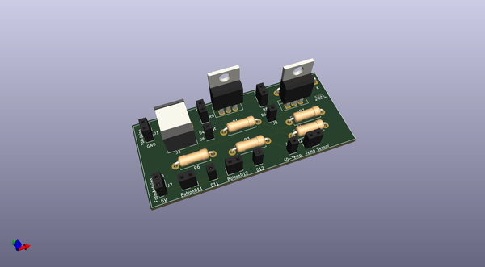
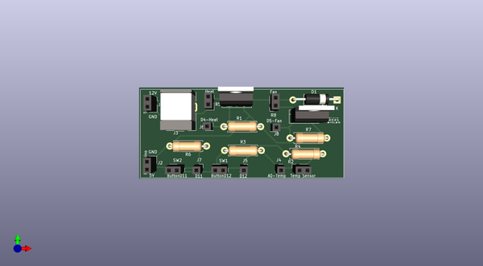
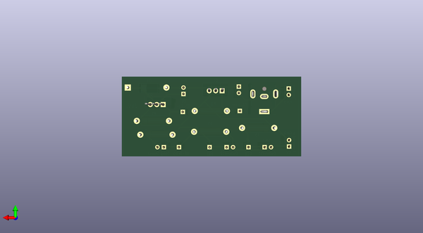

# biolab_incubator
 
## summary 
* id: altlab_biolab_incubator_controller
* user: altlab
* name: biolab_incubator
* board: controller
* repo: https://github.com/altLab/biolab-incubator
* src_file_repo_kicad_pcb: Controller.kicad_pcb
* src_file_repo_kicad_pcb_link: https://github.com/altLab/biolab-incubator/tree/main/Controller.kicad_pcb

* src_file_repo_sch: Controller.sch
* src_file_repo_sch_link: https://github.com/altLab/biolab-incubator/tree/main/Controller.sch
* full details link: https://github.com/oomlout/oomlout_oomp_project_bot_v_2/tree/main/projects/altlab_biolab_incubator_controller/current_version/working  

## schematic  
  
[schematic (pdf)](working_schematic.pdf) 

## pcb  
 
  
  
  
[board (pdf)](working.pdf)  

## working_bom
| Id | Designator | Footprint | Quantity | Designation | Supplier and ref |  | None | 
| --- | --- | --- | --- | --- | --- | --- | --- | 
| 1 | D1 | D_DO-15_P15.24mm_Horizontal | 1 | DIODE |  |  | [''] | 
| 2 | J1 | PinSocket_1x02_P2.54mm_Vertical | 1 | ToArduino |  |  | [''] | 
| 3 | J2 | PinSocket_1x02_P2.54mm_Vertical | 1 | FromArduino |  |  | [''] | 
| 4 | J3 | BarrelJack_CUI_PJ-063AH_Horizontal | 1 | Power12V |  |  | [''] | 
| 5 | J4 | PinSocket_1x01_P2.54mm_Vertical | 1 | A0 Sensor |  |  | [''] | 
| 6 | J5 | PinSocket_1x01_P2.54mm_Vertical | 1 | D12 |  |  | [''] | 
| 7 | J6 | PinSocket_1x01_P2.54mm_Vertical | 1 | D4 - Heat |  |  | [''] | 
| 8 | J7 | PinSocket_1x01_P2.54mm_Vertical | 1 | D11 |  |  | [''] | 
| 9 | J8 | PinSocket_1x01_P2.54mm_Vertical | 1 | D5-Fan |  |  | [''] | 
| 10 | Q1 | TO-220-3_Vertical | 1 | IRF-Heat |  |  | [''] | 
| 11 | Q2 | TO-220-3_Vertical | 1 | IRF-Fan |  |  | [''] | 
| 12 | R1 | R_Axial_DIN0411_L9.9mm_D3.6mm_P12.70mm_Horizontal | 1 | Heat-R |  |  | [''] | 
| 13 | R2 | PinSocket_1x02_P2.54mm_Vertical | 1 | Sensor |  |  | [''] | 
| 14 | R3 | R_Axial_DIN0411_L9.9mm_D3.6mm_P12.70mm_Horizontal | 1 | Temp R |  |  | [''] | 
| 15 | R4 | R_Axial_DIN0411_L9.9mm_D3.6mm_P12.70mm_Horizontal | 1 | Pull-D12 |  |  | [''] | 
| 16 | R5 | PinSocket_1x02_P2.54mm_Vertical | 1 | Heating |  |  | [''] | 
| 17 | R6 | R_Axial_DIN0411_L9.9mm_D3.6mm_P12.70mm_Horizontal | 1 | Pull-D11 |  |  | [''] | 
| 18 | R7 | R_Axial_DIN0411_L9.9mm_D3.6mm_P12.70mm_Horizontal | 1 | Fan-R |  |  | [''] | 
| 19 | R8 | PinSocket_1x02_P2.54mm_Vertical | 1 | Fan |  |  | [''] | 
| 20 | SW1 | PinSocket_1x02_P2.54mm_Vertical | 1 | Button + |  |  | [''] | 
| 21 | SW2 | PinSocket_1x02_P2.54mm_Vertical | 1 | Button - |  |  | [''] | 

## bom_schematic
| Ref | Qnty | Value | Cmp name | Footprint | Description | Vendor | DNP | 
| --- | --- | --- | --- | --- | --- | --- | --- | 
| D1 | 1 | DIODE | DIODE-pspice | Diode_THT:D_DO-15_P15.24mm_Horizontal |  |  |  | 
| J1 | 1 | ToArduino | Conn_01x02_Female-Connector | Connector_PinSocket_2.54mm:PinSocket_1x02_P2.54mm_Vertical |  |  |  | 
| J2 | 1 | FromArduino | Conn_01x02_Female-Connector | Connector_PinSocket_2.54mm:PinSocket_1x02_P2.54mm_Vertical |  |  |  | 
| J3 | 1 | Power12V | Conn_01x02_Female-Connector | Connector_BarrelJack:BarrelJack_CUI_PJ-063AH_Horizontal |  |  |  | 
| J4 | 1 | A0 Sensor | Conn_01x01_Female-Connector | Connector_PinSocket_2.54mm:PinSocket_1x01_P2.54mm_Vertical |  |  |  | 
| J5 | 1 | D12 | Conn_01x01_Female-Connector | Connector_PinSocket_2.54mm:PinSocket_1x01_P2.54mm_Vertical |  |  |  | 
| J6 | 1 | D4 - Heat | Conn_01x01_Female-Connector | Connector_PinSocket_2.54mm:PinSocket_1x01_P2.54mm_Vertical |  |  |  | 
| J7 | 1 | D11 | Conn_01x01_Female-Connector | Connector_PinSocket_2.54mm:PinSocket_1x01_P2.54mm_Vertical |  |  |  | 
| J8 | 1 | D5-Fan | Conn_01x01_Female-Connector | Connector_PinSocket_2.54mm:PinSocket_1x01_P2.54mm_Vertical |  |  |  | 
| Q1 | 1 | IRF-Heat | IRF540NPBF-dk_Transistors-FETs-MOSFETs-Single | Package_TO_SOT_THT:TO-220-3_Vertical |  |  |  | 
| Q2 | 1 | IRF-Fan | IRF540NPBF-dk_Transistors-FETs-MOSFETs-Single | Package_TO_SOT_THT:TO-220-3_Vertical |  |  |  | 
| R1 | 1 | Heat-R | R-pspice | Resistor_THT:R_Axial_DIN0411_L9.9mm_D3.6mm_P12.70mm_Horizontal |  |  |  | 
| R2 | 1 | Sensor | R-pspice | Connector_PinSocket_2.54mm:PinSocket_1x02_P2.54mm_Vertical |  |  |  | 
| R3 | 1 | Temp R | R-pspice | Resistor_THT:R_Axial_DIN0411_L9.9mm_D3.6mm_P12.70mm_Horizontal |  |  |  | 
| R4 | 1 | Pull-D12 | R-pspice | Resistor_THT:R_Axial_DIN0411_L9.9mm_D3.6mm_P12.70mm_Horizontal |  |  |  | 
| R5 | 1 | Heating | R-pspice | Connector_PinSocket_2.54mm:PinSocket_1x02_P2.54mm_Vertical |  |  |  | 
| R6 | 1 | Pull-D11 | R-pspice | Resistor_THT:R_Axial_DIN0411_L9.9mm_D3.6mm_P12.70mm_Horizontal |  |  |  | 
| R7 | 1 | Fan-R | R-pspice | Resistor_THT:R_Axial_DIN0411_L9.9mm_D3.6mm_P12.70mm_Horizontal |  |  |  | 
| R8 | 1 | Fan | R-pspice | Connector_PinSocket_2.54mm:PinSocket_1x02_P2.54mm_Vertical |  |  |  | 
| SW1 | 1 | Button + | SW_Push_Dual | Connector_PinSocket_2.54mm:PinSocket_1x02_P2.54mm_Vertical | Push button switch, generic, symbol, four pins |  |  | 
| SW2 | 1 | Button - | SW_Push_Dual | Connector_PinSocket_2.54mm:PinSocket_1x02_P2.54mm_Vertical | Push button switch, generic, symbol, four pins |  |  | 

