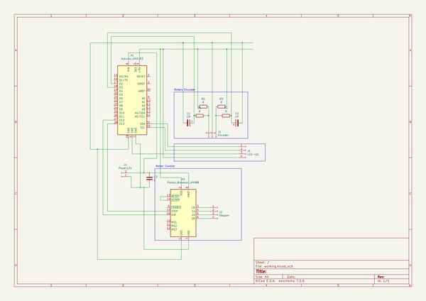

# biolab_peristaltic_pump
 
## summary 
* id: altlab_biolab_peristaltic_pump_peristaltic_pump
* user: altlab
* name: biolab_peristaltic_pump
* board: peristaltic_pump
* repo: https://github.com/altLab/biolab-peristaltic-pump
* src_file_repo_kicad_pcb: peristaltic-pump.kicad_pcb
* src_file_repo_kicad_pcb_link: https://github.com/altLab/biolab-peristaltic-pump/tree/main/peristaltic-pump.kicad_pcb

* src_file_repo_sch: peristaltic-pump.sch
* src_file_repo_sch_link: https://github.com/altLab/biolab-peristaltic-pump/tree/main/peristaltic-pump.sch
* full details link: https://github.com/oomlout/oomlout_oomp_project_bot_v_2/tree/main/projects/altlab_biolab_peristaltic_pump_peristaltic_pump/current_version/working  

## schematic  
  
[schematic (pdf)](working_schematic.pdf) 

## pcb  
 
  
  
  
[board (pdf)](working.pdf)  

## working_bom
| Id | Designator | Footprint | Quantity | Designation | Supplier and ref |  | None | 
| --- | --- | --- | --- | --- | --- | --- | --- | 
| 1 | A1 | Arduino_UNO_R3 | 1 | Arduino_UNO_R3 |  |  | [''] | 
| 2 | A2 | DIP-16_W7.62mm_Socket_LongPads | 1 | Pololu_Breakout_A4988 |  |  | [''] | 
| 3 | C1,C2 | C_Disc_D7.5mm_W2.5mm_P5.00mm | 2 | CP |  |  | [''] | 
| 4 | C3 | CP_Radial_D6.3mm_P2.50mm | 1 | C |  |  | [''] | 
| 5 | J1 | PinSocket_1x03_P2.54mm_Vertical | 1 | Encoder |  |  | [''] | 
| 6 | J2 | PinSocket_1x04_P2.54mm_Vertical | 1 | Stepper |  |  | [''] | 
| 7 | R1,R2,R3,R4 | R_Axial_DIN0207_L6.3mm_D2.5mm_P7.62mm_Horizontal | 4 | R |  |  | [''] | 
| 8 | J4 | BarrelJack_CUI_PJ-063AH_Horizontal | 1 | Power12V |  |  | [''] | 
| 9 | J5 | PinSocket_1x04_P2.54mm_Vertical | 1 | LCD-I2C |  |  | [''] | 

## bom_schematic
| Ref | Qnty | Value | Cmp name | Footprint | Description | Vendor | DNP | 
| --- | --- | --- | --- | --- | --- | --- | --- | 
| A1 | 1 | Arduino_UNO_R3 | Arduino_UNO_R3-MCU_Module | Module:Arduino_UNO_R3 |  |  |  | 
| A2 | 1 | Pololu_Breakout_A4988 | Pololu_Breakout_A4988 | Package_DIP:DIP-16_W7.62mm_Socket_LongPads | Pololu Breakout Board, Stepper Driver A4988 |  |  | 
| C1, C2 | 2 | CP | CP-Device | Capacitor_THT:C_Disc_D7.5mm_W2.5mm_P5.00mm |  |  |  | 
| C3 | 1 | C | C | Capacitor_THT:CP_Radial_D6.3mm_P2.50mm | Unpolarized capacitor |  |  | 
| J1 | 1 | Encoder | Conn_01x03_Female-Connector | Connector_PinSocket_2.54mm:PinSocket_1x03_P2.54mm_Vertical |  |  |  | 
| J2 | 1 | Stepper | Conn_01x04_Female-Connector | Connector_PinSocket_2.54mm:PinSocket_1x04_P2.54mm_Vertical |  |  |  | 
| J4 | 1 | Power12V | Conn_01x02_Female-Connector | Connector_BarrelJack:BarrelJack_CUI_PJ-063AH_Horizontal |  |  |  | 
| J5 | 1 | LCD-I2C | Conn_01x04_Female-Connector | Connector_PinSocket_2.54mm:PinSocket_1x04_P2.54mm_Vertical |  |  |  | 
| R1, R2, R3, R4 | 4 | R | R | Resistor_THT:R_Axial_DIN0207_L6.3mm_D2.5mm_P7.62mm_Horizontal | Resistor |  |  | 

