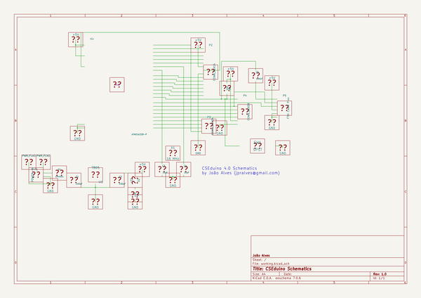
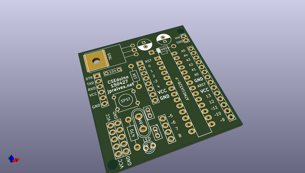
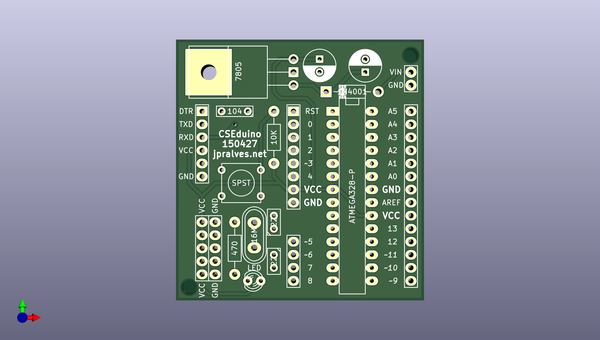
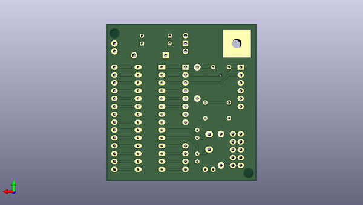

# hardwareblocks_cseduino
 
## summary 
* id: altlab_hardwareblocks_cseduino_cseduinov4
* user: altlab
* name: hardwareblocks_cseduino
* board: cseduinov4
* repo: https://github.com/altLab/HardwareBlocks_CSEduino
* src_file_repo_kicad_pcb: boards/2-layer/cseduinov4.kicad_pcb
* src_file_repo_kicad_pcb_link: https://github.com/altLab/HardwareBlocks_CSEduino/tree/master/boards/2-layer/cseduinov4.kicad_pcb

* src_file_repo_sch: boards/2-layer/cseduinov4.sch
* src_file_repo_sch_link: https://github.com/altLab/HardwareBlocks_CSEduino/tree/master/boards/2-layer/cseduinov4.sch
* full details link: https://github.com/oomlout/oomlout_oomp_project_bot_v_2/tree/main/projects/altlab_hardwareblocks_cseduino_cseduinov4/current_version/working  

## schematic  
  
[schematic (pdf)](working_schematic.pdf) 

## pcb  
 
  
  
  
[board (pdf)](working.pdf)  

## working_bom
| Id | Designator | Footprint | Quantity | Designation | Supplier and ref |  | None | 
| --- | --- | --- | --- | --- | --- | --- | --- | 
| 1 | C1,C2 | C_Radial_D6.3_L11.2_P2.5 | 2 | 100uF |  |  | [''] | 
| 2 | C3,C4 | C1 | 2 | 22 |  |  | [''] | 
| 3 | C5 | C2 | 1 | 104 |  |  | [''] | 
| 4 | D2 | LED-3MM | 1 | LED |  |  | [''] | 
| 5 | IC1 | DIP-28__300_ELL | 1 | ATMEGA328-P |  |  | [''] | 
| 6 | P1 | Pin_Header_Straight_1x02 | 1 | CONN_01X02 |  |  | [''] | 
| 7 | P2 | Pin_Header_Straight_1x14 | 1 | CONN_01X14 |  |  | [''] | 
| 8 | P3 | Pin_Header_Straight_1x04 | 1 | CONN_01X04 |  |  | [''] | 
| 9 | P4 | Pin_Header_Straight_1x08 | 1 | CONN_01X08 |  |  | [''] | 
| 10 | P5 | Pin_Header_Straight_1x06 | 1 | CONN_01X06 |  |  | [''] | 
| 11 | R1 | Resistor_Horizontal_RM10mm | 1 | 470 |  |  | [''] | 
| 12 | R2 | Resistor_Horizontal_RM10mm | 1 | 10K |  |  | [''] | 
| 13 | SW1 | SW_PUSH_SMALL | 1 | SPST |  |  | [''] | 
| 14 | U1 | LM78XX | 1 | 7805 |  |  | [''] | 
| 15 | X1 | Crystal_HC50-U_Vertical | 1 | 16M |  |  | [''] | 
| 16 | D1 | Diode_DO-41_SOD81_Horizontal_RM10 | 1 | 1N4001 |  |  | [''] | 
| 17 | REF** | Pin_Header_Straight_1x05 | 1 | VCC |  |  | [''] | 
| 18 | REF** | Pin_Header_Straight_1x05 | 1 | GND |  |  | [''] | 
| 19 | REF**,REF** | MountingHole_3mm | 2 | MountingHole_3mm |  |  | [''] | 

## bom_schematic
no data

## mounting_holes
| x | y | package | value | ref | size | 
| --- | --- | --- | --- | --- | --- | 
| 43.18 | 45.72 | MountingHole_3mm | MountingHole_3mm | REF** | m3 | 
| 0.0 | 0.0 | MountingHole_3mm | MountingHole_3mm | REF** | m3 | 

