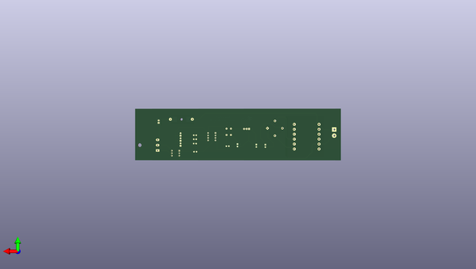

# heater
 
## summary 
* id: altlab_heater_power_rc_01
* user: altlab
* name: heater
* board: power_rc_01
* repo: https://github.com/altLab/heater
* src_file_repo_kicad_pcb: power_rc_01.kicad_pcb
* src_file_repo_kicad_pcb_link: https://github.com/altLab/heater/tree/main/power_rc_01.kicad_pcb

* src_file_repo_sch: power_rc_01.sch
* src_file_repo_sch_link: https://github.com/altLab/heater/tree/main/power_rc_01.sch
* full details link: https://github.com/oomlout/oomlout_oomp_project_bot_v_2/tree/main/projects/altlab_heater_power_rc_01/current_version/working  

## schematic  
  
[schematic (pdf)](working_schematic.pdf) 

## pcb  
 
  
  
  
[board (pdf)](working.pdf)  

## working_bom
| Id | Designator | Footprint | Quantity | Designation | Supplier and ref |  | None | 
| --- | --- | --- | --- | --- | --- | --- | --- | 
| 1 | T1 | Transformer_37x44 | 1 | Transformer_1P_1S |  |  | [''] | 
| 2 | C1,C2,C3 | CP_Radial_D5.0mm_P2.50mm | 3 | CP1 |  |  | [''] | 
| 3 | D1 | Diode_Bridge_15.7x15.7x6.3mm_P10.8mm | 1 | D_Bridge_-A+A |  |  | [''] | 
| 4 | D2,D3,D4 | LED_D3.0mm_Horizontal_O3.81mm_Z10.0mm | 3 | LED |  |  | [''] | 
| 5 | D5 | TO-218-3_Horizontal_TabUp | 1 | Q_TRIAC_A1A2G |  |  | [''] | 
| 6 | R1,R3,R4,R5,R6 | R_Axial_DIN0309_L9.0mm_D3.2mm_P2.54mm_Vertical | 5 | R |  |  | [''] | 
| 7 | R7 | JST_EH_B2B-EH-A_1x02_P2.50mm_Vertical | 1 | Heater |  |  | [''] | 
| 8 | SW1 | SW_PUSH_6mm | 1 | SW_Push |  |  | [''] | 
| 9 | U1 | 3-SIP_Module_V7805-1000 | 1 | V7805-1000 |  |  | [''] | 
| 10 | U2 | DIP-6_W7.62mm | 1 | MOC3021 |  |  | [''] | 
| 11 | U3 | DIP-8_W7.62mm | 1 | ATTINY85-20PU |  |  | [''] | 
| 12 | LOGO*** | ALTLAB_LOGO | 1 | ALTLAB |  |  | [''] | 
| 13 | F1 | Fuseholder_Cylinder-5x20mm_Schurter_0031_8201_Horizontal_Open | 1 | DFP10112 |  |  | [''] | 

## bom_schematic
| Ref | Qnty | Value | Cmp name | Footprint | Description | Vendor | DNP | 
| --- | --- | --- | --- | --- | --- | --- | --- | 
| C1, C2, C3 | 3 | CP1 | CP1-Device | Capacitor_THT:CP_Radial_D5.0mm_P2.50mm |  |  |  | 
| D1 | 1 | D_Bridge_-A+A | D_Bridge_-A+A | Diode_THT:Diode_Bridge_15.7x15.7x6.3mm_P10.8mm | Diode bridge, -ve/AC/+ve/AC |  |  | 
| D2, D3, D4 | 3 | LED | LED | LED_THT:LED_D3.0mm_Horizontal_O3.81mm_Z10.0mm | Light emitting diode |  |  | 
| D5 | 1 | Q_TRIAC_A1A2G | Q_TRIAC_A1A2G | Package_TO_SOT_THT:TO-218-3_Horizontal_TabUp | Triode for alternating current, anode1/anode2/gate |  |  | 
| F1 | 1 | DFP10112 | DFP10112-dk_Thermal-Cutoffs-Thermal-Fuses | Fuse:Fuseholder_Cylinder-5x20mm_Schurter_0031_8201_Horizontal_Open |  |  |  | 
| J1 | 1 | Conn_WallSocket | Conn_WallSocket | Connector_Wire:SolderWirePad_1x02_P7.62mm_Drill2mm | 3-pin german wall socket, no Earth wire (110VAC, 220VAC) |  |  | 
| R1, R3, R4, R5, R6 | 5 | R | R | Resistor_THT:R_Axial_DIN0309_L9.0mm_D3.2mm_P2.54mm_Vertical | Resistor |  |  | 
| R7 | 1 | Heater | Heater | Connector_JST:JST_EH_B2B-EH-A_1x02_P2.50mm_Vertical | Resistive heater |  |  | 
| SW1 | 1 | SW_Push | SW_Push | Button_Switch_THT:SW_PUSH_6mm | Push button switch, generic, two pins |  |  | 
| T1 | 1 | Transformer_1P_1S | Transformer_1P_1S | Transformer_THT:Transformer_37x44 | Transformer, single primary, single secondary |  |  | 
| U1 | 1 | V7805-1000 | V7805-1000-dk_DC-DC-Converters | digikey-footprints:3-SIP_Module_V7805-1000 |  |  |  | 
| U2 | 1 | MOC3021 | MOC3021-dk_Optoisolators-Triac-SCR-Output | digikey-footprints:DIP-6_W7.62mm |  |  |  | 
| U3 | 1 | ATTINY85-20PU | ATTINY85-20PU-dk_Embedded-Microcontrollers | digikey-footprints:DIP-8_W7.62mm |  |  |  | 

