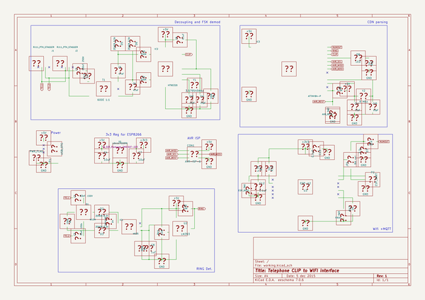
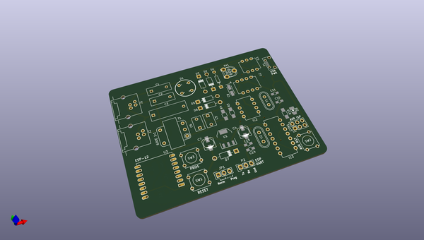
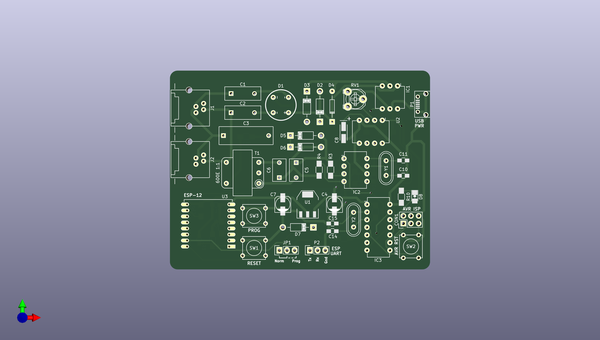
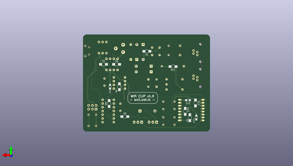

# wifi_pstn_cid
 
## summary 
* id: aniline_wifi_pstn_cid_tel_interf
* user: aniline
* name: wifi_pstn_cid
* board: tel_interf
* repo: https://github.com/aniline/wifi_pstn_cid
* src_file_repo_kicad_pcb: tel_interf.kicad_pcb
* src_file_repo_kicad_pcb_link: https://github.com/aniline/wifi_pstn_cid/tree/master/tel_interf.kicad_pcb

* src_file_repo_sch: tel_interf.sch
* src_file_repo_sch_link: https://github.com/aniline/wifi_pstn_cid/tree/master/tel_interf.sch
* full details link: https://github.com/oomlout/oomlout_oomp_project_bot_v_2/tree/main/projects/aniline_wifi_pstn_cid_tel_interf/current_version/working  

## schematic  
  
[schematic (pdf)](working_schematic.pdf) 

## pcb  
 
  
  
  
[board (pdf)](working.pdf)  

## working_bom
| Id | Designator | Footprint | Quantity | Designation | Supplier and ref |  | None | 
| --- | --- | --- | --- | --- | --- | --- | --- | 
| 1 | C1 | C_Disc_D12_P7.75 | 1 | 33nF, 150V |  |  | [''] | 
| 2 | C2 | C_Disc_D12_P7.75 | 1 | 33nF, 150v |  |  | [''] | 
| 3 | C3 | C_Rect_L18_W6_P15 | 1 | 100nF, 250V |  |  | [''] | 
| 4 | CON1 | Pin_Header_Straight_2x03 | 1 | AVR-ISP-6 |  |  | [''] | 
| 5 | D1 | WOM_BRIDGE | 1 | W10M |  |  | [''] | 
| 6 | D2,D3 | Diode_DO-41_SOD81_Horizontal_RM10 | 2 | ZENER 8.2V |  |  | [''] | 
| 7 | D5,D6 | Diode_DO-41_SOD81_Horizontal_RM10 | 2 | ZENER 3.3V |  |  | [''] | 
| 8 | D7 | Diode_DO-41_SOD81_Horizontal_RM10 | 1 | 3.3v |  |  | [''] | 
| 9 | IC1 | DIP-6_W7.62mm | 1 | 4N35 |  |  | [''] | 
| 10 | IC2 | DIP-8_W7.62mm | 1 | HT9032D |  |  | [''] | 
| 11 | IC3 | DIP-14_W7.62mm | 1 | ATTINY84-P |  |  | [''] | 
| 12 | J1,J2 | RJ11_PTH_6P4C_STAG | 2 | RJ11_PTH_STAGGER |  |  | [''] | 
| 13 | P1 | USB_Micro-B | 1 | USB_OTG |  |  | [''] | 
| 14 | RV1 | Potentiometer_Triwood_RM-065 | 1 | 10K |  |  | [''] | 
| 15 | SW1 | SW_PUSH_SMALL | 1 | ESP_REST |  |  | [''] | 
| 16 | SW2 | SW_PUSH_SMALL | 1 | AVR_REST |  |  | [''] | 
| 17 | SW3 | SW_PUSH_SMALL | 1 | PROG |  |  | [''] | 
| 18 | T1 | TRANSFO-AUDIO-EL14 | 1 | 600E 1:1 |  |  | [''] | 
| 19 | U1 | SOT-223 | 1 | LD1117S33TR |  |  | [''] | 
| 20 | U2 | DIP-8_W7.62mm | 1 | LM393 |  |  | [''] | 
| 21 | U3 | ESP-12 | 1 | ESP-12 |  |  | [''] | 
| 22 | Y1 | Crystal_HC49-U_Vertical | 1 | 3.579545Mhz |  |  | [''] | 
| 23 | Y2 | Crystal_HC49-U_Vertical | 1 | 8 Mhz |  |  | [''] | 
| 24 | C4,C7 | c_elec_5x5.3 | 2 | 10uF |  |  | [''] | 
| 25 | C10,C11,C14,C15 | C_0805_HandSoldering | 4 | 22pF |  |  | [''] | 
| 26 | R10,R11,R12,R13 | R_1206_HandSoldering | 4 | 1K |  |  | [''] | 
| 27 | R3,R4,R2 | R_1206_HandSoldering | 3 | 220K |  |  | [''] | 
| 28 | C5,C6 | C_Disc_D7.5_P5 | 2 | 47nF |  |  | [''] | 
| 29 | D8 | LED-1206 | 1 | LED |  |  | [''] | 
| 30 | D4 | Diode_DO-35_SOD27_Horizontal_RM10 | 1 | 1N4148 |  |  | [''] | 
| 31 | C8 | TantalC_SizeA_EIA-3216_HandSoldering | 1 | 1uF |  |  | [''] | 
| 32 | JP1 | Pin_Header_Straight_1x03 | 1 | RX sel. |  |  | [''] | 
| 33 | P2 | Pin_Header_Straight_1x03 | 1 | ESP_UART |  |  | [''] | 
| 34 | C9,C12,C13 | C_0805_HandSoldering | 3 | 0.1uF |  |  | [''] | 
| 35 | R1,R6 | R_1206_HandSoldering | 2 | 100K |  |  | [''] | 
| 36 | R5 | R_1206_HandSoldering | 1 | 10K |  |  | [''] | 
| 37 | R7,R8 | R_1206_HandSoldering | 2 | 4.7K |  |  | [''] | 
| 38 | R9 | R_1206_HandSoldering | 1 | 1k |  |  | [''] | 

## bom_schematic
no data

