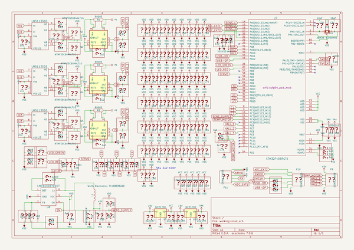
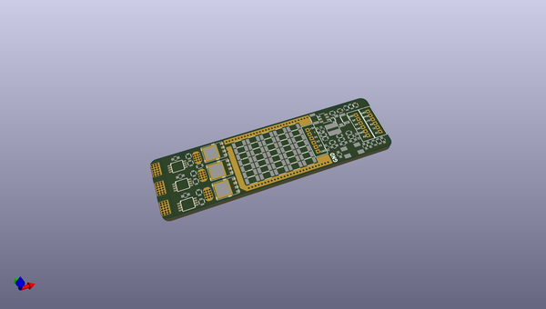
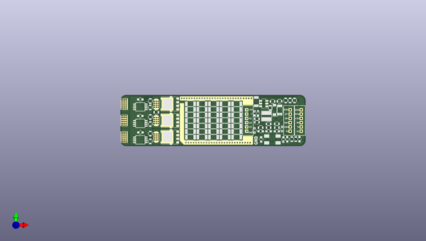
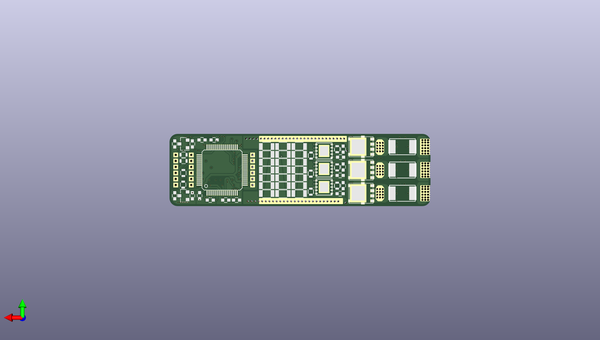

# mini4
 
## summary 
* id: antonchromjak_mini4_mini_vesc
* user: antonchromjak
* name: mini4
* board: mini_vesc
* repo: https://github.com/antonchromjak/MINI4
* src_file_repo_kicad_pcb: MINI VESC.kicad_pcb
* src_file_repo_kicad_pcb_link: https://github.com/antonchromjak/MINI4/tree/master/MINI VESC.kicad_pcb

* src_file_repo_sch: MINI VESC.sch
* src_file_repo_sch_link: https://github.com/antonchromjak/MINI4/tree/master/MINI VESC.sch
* full details link: https://github.com/oomlout/oomlout_oomp_project_bot_v_2/tree/main/projects/antonchromjak_mini4_mini_vesc/current_version/working  

## schematic  
  
[schematic (pdf)](working_schematic.pdf) 

## pcb  
 
  
  
  
[board (pdf)](working.pdf)  

## working_bom
| Id | Designator | Footprint | Quantity | Designation | Supplier and ref |  | None | 
| --- | --- | --- | --- | --- | --- | --- | --- | 
| 1 | U4,U5,U6 | MSOP | 3 | AD8418 |  |  | [''] | 
| 2 | C9,C10,C11,C17,C21,C77,C78,C22,C29,C6,C7,C8,C18,C19,C26,C27,C86,C87,C88,C89,C90 | C_0603 | 21 | 2u2 |  |  | [''] | 
| 3 | C14,C15,C16 | C_0603 | 3 | 4n7 |  |  | [''] | 
| 4 | R4,R12,R14,R16 | R_0603 | 4 | 25k5 |  |  | [''] | 
| 5 | R5,R13,R15,R17 | R_0603 | 4 | 2k2 |  |  | [''] | 
| 6 | R18,R19,R20,R30 | R_0603 | 4 | 100R |  |  | [''] | 
| 7 | C23 | R_0603 | 1 | 220nF |  |  | [''] | 
| 8 | C24,C25,C12,C13,C48,C28,C39,C60,C61,C62,C4,C5,C32,C63,C74,C75,C79,C82,C84,C85 | R_1206 | 20 | 10u |  |  | [''] | 
| 9 | D1 | D_SOD-123 | 1 | D_Schottky |  |  | [''] | 
| 10 | R21 | R_0603 | 1 | 510R |  |  | [''] | 
| 11 | R22 | R_0603 | 1 | 8k |  |  | [''] | 
| 12 | U8 | SOT-23-6 | 1 | LMR16006 |  |  | [''] | 
| 13 | P9,P10,P11 | JST_ZH_1.5_6-Pin | 3 | CONN_01X06 |  |  | [''] | 
| 14 | D3,D4 | R_0603 | 2 | LED |  |  | [''] | 
| 15 | R28,R29 | R_0603 | 2 | 220R |  |  | [''] | 
| 16 | C30,C31 | C_0603 | 2 | 10pF |  |  | [''] | 
| 17 | X1 | 5x3.2KRISTALL | 1 | CRYSTAL_SMD |  |  | [''] | 
| 18 | C34,C40,C42,C44,C45,C46,C47,C49,C50,C51,C52,C53,C54,C55,C56,C57,C58,C59,C64,C68,C69,C70,C71,C72,C73,C35,C36,C33,C37,C38,C41,C43,C65,C66,C67,C80,C81,C83 | R_1206 | 38 | C |  |  | [''] | 
| 19 | P1,P2,P3,P4,P5,P6 | prekov | 6 | CONN_1 |  |  | [''] | 
| 20 | R31,R33,R34 | R_0603 | 3 | 10k |  |  | [''] | 
| 21 | R32 | R_0603 | 1 | 10kNTC |  |  | [''] | 
| 22 | Q2,Q4,Q6,Q1,Q3,Q5 | DFN5 | 6 | Q_NMOS_GSD |  |  | [''] | 
| 23 | L1 | WE-MAPI | 1 | 22uH |  |  | [''] | 
| 24 | C1,C2,C3 | C_0603 | 3 | 220n |  |  | [''] | 
| 25 | U7 | lqfp64_pad_mod | 1 | STM32F40X_LQFP64 |  |  | [''] | 
| 26 | C20 | C_0603 | 1 | 220nF |  |  | [''] | 
| 27 | R6,R7,R8,R9,R10,R11 | R_0603 | 6 | 7R5 |  |  | [''] | 
| 28 | R25,R27 | R_0603 | 2 | 22R |  |  | [''] | 
| 29 | C76 | R_0603 | 1 | 100n |  |  | [''] | 
| 30 | U1,U2,U3 | WSON10_ | 3 | LM5113 |  |  | [''] | 
| 31 | R1,R2,R3 | 2512Rv2 | 3 | RSENS |  |  | [''] | 
| 32 | U9,U10 | SOT-23 | 2 | MCP1700 |  |  | [''] | 

## bom_schematic
| Ref | Qnty | Value | Cmp name | Footprint | Description | Vendor | DNP | 
| --- | --- | --- | --- | --- | --- | --- | --- | 
| L1 | 1 | Wurth Electronics 74438335220 | INDUCTOR-RESCUE-MINI_VESC | mojaKniznica:WE-MAPI |  |  |  | 
| P1, P2, P3, P4, P5, P6 | 6 | CONN_1 | CONN_1-RESCUE-MINI_VESC | kicad_subory:prekov |  |  |  | 
| R1, R2, R3 | 3 | R0005 | RSENS-RESCUE-MINI_VESC | mojaKniznica:2512Rv2 |  |  |  | 
| U1, U2, U3 | 3 | LM5113SDE | LM5001-RESCUE-MINI_VESC | kicad_subory:WSON10__ |  |  |  | 
| U4, U5, U6 | 3 | AD8417 | AD8418-RESCUE-MINI_VESC | kicad_subory:MSOP |  |  |  | 
| U7 | 1 | STM32F405RGT6 | STM32F40X_LQFP64-RESCUE-MINI_VESC | crf1:lqfp64_pad_mod |  |  |  | 
| U8 | 1 | LMR16006YDDCT | BD9G101G-RESCUE-MINI_VESC | TO_SOT_Packages_SMD:SOT-23-6 |  |  |  | 
| U9, U10 | 2 | MCP1700 | MCP1700-RESCUE-MINI_VESC | TO_SOT_Packages_SMD:SOT-23 |  |  |  | 
| X1 | 1 | ABM3B-8.000MHZ | CRYSTAL_SMD-RESCUE-MINI_VESC | mojaKniznica:5x3.2KRISTALL |  |  |  | 

