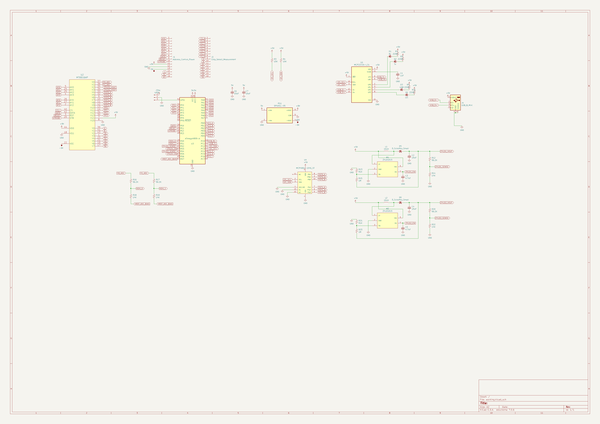
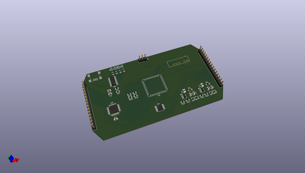
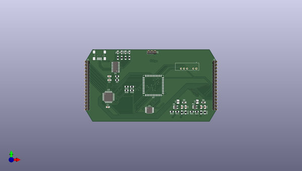
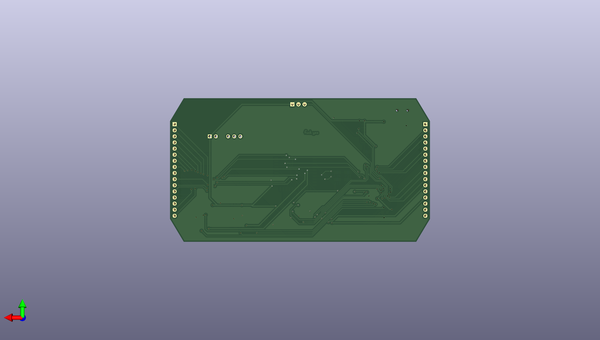

# breadware
 
## summary 
* id: architeuthis_flux_breadware_breadcontrol
* user: architeuthis_flux
* name: breadware
* board: breadcontrol
* repo: https://github.com/Architeuthis-Flux/breadWare
* src_file_repo_kicad_pcb: v0.1-alpha/KiCad Files/BreadControl/BreadControl.kicad_pcb
* src_file_repo_kicad_pcb_link: https://github.com/Architeuthis-Flux/breadWare/tree/main/v0.1-alpha/KiCad Files/BreadControl/BreadControl.kicad_pcb
* src_file_repo_kicad_sch: Jumperless/Hardware/MTMatrixV3/MTMatrixV3.kicad_sch
* src_file_repo_kicad_sch_link: https://github.com/Architeuthis-Flux/breadWare/tree/main/Jumperless/Hardware/MTMatrixV3/MTMatrixV3.kicad_sch

* src_file_repo_sch: v0.1-alpha/KiCad Files/BreadControl/BreadControl.sch
* src_file_repo_sch_link: https://github.com/Architeuthis-Flux/breadWare/tree/main/v0.1-alpha/KiCad Files/BreadControl/BreadControl.sch
* full details link: https://github.com/oomlout/oomlout_oomp_project_bot_v_2/tree/main/projects/architeuthis_flux_breadware_breadcontrol/current_version/working  

## schematic  
  
[schematic (pdf)](working_schematic.pdf) 

## pcb  
 
  
  
  
[board (pdf)](working.pdf)  

## working_bom
| Id | Designator | Footprint | Quantity | Designation | Supplier and ref |  | None | 
| --- | --- | --- | --- | --- | --- | --- | --- | 
| 1 | C1 | C_0805_2012Metric_Pad1.15x1.40mm_HandSolder | 1 | 1uF |  |  | [''] | 
| 2 | C2,C4,C6,C7 | C_0805_2012Metric_Pad1.15x1.40mm_HandSolder | 4 | 10uF |  |  | [''] | 
| 3 | C3,C5 | C_0805_2012Metric_Pad1.15x1.40mm_HandSolder | 2 | 4.7uF |  |  | [''] | 
| 4 | D1 | D_0603_1608Metric_Pad1.05x0.95mm_HandSolder | 1 | Rx |  |  | [''] | 
| 5 | D2 | D_0603_1608Metric_Pad1.05x0.95mm_HandSolder | 1 | Tx |  |  | [''] | 
| 6 | D3 | D_0603_1608Metric_Pad1.05x0.95mm_HandSolder | 1 | USB |  |  | [''] | 
| 7 | D4 | D_0603_1608Metric_Pad1.05x0.95mm_HandSolder | 1 | I2C |  |  | [''] | 
| 8 | D5,D6 | D_SOD-323_HandSoldering | 2 | D_Schottky_Small |  |  | [''] | 
| 9 | J1 | PinHeader_1x16_P2.54mm_Vertical | 1 | Address_Control_Power |  |  | [''] | 
| 10 | J2 | PinHeader_1x16_P2.54mm_Vertical | 1 | Chip_Select_Measurement |  |  | [''] | 
| 11 | J3 | PinHeader_1x03_P2.54mm_Vertical | 1 | UPDI |  |  | [''] | 
| 12 | L1,L2 | L_1008_2520Metric | 2 | 10uH |  |  | [''] | 
| 13 | M1,M2 | SOT-23-5_HandSoldering | 2 | ZXLD1615 |  |  | [''] | 
| 14 | PS1 | CONV_DPU01L-05 | 1 | DPU01L-05 |  |  | [''] | 
| 15 | R1,R2,R5,R11 | R_0805_2012Metric_Pad1.15x1.40mm_HandSolder | 4 | 220R |  |  | [''] | 
| 16 | R3,R4 | R_0805_2012Metric_Pad1.15x1.40mm_HandSolder | 2 | 10K |  |  | [''] | 
| 17 | R12,R16,R17,R20 | R_0805_2012Metric_Pad1.15x1.40mm_HandSolder | 4 | 56.2K |  |  | [''] | 
| 18 | R13,R21 | R_0805_2012Metric_Pad1.15x1.40mm_HandSolder | 2 | 91K |  |  | [''] | 
| 19 | R14,R18,R19,R22 | R_0805_2012Metric_Pad1.15x1.40mm_HandSolder | 4 | 14K |  |  | [''] | 
| 20 | R15,R23 | R_0805_2012Metric_Pad1.15x1.40mm_HandSolder | 2 | 1M |  |  | [''] | 
| 21 | U1 | SOIC-14_3.9x8.7mm_P1.27mm | 1 | MCP2221A-I_SL |  |  | [''] | 
| 22 | U2 | PLCC-44_16.6x16.6mm_P1.27mm | 1 | MT8816AP |  |  | [''] | 
| 23 | U3 | TQFP-48_7x7mm_P0.5mm | 1 | ATmega4809-A |  |  | [''] | 
| 24 | U4 | TSSOP-14_4.4x5mm_P0.65mm | 1 | MCP4661-104E_ST |  |  | [''] | 
| 25 | J4 | AMPHENOL_10033526-N3212LF | 1 | USB_B_Mini |  |  | [''] | 

## bom_schematic
| Ref | Qnty | Value | Cmp name | Footprint | Description | Vendor | DNP | 
| --- | --- | --- | --- | --- | --- | --- | --- | 
| C1 | 1 | 1uF | C_Small | Capacitor_SMD:C_0805_2012Metric_Pad1.15x1.40mm_HandSolder | Unpolarized capacitor, small symbol |  |  | 
| C2, C4, C6, C7 | 4 | 10uF | C_Small | Capacitor_SMD:C_0805_2012Metric_Pad1.15x1.40mm_HandSolder | Unpolarized capacitor, small symbol |  |  | 
| C3, C5 | 2 | 4.7uF | C_Small | Capacitor_SMD:C_0805_2012Metric_Pad1.15x1.40mm_HandSolder | Unpolarized capacitor, small symbol |  |  | 
| D1 | 1 | Rx | LED_Small | Diode_SMD:D_0603_1608Metric_Pad1.05x0.95mm_HandSolder | Light emitting diode, small symbol |  |  | 
| D2 | 1 | Tx | LED_Small | Diode_SMD:D_0603_1608Metric_Pad1.05x0.95mm_HandSolder | Light emitting diode, small symbol |  |  | 
| D3 | 1 | USB | LED_Small | Diode_SMD:D_0603_1608Metric_Pad1.05x0.95mm_HandSolder | Light emitting diode, small symbol |  |  | 
| D4 | 1 | I2C | LED_Small | Diode_SMD:D_0603_1608Metric_Pad1.05x0.95mm_HandSolder | Light emitting diode, small symbol |  |  | 
| D5, D6 | 2 | D_Schottky_Small | D_Schottky_Small | Diode_SMD:D_SOD-323_HandSoldering | Schottky diode, small symbol |  |  | 
| J1 | 1 | Address_Control_Power | Conn_01x16_Female-Connector | Connector_PinHeader_2.54mm:PinHeader_1x16_P2.54mm_Vertical |  |  |  | 
| J2 | 1 | Chip_Select_Measurement | Conn_01x16_Female-Connector | Connector_PinHeader_2.54mm:PinHeader_1x16_P2.54mm_Vertical |  |  |  | 
| J3 | 1 | UPDI | Conn_01x03_Male-Connector | Connector_PinHeader_2.54mm:PinHeader_1x03_P2.54mm_Vertical |  |  |  | 
| J4 | 1 | USB_B_Mini | USB_B_Mini-Connector | 10033526-N3212LF:AMPHENOL_10033526-N3212LF |  |  |  | 
| L1, L2 | 2 | 10uH | L_Small | Inductor_SMD:L_1008_2520Metric | Inductor, small symbol |  |  | 
| M1, M2 | 2 | ZXLD1615 | ZXLD1615-Regulator_Controller | Package_TO_SOT_SMD:SOT-23-5_HandSoldering |  |  |  | 
| PS1 | 1 | DPU01L-05 | DPU01L-05-DPU01L-05 | DPU01L-05:CONV_DPU01L-05 |  |  |  | 
| R1, R2, R5, R11 | 4 | 220R | R_Small_US | Resistor_SMD:R_0805_2012Metric_Pad1.15x1.40mm_HandSolder | Resistor, small US symbol |  |  | 
| R3, R4 | 2 | 10K | R_Small_US | Resistor_SMD:R_0805_2012Metric_Pad1.15x1.40mm_HandSolder | Resistor, small US symbol |  |  | 
| R12, R16, R17, R20 | 4 | 56.2K | R_Small_US | Resistor_SMD:R_0805_2012Metric_Pad1.15x1.40mm_HandSolder | Resistor, small US symbol |  |  | 
| R13, R21 | 2 | 91K | R_Small_US | Resistor_SMD:R_0805_2012Metric_Pad1.15x1.40mm_HandSolder | Resistor, small US symbol |  |  | 
| R14, R18, R19, R22 | 4 | 14K | R_Small_US | Resistor_SMD:R_0805_2012Metric_Pad1.15x1.40mm_HandSolder | Resistor, small US symbol |  |  | 
| R15, R23 | 2 | 1M | R_Small_US | Resistor_SMD:R_0805_2012Metric_Pad1.15x1.40mm_HandSolder | Resistor, small US symbol |  |  | 
| U1 | 1 | MCP2221A-I_SL | MCP2221A-I_SL-MCP2221A-I_SL | Package_SO:SOIC-14_3.9x8.7mm_P1.27mm |  |  |  | 
| U2 | 1 | MT8816AP | MT8816AP-MT8816 | Package_LCC:PLCC-44_16.6x16.6mm_P1.27mm |  |  |  | 
| U3 | 1 | ATmega4809-A | ATmega4809-A | Package_QFP:TQFP-48_7x7mm_P0.5mm | 20MHz, 48kB Flash, 6kB SRAM, 256B EEPROM, TQFP-48 |  |  | 
| U4 | 1 | MCP4661-104E_ST | MCP4661-104E_ST-MCP4661-104E_ST | Package_SO:TSSOP-14_4.4x5mm_P0.65mm |  |  |  | 

