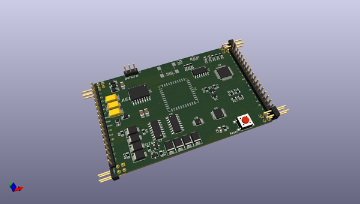
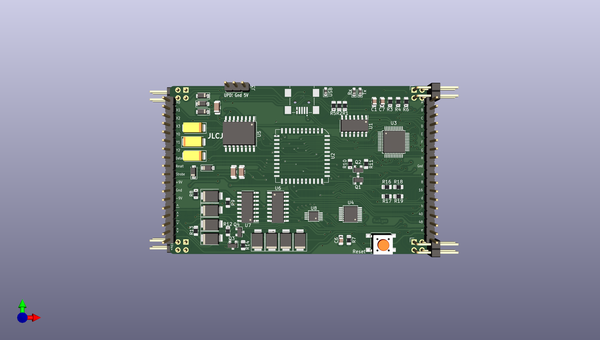
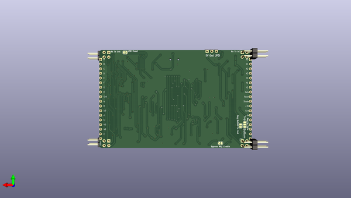

# breadware
 
## summary 
* id: architeuthis_flux_breadware_breadcontrolv2_rounded_3
* user: architeuthis_flux
* name: breadware
* board: breadcontrolv2_rounded_3
* repo: https://github.com/Architeuthis-Flux/breadWare
* src_file_repo_kicad_pcb: v0.2-beta/breadWare KiCad Files/BreadControlV0.2/BreadControlV2-rounded 3.kicad_pcb
* src_file_repo_kicad_pcb_link: https://github.com/Architeuthis-Flux/breadWare/tree/main/v0.2-beta/breadWare KiCad Files/BreadControlV0.2/BreadControlV2-rounded 3.kicad_pcb
* src_file_repo_kicad_sch: Jumperless/Hardware/MTMatrixV3/MTMatrixV3.kicad_sch
* src_file_repo_kicad_sch_link: https://github.com/Architeuthis-Flux/breadWare/tree/main/Jumperless/Hardware/MTMatrixV3/MTMatrixV3.kicad_sch

* src_file_repo_sch: v0.1-alpha/KiCad Files/MTMatrix/MTMatrix.sch
* src_file_repo_sch_link: https://github.com/Architeuthis-Flux/breadWare/tree/main/v0.1-alpha/KiCad Files/MTMatrix/MTMatrix.sch
* full details link: https://github.com/oomlout/oomlout_oomp_project_bot_v_2/tree/main/projects/architeuthis_flux_breadware_breadcontrolv2_rounded_3/current_version/working  

## pcb  
 
  
  
  
[board (pdf)](working.pdf)  

## working_bom
| Id | Designator | Footprint | Quantity | Designation | Supplier and ref |  | None | 
| --- | --- | --- | --- | --- | --- | --- | --- | 
| 1 | C1 | C_0805_2012Metric_Pad1.15x1.40mm_HandSolder | 1 | 1uF |  |  | [''] | 
| 2 | C2,C5,C9 | C_1206_3216Metric_Pad1.42x1.75mm_HandSolder | 3 | 100uF |  |  | [''] | 
| 3 | C3,C4,C8 | CP_EIA-6032-20_AVX-F_Pad2.25x2.35mm_HandSolder | 3 | 10uF |  |  | [''] | 
| 4 | C6,C7 | C_0805_2012Metric_Pad1.15x1.40mm_HandSolder | 2 | 10uF |  |  | [''] | 
| 5 | Tx | D_0603_1608Metric_Pad1.05x0.95mm_HandSolder | 1 | Rx |  |  | [''] | 
| 6 | Rx | D_0603_1608Metric_Pad1.05x0.95mm_HandSolder | 1 | Tx |  |  | [''] | 
| 7 | USB | D_0603_1608Metric_Pad1.05x0.95mm_HandSolder | 1 | USB |  |  | [''] | 
| 8 | D4,D5,D6,D7,D8 | D_SOD-123 | 5 | 1N4001 |  |  | [''] | 
| 9 | D9,D10,D11,D12,D13,D14,D15,D16 | D_SMB | 8 | D_Schottky_Small |  |  | [''] | 
| 10 | J1 | PinHeader_1x18_P2.54mm_Vertical | 1 | Address_Control_Power |  |  | [''] | 
| 11 | J2 | PinHeader_1x18_P2.54mm_Vertical | 1 | Chip_Select_Measurement |  |  | [''] | 
| 12 | J3 | PinHeader_1x03_P2.54mm_Vertical | 1 | UPDI |  |  | [''] | 
| 13 | J4 | AMPHENOL_10033526-N3212LF | 1 | USB_B_Mini |  |  | [''] | 
| 14 | Rx Tx Out,J8 | PinHeader_2x02_P2.54mm_Horizontal | 2 | Conn_01x04_Male |  |  | [''] | 
| 15 | Q1,Q2,Q4 | SOT-23 | 3 | Q_PNP_BCE |  |  | [''] | 
| 16 | Q3 | SOT-23 | 1 | Q_NMOS_GSD |  |  | [''] | 
| 17 | R1,R2,R5 | R_0805_2012Metric_Pad1.15x1.40mm_HandSolder | 3 | 220R |  |  | [''] | 
| 18 | R3,R4,R6,R8,R13 | R_0805_2012Metric_Pad1.15x1.40mm_HandSolder | 5 | 10K |  |  | [''] | 
| 19 | R7 | R_0805_2012Metric_Pad1.15x1.40mm_HandSolder | 1 | 100R |  |  | [''] | 
| 20 | R9,R12 | R_0805_2012Metric_Pad1.15x1.40mm_HandSolder | 2 | 6.04K |  |  | [''] | 
| 21 | R10,R11 | R_0805_2012Metric_Pad1.15x1.40mm_HandSolder | 2 | 1K |  |  | [''] | 
| 22 | R14 | R_0805_2012Metric_Pad1.15x1.40mm_HandSolder | 1 | 100K |  |  | [''] | 
| 23 | R16,R17 | R_0805_2012Metric_Pad1.15x1.40mm_HandSolder | 2 | 56.2K |  |  | [''] | 
| 24 | R18,R19 | R_0805_2012Metric_Pad1.15x1.40mm_HandSolder | 2 | 14K |  |  | [''] | 
| 25 | Reset | SW_SPST_PTS645 | 1 | SW_Push |  |  | [''] | 
| 26 | U1 | SOIC-14_3.9x8.7mm_P1.27mm | 1 | MCP2221A-I_SL |  |  | [''] | 
| 27 | U2 | PLCC-44_16.6x16.6mm_P1.27mm | 1 | MT8816AP |  |  | [''] | 
| 28 | U3 | TQFP-48_7x7mm_P0.5mm | 1 | ATmega4809-A |  |  | [''] | 
| 29 | U4 | TSSOP-14_4.4x5mm_P0.65mm | 1 | MCP4661-104E_ST |  |  | [''] | 
| 30 | U5 | SOIC-16W_7.5x10.3mm_P1.27mm | 1 | LT1054xSW |  |  | [''] | 
| 31 | U6,U7 | SOIC-16_3.9x9.9mm_P1.27mm | 2 | L272D |  |  | [''] | 
| 32 | U8 | MSOP-10_3x3mm_P0.5mm | 1 | MCP4728 |  |  | [''] | 
| 33 | Rx Tx in,J7 | PinHeader_2x02_P2.54mm_Horizontal | 2 | Conn_01x04_Female |  |  | [''] | 

