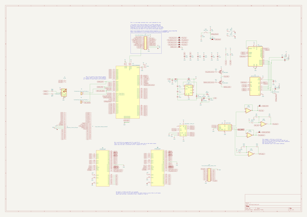
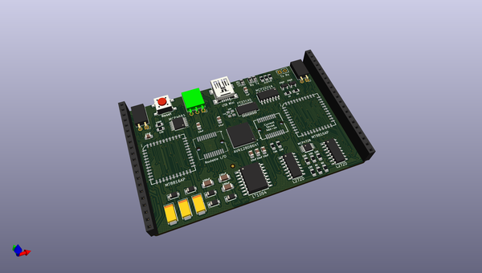
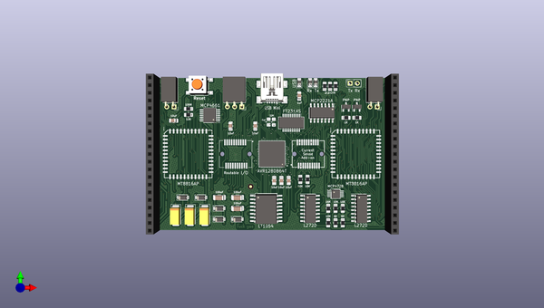
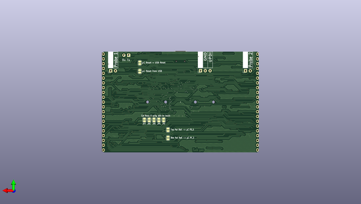

# breadware
 
## summary 
* id: architeuthis_flux_breadware_breadcontrolv3
* user: architeuthis_flux
* name: breadware
* board: breadcontrolv3
* repo: https://github.com/Architeuthis-Flux/breadWare
* src_file_repo_kicad_pcb: Jumperless/Hardware/BreadControlV3/BreadControlV3.kicad_pcb
* src_file_repo_kicad_pcb_link: https://github.com/Architeuthis-Flux/breadWare/tree/main/Jumperless/Hardware/BreadControlV3/BreadControlV3.kicad_pcb
* src_file_repo_kicad_sch: Jumperless/Hardware/BreadControlV3/BreadControlV3.kicad_sch
* src_file_repo_kicad_sch_link: https://github.com/Architeuthis-Flux/breadWare/tree/main/Jumperless/Hardware/BreadControlV3/BreadControlV3.kicad_sch

* src_file_repo_sch: 
* src_file_repo_sch_link: https://github.com/Architeuthis-Flux/breadWare/tree/main/
* full details link: https://github.com/oomlout/oomlout_oomp_project_bot_v_2/tree/main/projects/architeuthis_flux_breadware_breadcontrolv3/current_version/working  

## schematic  
  
[schematic (pdf)](working_schematic.pdf) 

## pcb  
 
  
  
  
[board (pdf)](working.pdf)  

## working_bom
| Id | Designator | Footprint | Quantity | Designation | Supplier and ref |  | None | 
| --- | --- | --- | --- | --- | --- | --- | --- | 
| 1 | D1 | D_0805_2012Metric_Pad1.15x1.40mm_HandSolder | 1 | Rx |  |  | [''] | 
| 2 | C3,C8,C4 | CP_EIA-6032-20_AVX-F_Pad2.25x2.35mm_HandSolder | 3 | 10uF |  |  | [''] | 
| 3 | R14,R12 | R_0805_2012Metric_Pad1.20x1.40mm_HandSolder | 2 | 6.04K |  |  | [''] | 
| 4 | U2 | SSOP-20_3.9x8.7mm_P0.635mm | 1 | FT231XS |  |  | [''] | 
| 5 | R15,R6,R4,R9,R3 | R_0805_2012Metric_Pad1.20x1.40mm_HandSolder | 5 | 10K |  |  | [''] | 
| 6 | R5,R2,R1 | R_0805_2012Metric_Pad1.20x1.40mm_HandSolder | 3 | 220R |  |  | [''] | 
| 7 | C9,C2,C5 | C_1206_3216Metric_Pad1.33x1.80mm_HandSolder | 3 | 100uF |  |  | [''] | 
| 8 | U5 | SOIC-16W_7.5x10.3mm_P1.27mm | 1 | LT1054xSW |  |  | [''] | 
| 9 | R10,R11 | R_0805_2012Metric_Pad1.20x1.40mm_HandSolder | 2 | 1K |  |  | [''] | 
| 10 | U1 | SOIC-14_3.9x8.7mm_P1.27mm | 1 | MCP2221A-I_SL |  |  | [''] | 
| 11 | J2 | PinHeadet_1x21Compact | 1 | Chip_Select_Measurement |  |  | [''] | 
| 12 | J6 | PinSocket_1x02_P2.54mm_Vertical | 1 | Tx_Rx |  |  | [''] | 
| 13 | U3 | VQFN-64-1EP_9x9mm_P0.5mm_EP7.15x7.15mm | 1 | AVR128DB64T |  |  | [''] | 
| 14 | J4 | USB_Mini-B_Wuerth_65100516121_Horizontal | 1 | USB_B_Mini |  |  | [''] | 
| 15 | R16,R17 | R_0805_Optional_Bridged | 2 | 22R |  |  | [''] | 
| 16 | J10,J7 | 10056847-101LF | 2 | Conn_02x10_Row_Letter_First |  |  | [''] | 
| 17 | C13,C7,C10,C11,C12,C6 | C_0805_2012Metric_Pad1.18x1.45mm_HandSolder | 6 | 10uF |  |  | [''] | 
| 18 | J3 | PinSocket_1x03_P2.54mm_Horizontal | 1 | UPDI |  |  | [''] | 
| 19 | J8 | PinSocket_1x02_P2.54mm_Horizontal | 1 | Connection_Sensing_Probes_2 |  |  | [''] | 
| 20 | J1 | PinHeadet_1x21Compact | 1 | Address_Control_Power |  |  | [''] | 
| 21 | D3 | D_0805_2012Metric_Pad1.15x1.40mm_HandSolder | 1 | USB |  |  | [''] | 
| 22 | REF**,REF**,REF** | Fiducial_1mm_Mask2mm | 3 | Fiducial_1mm_Mask2mm |  |  | [''] | 
| 23 | D8,D5,D4,D6,D7 | D_SOD-123 | 5 | 1N4001 |  |  | [''] | 
| 24 | Q2,Q1 | SOT-23 | 2 | Q_PNP_BCE |  |  | [''] | 
| 25 | U8 | MSOP-10_3x3mm_P0.5mm | 1 | MCP4728 |  |  | [''] | 
| 26 | J5,I1 | PLCC-44_16.6x16.6mm_P1.27mm | 2 | MT8816AP |  |  | [''] | 
| 27 | SW1 | SW_SPST_PTS645 | 1 | SW_Push |  |  | [''] | 
| 28 | R7 | R_0805_2012Metric_Pad1.20x1.40mm_HandSolder | 1 | 100R |  |  | [''] | 
| 29 | U4 | TSSOP-14_4.4x5mm_P0.65mm | 1 | MCP4661-104E_ST |  |  | [''] | 
| 30 | J9 | PinSocket_1x02_P2.54mm_Horizontal | 1 | Connection_Sensing_Probes_1 |  |  | [''] | 
| 31 | C1 | C_0805_2012Metric_Pad1.18x1.45mm_HandSolder | 1 | 1uF |  |  | [''] | 
| 32 | R13,R8 | R_0805_2012Metric_Pad1.20x1.40mm_HandSolder | 2 | 16K |  |  | [''] | 
| 33 | U7,U6 | SOIC-16_3.9x9.9mm_P1.27mm | 2 | L272D |  |  | [''] | 
| 34 | D2 | D_0805_2012Metric_Pad1.15x1.40mm_HandSolder | 1 | Tx |  |  | [''] | 
| 35 | JP1 | SolderJumper-2_P1.3mm_Bridged_RoundedPad1.0x1.5mm | 1 | Jumper_NC_Small |  |  | [''] | 
| 36 | JP8,JP9 | SolderJumper-2_P1.3mm_Open_RoundedPad1.0x1.5mm | 2 | SolderJumper_2_Open |  |  | [''] | 
| 37 | JP6,JP3,JP4,JP5,JP7 | SolderJumper-2_P1.3mm_Bridged_RoundedPad1.0x1.5mm | 5 | SolderJumper_2_Bridged |  |  | [''] | 
| 38 | JP2 | SolderJumper-2_P1.3mm_Bridged_RoundedPad1.0x1.5mm | 1 | USB_RESET |  |  | [''] | 

## bom_schematic
| Ref | Qnty | Value | Cmp name | Footprint | Description | Vendor | DNP | 
| --- | --- | --- | --- | --- | --- | --- | --- | 
| C1 | 1 | 1uF | C_Small | Capacitor_SMD:C_0805_2012Metric_Pad1.18x1.45mm_HandSolder | Unpolarized capacitor, small symbol |  |  | 
| C2, C5, C9 | 3 | 100uF | CP1_Small | Capacitor_SMD:C_1206_3216Metric_Pad1.33x1.80mm_HandSolder |  |  |  | 
| C3, C4, C8 | 3 | 10uF | CP1_Small | Capacitor_Tantalum_SMD:CP_EIA-6032-20_AVX-F_Pad2.25x2.35mm_HandSolder |  |  |  | 
| C6, C7, C10, C11, C12, C13 | 6 | 10uF | C_Small | Capacitor_SMD:C_0805_2012Metric_Pad1.18x1.45mm_HandSolder | Unpolarized capacitor, small symbol |  |  | 
| D1 | 1 | Rx | LED_Small | Diode_SMD:D_0805_2012Metric_Pad1.15x1.40mm_HandSolder | Light emitting diode, small symbol |  |  | 
| D2 | 1 | Tx | LED_Small | Diode_SMD:D_0805_2012Metric_Pad1.15x1.40mm_HandSolder | Light emitting diode, small symbol |  |  | 
| D3 | 1 | USB | LED_Small | Diode_SMD:D_0805_2012Metric_Pad1.15x1.40mm_HandSolder | Light emitting diode, small symbol |  |  | 
| D4, D5, D6, D7, D8 | 5 | 1N4001 | 1N4001 | Diode_SMD:D_SOD-123 | 50V 1A General Purpose Rectifier Diode, DO-41 |  |  | 
| I1 | 1 | MT8816AP | MT8816AP | Package_LCC:PLCC-44_16.6x16.6mm_P1.27mm |  |  |  | 
| J1 | 1 | Address_Control_Power | Conn_01x21_Female | Connector_PinHeader_2.54mm:PinHeader_1x21_P2.54mm_Vertical | Generic connector, single row, 01x21, script generated (kicad-library-utils/schlib/autogen/connector/) |  |  | 
| J2 | 1 | Chip_Select_Measurement | Conn_01x21_Female | Connector_PinHeader_2.54mm:PinHeader_1x21_P2.54mm_Vertical | Generic connector, single row, 01x21, script generated (kicad-library-utils/schlib/autogen/connector/) |  |  | 
| J3 | 1 | UPDI | Conn_01x03_Male | Connector_PinHeader_2.54mm:PinHeader_1x03_P2.54mm_Vertical | Generic connector, single row, 01x03, script generated (kicad-library-utils/schlib/autogen/connector/) |  |  | 
| J4 | 1 | USB_B_Mini | USB_B_Mini | Connector_USB:USB_Mini-B_Wuerth_65100516121_Horizontal | USB Mini Type B connector |  |  | 
| J5 | 1 | MT8816AP | MT8816AP | Package_LCC:PLCC-44_16.6x16.6mm_P1.27mm |  |  |  | 
| J6 | 1 | Tx_Rx | Conn_01x02_Male | Connector_PinHeader_2.54mm:PinHeader_1x02_P2.54mm_Vertical | Generic connector, single row, 01x02, script generated (kicad-library-utils/schlib/autogen/connector/) |  |  | 
| J7, J10 | 2 | Conn_02x10_Row_Letter_First | Conn_02x10_Odd_Even | 10056847-101LF:10056847-101LF | Generic connector, double row, 02x10, odd/even pin numbering scheme (row 1 odd numbers, row 2 even numbers), script generated (kicad-library-utils/schlib/autogen/connector/) |  |  | 
| J8 | 1 | Connection_Sensing_Probes_2 | Conn_01x02 | Connector_PinHeader_2.54mm:PinHeader_1x02_P2.54mm_Vertical | Generic connector, single row, 01x02, script generated (kicad-library-utils/schlib/autogen/connector/) |  |  | 
| J9 | 1 | Connection_Sensing_Probes_1 | Conn_01x02 | Connector_PinHeader_2.54mm:PinHeader_1x02_P2.54mm_Vertical | Generic connector, single row, 01x02, script generated (kicad-library-utils/schlib/autogen/connector/) |  |  | 
| JP1 | 1 | Jumper_NC_Small | Jumper_NC_Small | Jumper:SolderJumper-2_P1.3mm_Bridged_RoundedPad1.0x1.5mm |  |  |  | 
| JP2 | 1 | USB_RESET | SolderJumper_2_Bridged | Jumper:SolderJumper-2_P1.3mm_Bridged_RoundedPad1.0x1.5mm | Solder Jumper, 2-pole, closed/bridged |  |  | 
| JP3, JP4, JP5, JP6, JP7 | 5 | SolderJumper_2_Bridged | SolderJumper_2_Bridged | Jumper:SolderJumper-2_P1.3mm_Bridged_RoundedPad1.0x1.5mm | Solder Jumper, 2-pole, closed/bridged |  |  | 
| JP8, JP9 | 2 | SolderJumper_2_Open | SolderJumper_2_Open | Jumper:SolderJumper-2_P1.3mm_Open_RoundedPad1.0x1.5mm | Solder Jumper, 2-pole, open |  |  | 
| Q1, Q2 | 2 | Q_PNP_BCE | Q_PNP_BCE | Package_TO_SOT_SMD:SOT-23 | PNP transistor, base/collector/emitter |  |  | 
| R1, R2, R5 | 3 | 220R | R_Small_US | Resistor_SMD:R_0805_2012Metric_Pad1.20x1.40mm_HandSolder | Resistor, small US symbol |  |  | 
| R3, R4, R6, R9, R15 | 5 | 10K | R_Small_US | Resistor_SMD:R_0805_2012Metric_Pad1.20x1.40mm_HandSolder | Resistor, small US symbol |  |  | 
| R7 | 1 | 100R | R_Small_US | Resistor_SMD:R_0805_2012Metric_Pad1.20x1.40mm_HandSolder | Resistor, small US symbol |  |  | 
| R8, R13 | 2 | 16K | R_Small_US | Resistor_SMD:R_0805_2012Metric_Pad1.20x1.40mm_HandSolder | Resistor, small US symbol |  |  | 
| R10, R11 | 2 | 1K | R_Small_US | Resistor_SMD:R_0805_2012Metric_Pad1.20x1.40mm_HandSolder | Resistor, small US symbol |  |  | 
| R12, R14 | 2 | 6.04K | R_Small_US | Resistor_SMD:R_0805_2012Metric_Pad1.20x1.40mm_HandSolder | Resistor, small US symbol |  |  | 
| R16, R17 | 2 | 22R | R_Small_US | Resistor_SMD:R_0805_Optional_Bridged | Resistor, small US symbol |  |  | 
| SW1 | 1 | SW_Push | SW_Push | Button_Switch_SMD:SW_SPST_PTS645 | Push button switch, generic, two pins |  |  | 
| U1 | 1 | MCP2221A-I_SL | MCP2221A-I_SL | Package_SO:SOIC-14_3.9x8.7mm_P1.27mm |  |  |  | 
| U2 | 1 | FT231XS | FT231XS | Package_SO:SSOP-20_3.9x8.7mm_P0.635mm | Full Speed USB to Full Handshake UART, SSOP-20 |  |  | 
| U3 | 1 | AVR128DB64T | AVR128DB64T | Package_DFN_QFN:VQFN-64-1EP_9x9mm_P0.5mm_EP7.15x7.15mm |  |  |  | 
| U4 | 1 | MCP4661-104E_ST | MCP4661-104E_ST | Package_SO:TSSOP-14_4.4x5mm_P0.65mm |  |  |  | 
| U5 | 1 | LT1054xSW | LT1054xSW | Package_SO:SOIC-16W_7.5x10.3mm_P1.27mm | Switched-Capacitor Voltage Converter with Regulator, output current 100mA, operating range 3.5V to 15V, low loss 1.1V at 100mA, SO-16 |  |  | 
| U6, U7 | 2 | L272D | L272D | Package_SO:SOIC-16_3.9x9.9mm_P1.27mm | Dual Power Operation Amplifier, SOIC-16 |  |  | 
| U8 | 1 | MCP4728 | MCP4728 | Package_SO:MSOP-10_3x3mm_P0.5mm | 12-bit digital to analog converter, quad output, 2.048V internal reference, integrated EEPROM, I2C interface |  |  | 

