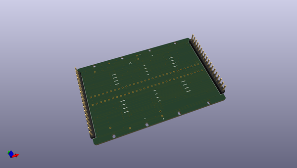

# breadware
 
## summary 
* id: architeuthis_flux_breadware_mtmatrixroundedagain
* user: architeuthis_flux
* name: breadware
* board: mtmatrixroundedagain
* repo: https://github.com/Architeuthis-Flux/breadWare
* src_file_repo_kicad_pcb: v0.2-beta/breadWare KiCad Files/MTmatrixV0.2/MTMatrix.kicad_pcb
* src_file_repo_kicad_pcb_link: https://github.com/Architeuthis-Flux/breadWare/tree/main/v0.2-beta/breadWare KiCad Files/MTmatrixV0.2/MTMatrix.kicad_pcb
* src_file_repo_kicad_sch: Jumperless/Hardware/MTMatrixV3/MTMatrixV3.kicad_sch
* src_file_repo_kicad_sch_link: https://github.com/Architeuthis-Flux/breadWare/tree/main/Jumperless/Hardware/MTMatrixV3/MTMatrixV3.kicad_sch

* src_file_repo_sch: v0.2-beta/breadWare KiCad Files/MTmatrixV0.2/MTMatrix.sch
* src_file_repo_sch_link: https://github.com/Architeuthis-Flux/breadWare/tree/main/v0.2-beta/breadWare KiCad Files/MTmatrixV0.2/MTMatrix.sch
* full details link: https://github.com/oomlout/oomlout_oomp_project_bot_v_2/tree/main/projects/architeuthis_flux_breadware_mtmatrixroundedagain/current_version/working  

## schematic  
  
[schematic (pdf)](working_schematic.pdf) 

## pcb  
 
  
  
  
[board (pdf)](working.pdf)  

## working_bom
| Id | Designator | Footprint | Quantity | Designation | Supplier and ref |  | None | 
| --- | --- | --- | --- | --- | --- | --- | --- | 
| 1 | J1 | PinHeader_1x18_P2.54mm_Vertical | 1 | Address_Control_Power |  |  | [''] | 
| 2 | J2 | PinHeader_1x18_P2.54mm_Vertical | 1 | Chip_Select_Measurement |  |  | [''] | 
| 3 | J3 | Breadboard_Top | 1 | Breadboard |  |  | [''] | 
| 4 | A0,B0,C0,D0,E0,F0,G0,H0 | PLCC-44_16.6x16.6mm_P1.27mm | 8 | MT8816AP |  |  | [''] | 
| 5 | C1,C2,C3,C4,C5,C6 | C_0805_2012Metric_Pad1.15x1.40mm_HandSolder | 6 | 10uF |  |  | [''] | 
| 6 | D1,D2,D3,D4,D5,D6,D7,D8 | LED_1206_3216Metric_ReverseMount_Hole1.8x2.4mm | 8 | LED_Small_ALT |  |  | [''] | 
| 7 | R1,R2 | R_0805_2012Metric_Pad1.15x1.40mm_HandSolder | 2 | 220R |  |  | [''] | 

## bom_schematic
| Ref | Qnty | Value | Cmp name | Footprint | Description | Vendor | DNP | 
| --- | --- | --- | --- | --- | --- | --- | --- | 
| A0 | 1 | MT8816AP | MT8816AP-MT8816 | Package_LCC:PLCC-44_16.6x16.6mm_P1.27mm |  |  |  | 
| B0 | 1 | MT8816AP | MT8816AP-MT8816 | Package_LCC:PLCC-44_16.6x16.6mm_P1.27mm |  |  |  | 
| C0 | 1 | MT8816AP | MT8816AP-MT8816 | Package_LCC:PLCC-44_16.6x16.6mm_P1.27mm |  |  |  | 
| C1, C2, C3, C4, C5, C6 | 6 | 10uF | C_Small | Capacitor_SMD:C_0805_2012Metric_Pad1.15x1.40mm_HandSolder | Unpolarized capacitor, small symbol |  |  | 
| D0 | 1 | MT8816AP | MT8816AP-MT8816 | Package_LCC:PLCC-44_16.6x16.6mm_P1.27mm |  |  |  | 
| D1, D2, D3, D4, D5, D6, D7, D8 | 8 | LED_Small_ALT | LED_Small_ALT-Device | LED_SMD:LED_1206_3216Metric_ReverseMount_Hole1.8x2.4mm |  |  |  | 
| E0 | 1 | MT8816AP | MT8816AP-MT8816 | Package_LCC:PLCC-44_16.6x16.6mm_P1.27mm |  |  |  | 
| F0 | 1 | MT8816AP | MT8816AP-MT8816 | Package_LCC:PLCC-44_16.6x16.6mm_P1.27mm |  |  |  | 
| G0 | 1 | MT8816AP | MT8816AP-MT8816 | Package_LCC:PLCC-44_16.6x16.6mm_P1.27mm |  |  |  | 
| H0 | 1 | MT8816AP | MT8816AP-MT8816 | Package_LCC:PLCC-44_16.6x16.6mm_P1.27mm |  |  |  | 
| J1 | 1 | Address_Control_Power | Conn_01x18_Female-Connector | Connector_PinHeader_2.54mm:PinHeader_1x18_P2.54mm_Vertical |  |  |  | 
| J2 | 1 | Chip_Select_Measurement | Conn_01x18_Female-Connector | Connector_PinHeader_2.54mm:PinHeader_1x18_P2.54mm_Vertical |  |  |  | 
| J3 | 1 | Breadboard | Breadboard-Connector | Footprints:Breadboard_Top |  |  |  | 
| JP1, JP2 | 2 | SolderJumper_2_Bridged | SolderJumper_2_Bridged | Jumper:SolderJumper-2_P1.3mm_Bridged_RoundedPad1.0x1.5mm | Solder Jumper, 2-pole, closed/bridged |  |  | 
| R1, R2 | 2 | 220R | R_Small_US | Resistor_SMD:R_0805_2012Metric_Pad1.15x1.40mm_HandSolder | Resistor, small US symbol |  |  | 

