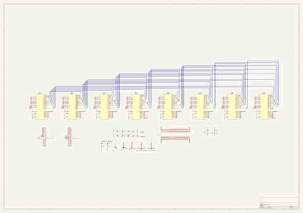

# breadware
 
## summary 
* id: architeuthis_flux_breadware_mtmatrixv3
* user: architeuthis_flux
* name: breadware
* board: mtmatrixv3
* repo: https://github.com/Architeuthis-Flux/breadWare
* src_file_repo_kicad_pcb: Jumperless/Hardware/MTMatrixV3/MTMatrixV3.kicad_pcb
* src_file_repo_kicad_pcb_link: https://github.com/Architeuthis-Flux/breadWare/tree/main/Jumperless/Hardware/MTMatrixV3/MTMatrixV3.kicad_pcb
* src_file_repo_kicad_sch: Jumperless/Hardware/MTMatrixV3/MTMatrixV3.kicad_sch
* src_file_repo_kicad_sch_link: https://github.com/Architeuthis-Flux/breadWare/tree/main/Jumperless/Hardware/MTMatrixV3/MTMatrixV3.kicad_sch

* src_file_repo_sch: 
* src_file_repo_sch_link: https://github.com/Architeuthis-Flux/breadWare/tree/main/
* full details link: https://github.com/oomlout/oomlout_oomp_project_bot_v_2/tree/main/projects/architeuthis_flux_breadware_mtmatrixv3/current_version/working  

## schematic  
  
[schematic (pdf)](working_schematic.pdf) 

## working_bom
| Id | Designator | Footprint | Quantity | Designation | Supplier and ref |  | None | 
| --- | --- | --- | --- | --- | --- | --- | --- | 
| 1 | J1 | PinHeadet_1x21Compact | 1 | Address_Control_Power |  |  | [''] | 
| 2 | J3 | BreadBoard | 1 | Breadboard |  |  | [''] | 
| 3 | J2 | PinHeadet_1x21Compact | 1 | Chip_Select_Measurement |  |  | [''] | 
| 4 | C5,C6,C4,C2,C1,C3 | C_0805_2012Metric_Pad1.18x1.45mm_HandSolder | 6 | 10uF |  |  | [''] | 
| 5 | REF**,REF**,REF** | Fiducial_1mm_Mask2mm | 3 | Fiducial_1mm_Mask2mm |  |  | [''] | 
| 6 | JP1,JP2,JP3 | SolderJumper-2_P1.3mm_Bridged_RoundedPad1.0x1.5mm | 3 | SolderJumper_2_Bridged |  |  | [''] | 
| 7 | JP7,JP5,JP6,JP4 | SolderJumper-3_P1.3mm_Bridged12_RoundedPad1.0x1.5mm | 4 | SolderJumper_3_Bridged12 |  |  | [''] | 
| 8 | D7,D6,D2,D4,D8,D3,D5,D1 | LED_1206_3216Metric_ReverseMount_Hole1.8x2.4mm | 8 | LED_Small_ALT |  |  | [''] | 
| 9 | R2,R1 | R_0805_2012Metric_Pad1.20x1.40mm_HandSolder | 2 | 220R |  |  | [''] | 
| 10 | H,B,F,D,G,C,E,A | PLCC-44_16.6x16.6mm_P1.27mm | 8 | MT8816AP |  |  | [''] | 

## bom_schematic
| Ref | Qnty | Value | Cmp name | Footprint | Description | Vendor | DNP | 
| --- | --- | --- | --- | --- | --- | --- | --- | 
| A0 | 1 | MT8816AP | MT8816AP | Package_LCC:PLCC-44_16.6x16.6mm_P1.27mm |  |  |  | 
| B0 | 1 | MT8816AP | MT8816AP | Package_LCC:PLCC-44_16.6x16.6mm_P1.27mm |  |  |  | 
| C0 | 1 | MT8816AP | MT8816AP | Package_LCC:PLCC-44_16.6x16.6mm_P1.27mm |  |  |  | 
| C1, C2, C3, C4, C5, C6 | 6 | 10uF | C_Small | Capacitor_SMD:C_0805_2012Metric_Pad1.18x1.45mm_HandSolder |  |  |  | 
| D0 | 1 | MT8816AP | MT8816AP | Package_LCC:PLCC-44_16.6x16.6mm_P1.27mm |  |  |  | 
| D1, D2, D3, D4, D5, D6, D7, D8 | 8 | LED_Small_ALT | LED_Small_ALT | LED_SMD:LED_1206_3216Metric_ReverseMount_Hole1.8x2.4mm |  |  |  | 
| E0 | 1 | MT8816AP | MT8816AP | Package_LCC:PLCC-44_16.6x16.6mm_P1.27mm |  |  |  | 
| F0 | 1 | MT8816AP | MT8816AP | Package_LCC:PLCC-44_16.6x16.6mm_P1.27mm |  |  |  | 
| G0 | 1 | MT8816AP | MT8816AP | Package_LCC:PLCC-44_16.6x16.6mm_P1.27mm |  |  |  | 
| H0 | 1 | MT8816AP | MT8816AP | Package_LCC:PLCC-44_16.6x16.6mm_P1.27mm |  |  |  | 
| J1 | 1 | Address_Control_Power | Conn_01x21_Female | Connector_PinHeader_2.54mm:PinHeader_1x21_P2.54mm_Vertical | Generic connector, single row, 01x21, script generated (kicad-library-utils/schlib/autogen/connector/) |  |  | 
| J2 | 1 | Chip_Select_Measurement | Conn_01x21_Female | Connector_PinHeader_2.54mm:PinHeader_1x21_P2.54mm_Vertical | Generic connector, single row, 01x21, script generated (kicad-library-utils/schlib/autogen/connector/) |  |  | 
| J3 | 1 | Breadboard | Breadboard | Connector:BreadBoard |  |  |  | 
| JP1, JP2, JP3 | 3 | SolderJumper_2_Bridged | SolderJumper_2_Bridged | Jumper:SolderJumper-2_P1.3mm_Bridged_RoundedPad1.0x1.5mm |  |  |  | 
| JP4 | 1 | SolderJumper_3_Bridged12 | SolderJumper_3_Bridged12 | Capacitor_SMD:C_0805_2012Metric_Pad1.18x1.45mm_HandSolder | 3-pole Solder Jumper, pins 1+2 closed/bridged |  |  | 
| JP5, JP6, JP7 | 3 | SolderJumper_3_Bridged12 | SolderJumper_3_Bridged12 | Jumper:SolderJumper-3_P1.3mm_Bridged2Bar12_RoundedPad1.0x1.5mm | 3-pole Solder Jumper, pins 1+2 closed/bridged |  |  | 
| R1, R2 | 2 | 220R | R_Small_US | Resistor_SMD:R_0805_2012Metric_Pad1.20x1.40mm_HandSolder |  |  |  | 

