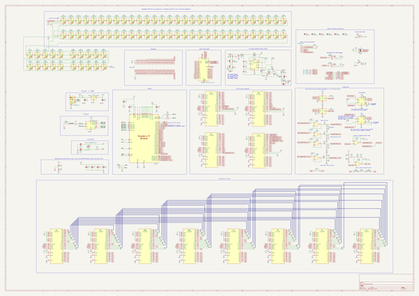
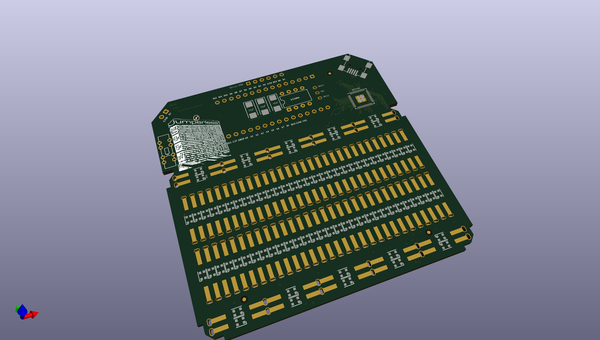
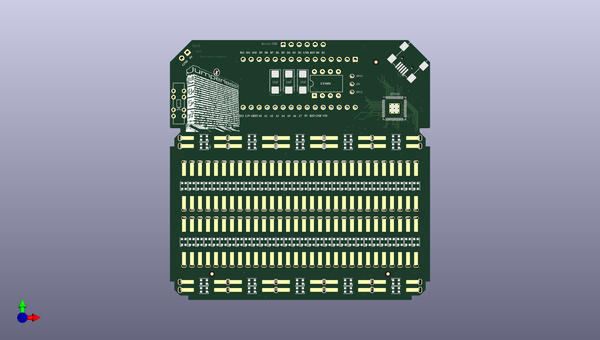
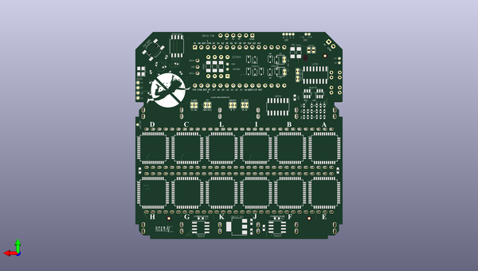

# jumperless
 
## summary 
* id: architeuthis_flux_jumperless_jumperlessrev1
* user: architeuthis_flux
* name: jumperless
* board: jumperlessrev1
* repo: https://github.com/Architeuthis-Flux/Jumperless
* src_file_repo_kicad_pcb: Hardware/KiCAD/Jumperless Rev 1/UnroutedTestPlot/JumperlessRev1.kicad_pcb
* src_file_repo_kicad_pcb_link: https://github.com/Architeuthis-Flux/Jumperless/tree/main/Hardware/KiCAD/Jumperless Rev 1/UnroutedTestPlot/JumperlessRev1.kicad_pcb
* src_file_repo_kicad_sch: Hardware/KiCAD/Jumperless Rev 1/JumperlessRev1.kicad_sch
* src_file_repo_kicad_sch_link: https://github.com/Architeuthis-Flux/Jumperless/tree/main/Hardware/KiCAD/Jumperless Rev 1/JumperlessRev1.kicad_sch

* src_file_repo_sch: 
* src_file_repo_sch_link: https://github.com/Architeuthis-Flux/Jumperless/tree/main/
* full details link: https://github.com/oomlout/oomlout_oomp_project_bot_v_2/tree/main/projects/architeuthis_flux_jumperless_jumperlessrev1/current_version/working  

## schematic  
  
[schematic (pdf)](working_schematic.pdf) 

## pcb  
 
  
  
  
[board (pdf)](working.pdf)  

## working_bom
| Id | Designator | Footprint | Quantity | Designation | Supplier and ref |  | None | 
| --- | --- | --- | --- | --- | --- | --- | --- | 
| 1 | D23,D37,D20,D25,D33,D60,D36,D83,D34,D73,D12,D11,D85,D32,D80,D9,D13,D28,D58,D74,D88,D31,D8,D48,D30,D71,D35,D1,D41,D3,D49,D72,D6,D39,D86,D54,D17,D46,D21,D24,D18,D56,D40,D50,D52,D42,D10,D15,D5,D55,D16,D19,D45,D53,D43,D14,D87,D38,D4,D82,D7,D81,D44,D2,D27,D51,D22,D57,D47,D79,D77,D84,D76,D26,D78,D75,D89,D29,D90,D59 | LED_WS2812B-2020_PLCC4_2.0x2.0mm | 80 | WS2812B |  |  | [''] | 
| 2 | J1 | PinHeader_1x03_P2.54mm_Vertical | 1 | Debug |  |  | [''] | 
| 3 | REF**,REF**,REF**,REF**,REF**,REF** | Fiducial_1mm_Mask2mm | 6 | Fiducial_1mm_Mask2mm |  |  | [''] | 
| 4 | U1 | DIP-8_W7.62mm | 1 | LT1054 |  |  | [''] | 
| 5 | J5 | USB_Mini-B_Wuerth_65100516121_Horizontal | 1 | USB_B_Mini |  |  | [''] | 
| 6 | C3,C2,C5 | CP_EIA-6032-20_AVX-F_Pad2.25x2.35mm_HandSolder | 3 | 10uF |  |  | [''] | 
| 7 | SW2 | Slide_Switch_SSSS223600 | 1 | SW_DP3T |  |  | [''] | 
| 8 | J2 | PinHeader_1x02_P2.54mm_Vertical | 1 | Conn_01x02 |  |  | [''] | 
| 9 | J3 | PinHeader_1x06_P2.54mm_Vertical | 1 | SERIAL USB |  |  | [''] | 
| 10 | J4 | Breadboard_CustomClips_Fallback | 1 | Breadboard |  |  | [''] | 
| 11 | A1 | Arduino_Nano | 1 | Arduino_Nano_v3.x |  |  | [''] | 
| 12 | U9 | RP2040-QFN-56 | 1 | RP2040 |  |  | [''] | 
| 13 | C12,C21,C9,C19,C18,C11,C20 | C_0402_1005Metric | 7 | 1u |  |  | [''] | 
| 14 | F1,F4 | Fuse_1206_3216Metric_Pad1.42x1.75mm_HandSolder | 2 | PTC Fuse |  |  | [''] | 
| 15 | TP1 | TestPoint_Pad_D1.0mm | 1 | GPIO 16 |  |  | [''] | 
| 16 | C6,C4,C1 | C_1206_3216Metric_Pad1.33x1.80mm_HandSolder | 3 | 100uF |  |  | [''] | 
| 17 | TP2 | TestPoint_Pad_D1.0mm | 1 | GPIO 17 |  |  | [''] | 
| 18 | TP6 | TestPoint_D0.75mm | 1 | VREF |  |  | [''] | 
| 19 | R16,R15,R19 | R_0402_1005Metric | 3 | 47K |  |  | [''] | 
| 20 | D62,D68,D61,D65,D67 | D_SOD-323 | 5 | 1N5819 |  |  | [''] | 
| 21 | R22,R11,R23,R21,R7,R8,R9,R10,R6 | R_0402_1005Metric | 9 | 1K |  |  | [''] | 
| 22 | JP6,JP5 | SolderJumper_2_Open_Small | 2 | SolderJumper_2_Open |  |  | [''] | 
| 23 | D66,D63,D69,D64 | D_SOD-323 | 4 | 1N4148 |  |  | [''] | 
| 24 | F5,I1,D70,L1,J6,A2,G1,B1,E1,H1,C26,K1 | LQFP44_Tight | 12 | CH446Q |  |  | [''] | 
| 25 | R4,R1 | R_0603_1608Metric | 2 | 2Ω |  |  | [''] | 
| 26 | JP14,JP7,JP3,JP13,JP9,JP10 | SolderJumper_2_Bridged_Small | 6 | Jumper_2_Bridged |  |  | [''] | 
| 27 | R13,R14 | R_0402_1005Metric | 2 | 21K |  |  | [''] | 
| 28 | U5,U3 | SOT-23-6 | 2 | MCP4725 |  |  | [''] | 
| 29 | TP4 | TestPoint_Pad_D1.0mm | 1 | GPIO 19 |  |  | [''] | 
| 30 | C14,C13 | C_0402_1005Metric | 2 | 27p |  |  | [''] | 
| 31 | TP15 | TestPoint_D0.75mm | 1 | LED DOUT |  |  | [''] | 
| 32 | R17,R20,R18 | R_0402_1005Metric | 3 | 68K |  |  | [''] | 
| 33 | JP12 | SolderJumper_2_Bridged_Small | 1 | DAC_PWR- |  |  | [''] | 
| 34 | SW1 | SW_SPST_TL3342 | 1 | USB BOOT |  |  | [''] | 
| 35 | TP8 | TestPoint_D0.75mm | 1 | +-8V DAC |  |  | [''] | 
| 36 | TP7 | TestPoint_D0.75mm | 1 | 0-5V DAC |  |  | [''] | 
| 37 | C8,C7 | C_0603_1608Metric | 2 | 10u |  |  | [''] | 
| 38 | R3,R2 | R_0402_1005Metric | 2 | 22R |  |  | [''] | 
| 39 | C23,C16,C22,C25 | C_0603_1608Metric | 4 | 10uF |  |  | [''] | 
| 40 | Y1 | Crystal_SMD_3225-4Pin_3.2x2.5mm | 1 | ABLS-12.000MHZ-B4-T |  |  | [''] | 
| 41 | JP1 | SolderJumper_2_Bridged_Small | 1 | NANO 3V3 |  |  | [''] | 
| 42 | U7 | SOIC-14_3.9x8.7mm_P1.27mm | 1 | LM324 |  |  | [''] | 
| 43 | U10 | SOIC-16_3.9x9.9mm_P1.27mm | 1 | L272D |  |  | [''] | 
| 44 | TP10 | TestPoint_D0.75mm | 1 | ADC 1 |  |  | [''] | 
| 45 | TP3 | TestPoint_Pad_D1.0mm | 1 | GPIO 18 |  |  | [''] | 
| 46 | U8 | SOIC-8_5.23x5.23mm_P1.27mm | 1 | W25Q128JVS |  |  | [''] | 
| 47 | R12,R5 | R_0402_1005Metric | 2 | 1k |  |  | [''] | 
| 48 | TP12 | TestPoint_D0.75mm | 1 | ADC 3 |  |  | [''] | 
| 49 | TP13 | TestPoint_D0.75mm | 1 | -8V |  |  | [''] | 
| 50 | TP14 | TestPoint_D0.75mm | 1 | +8V |  |  | [''] | 
| 51 | TP5 | TestPoint_D0.75mm | 1 | FB/SHDN |  |  | [''] | 
| 52 | JP2 | SolderJumper_2_Bridged_Small | 1 | NANO 5V |  |  | [''] | 
| 53 | U6,U4 | SOIC-8_3.9x4.9mm_P1.27mm | 2 | INA219 |  |  | [''] | 
| 54 | U2 | SOT-223-3_TabPin2 | 1 | NCP1117-3.3_SOT223 |  |  | [''] | 
| 55 | JP4,JP8 | SolderJumper_2_Bridged_Small | 2 | SolderJumper_2_Bridged |  |  | [''] | 
| 56 | TP9 | TestPoint_D0.75mm | 1 | ADC 0 |  |  | [''] | 
| 57 | TP11 | TestPoint_D0.75mm | 1 | ADC 2 |  |  | [''] | 
| 58 | JP11 | SolderJumper_2_Bridged_Small | 1 | DAC_PWR+ |  |  | [''] | 

## bom_schematic
| Ref | Qnty | Value | Cmp name | Footprint | Description | Vendor | DNP | 
| --- | --- | --- | --- | --- | --- | --- | --- | 
| A1 | 1 | Arduino_Nano_v3.x | Arduino_Nano_v3.x | Module:Arduino_Nano | Arduino Nano v3.x |  |  | 
| A2 | 1 | CH446Q | CH446Q | Package_QFP:LQFP44_Tight |  |  |  | 
| B1 | 1 | CH446Q | CH446Q | Package_QFP:LQFP44_Tight |  |  |  | 
| C1, C4, C6 | 3 | 100uF | CP1_Small | Capacitor_SMD:C_1206_3216Metric_Pad1.33x1.80mm_HandSolder |  |  |  | 
| C2, C3, C5 | 3 | 10uF | CP1_Small | Capacitor_Tantalum_SMD:CP_EIA-6032-20_AVX-F_Pad2.25x2.35mm_HandSolder |  |  |  | 
| C7, C8 | 2 | 10u | C | Capacitor_SMD:C_0603_1608Metric | Unpolarized capacitor |  |  | 
| C9, C11, C12, C18, C19, C20, C21 | 7 | 1u | C | Capacitor_SMD:C_0402_1005Metric | Unpolarized capacitor |  |  | 
| C13, C14 | 2 | 27p | C | Capacitor_SMD:C_0402_1005Metric | Unpolarized capacitor |  |  | 
| C16, C25 | 2 | 10uF | C_Small | Capacitor_SMD:C_0603_1608Metric |  |  |  | 
| C26 | 1 | CH446Q | CH446Q | Package_QFP:LQFP44_Tight |  |  |  | 
| D1, D2, D3, D4, D5, D6, D7, D8, D9, D10, D11, D12, D13, D14, D15, D16, D17, D18, D19, D20, D21, D22, D23, D24, D25, D26, D27, D28, D29, D30, D31, D32, D33, D34, D35, D36, D37, D38, D39, D40, D41, D42, D43, D44, D45, D46, D47, D48, D49, D50, D51, D52, D53, D54, D55, D56, D57, D58, D59, D60, D71, D72, D73, D74, D75, D76, D77, D78, D79, D80, D81, D82, D83, D84, D85, D86, D87, D88, D89, D90 | 80 | WS2812B | WS2812B_7 | LED_SMD:LED_WS2812B_PLCC4_5.0x5.0mm_P3.2mm | RGB LED with integrated controller |  |  | 
| D61, D62, D65, D67, D68 | 5 | 1N5819 | 1N5819 | Diode_THT:D_DO-41_SOD81_P10.16mm_Horizontal | 40V 1A Schottky Barrier Rectifier Diode, DO-41 |  |  | 
| D63, D64, D66, D69 | 4 | 1N4148 | 1N4148W | Diode_SMD:D_SOD-123 | 75V 0.15A Fast Switching Diode, SOD-123 |  |  | 
| D70 | 1 | CH446Q | CH446Q | Package_QFP:LQFP44_Tight |  |  |  | 
| D91 | 1 | LED | LED | LED_SMD:LED_1206_REVERSEMOUNT_OVAL | Light emitting diode |  |  | 
| E1 | 1 | CH446Q | CH446Q | Package_QFP:LQFP44_Tight |  |  |  | 
| F1 | 1 | FUSE | Polyfuse_Small | Fuse:Fuse_1206_3216Metric_Pad1.42x1.75mm_HandSolder | Resettable fuse, polymeric positive temperature coefficient, small symbol |  |  | 
| F4 | 1 | PTC Fuse | Polyfuse_Small | Fuse:Fuse_1206_3216Metric_Pad1.42x1.75mm_HandSolder | Resettable fuse, polymeric positive temperature coefficient, small symbol |  |  | 
| F5 | 1 | CH446Q | CH446Q | Package_QFP:LQFP44_Tight |  |  |  | 
| FID1, FID2, FID3, FID4, FID5, FID6 | 6 | Fiducial | Fiducial | Fiducial:Fiducial_1mm_Mask2mm | Fiducial Marker |  |  | 
| G1 | 1 | CH446Q | CH446Q | Package_QFP:LQFP44_Tight |  |  |  | 
| H1 | 1 | CH446Q | CH446Q | Package_QFP:LQFP44_Tight |  |  |  | 
| I1 | 1 | CH446Q | CH446Q | Package_QFP:LQFP44_Tight |  |  |  | 
| J1 | 1 | Debug | Conn_01x03_Socket | Connector_PinHeader_2.54mm:PinHeader_1x03_P2.54mm_Vertical | Generic connector, single row, 01x03, script generated |  |  | 
| J2 | 1 | Conn_01x02 | Conn_01x02 | Connector_PinHeader_2.54mm:PinHeader_1x02_P2.54mm_Vertical | Generic connector, single row, 01x02, script generated (kicad-library-utils/schlib/autogen/connector/) |  |  | 
| J3 | 1 | SERIAL-USB | Conn_01x06_Pin_1 | Connector_PinHeader_2.54mm:PinHeader_1x06_P2.54mm_Vertical | Generic connector, single row, 01x06, script generated |  |  | 
| J4 | 1 | Breadboard | Breadboard | Connector:Breadboard_CustomClips_Fallback |  |  |  | 
| J5 | 1 | USB_B_Mini | USB_B_Micro | Connector_USB:USB_Mini-B_Wuerth_65100516121_Horizontal | USB Micro Type B connector |  |  | 
| J6 | 1 | CH446Q | CH446Q | Package_QFP:LQFP44_Tight |  |  |  | 
| JP1 | 1 | NANO 3V3 | SolderJumper_2_Bridged | Jumper:SolderJumper_2_Bridged_Small | Solder Jumper, 2-pole, closed/bridged |  |  | 
| JP2 | 1 | NANO 5V | SolderJumper_2_Bridged | Jumper:SolderJumper_2_Bridged_Small | Solder Jumper, 2-pole, closed/bridged |  |  | 
| JP3, JP7, JP9, JP10, JP13, JP14 | 6 | Jumper_2_Bridged | Jumper_2_Bridged | Jumper:SolderJumper_2_Bridged_Small | Jumper, 2-pole, closed/bridged |  |  | 
| JP4, JP8 | 2 | SolderJumper_2_Bridged | SolderJumper_2_Bridged | Jumper:SolderJumper_2_Bridged_Small | Solder Jumper, 2-pole, closed/bridged |  |  | 
| JP5, JP6 | 2 | SolderJumper_2_Open | SolderJumper_2_Open | Jumper:SolderJumper_2_Open_Small | Solder Jumper, 2-pole, open |  |  | 
| JP11 | 1 | DAC_PWR+ | Jumper_2_Bridged | Jumper:SolderJumper_2_Bridged_Small | Jumper, 2-pole, closed/bridged |  |  | 
| JP12 | 1 | DAC_PWR- | Jumper_2_Bridged | Jumper:SolderJumper_2_Bridged_Small | Jumper, 2-pole, closed/bridged |  |  | 
| K1 | 1 | CH446Q | CH446Q | Package_QFP:LQFP44_Tight |  |  |  | 
| L1 | 1 | CH446Q | CH446Q | Package_QFP:LQFP44_Tight |  |  |  | 
| R1, R4 | 2 | 2Ω | R_Small_US_1 | Resistor_SMD:R_0603_1608Metric | Resistor, small US symbol |  |  | 
| R2, R3 | 2 | 22R | R | Resistor_SMD:R_0402_1005Metric | Resistor |  |  | 
| R5, R12 | 2 | 1k | R | Resistor_SMD:R_0402_1005Metric | Resistor |  |  | 
| R6, R7, R8, R9, R10, R11, R21, R22, R23, R24 | 10 | 1K | R_Small_US_2 | Resistor_SMD:R_0402_1005Metric | Resistor, small US symbol |  |  | 
| R13, R14 | 2 | 21K | R_Small_US_3 | Resistor_SMD:R_0402_1005Metric | Resistor, small US symbol |  |  | 
| R15, R16, R19 | 3 | 47K | R_Small_US_3 | Resistor_SMD:R_0402_1005Metric | Resistor, small US symbol |  |  | 
| R17, R18, R20 | 3 | 68K | R_Small_US | Resistor_SMD:R_0402_1005Metric |  |  |  | 
| SW1 | 1 | USB BOOT | SW_Push | Button_Switch_SMD:SW_SPST_TL3342 | Push button switch, generic, two pins |  |  | 
| SW2 | 1 | SW_DP3T | SW_DP3T | Button_Switch_THT:Slide_Switch_SSSS223600 | Switch, three position, dual pole triple throw, 3 position switch, SP3T |  |  | 
| TP1 | 1 | GPIO 16 | TestPoint | TestPoint:TestPoint_Pad_D1.0mm | test point |  |  | 
| TP2 | 1 | GPIO 17 | TestPoint | TestPoint:TestPoint_Pad_D1.0mm | test point |  |  | 
| TP3 | 1 | GPIO 18 | TestPoint | TestPoint:TestPoint_Pad_D1.0mm | test point |  |  | 
| TP4 | 1 | GPIO 19 | TestPoint | TestPoint:TestPoint_Pad_D1.0mm | test point |  |  | 
| TP5 | 1 | FB/SHDN | TestPoint | TestPoint:TestPoint_D0.75mm | test point |  |  | 
| TP6 | 1 | VREF | TestPoint | TestPoint:TestPoint_D0.75mm | test point |  |  | 
| TP7 | 1 | 0-5V DAC | TestPoint | TestPoint:TestPoint_D0.75mm | test point |  |  | 
| TP8 | 1 | +-8V DAC | TestPoint | TestPoint:TestPoint_D0.75mm | test point |  |  | 
| TP9 | 1 | ADC 0 | TestPoint | TestPoint:TestPoint_D0.75mm | test point |  |  | 
| TP10 | 1 | ADC 1 | TestPoint | TestPoint:TestPoint_D0.75mm | test point |  |  | 
| TP11 | 1 | ADC 2 | TestPoint | TestPoint:TestPoint_D0.75mm | test point |  |  | 
| TP12 | 1 | ADC 3 | TestPoint | TestPoint:TestPoint_D0.75mm | test point |  |  | 
| TP13 | 1 | -8V | TestPoint | TestPoint:TestPoint_D0.75mm | test point |  |  | 
| TP14 | 1 | +8V | TestPoint | TestPoint:TestPoint_D0.75mm | test point |  |  | 
| TP15 | 1 | LED DOUT | TestPoint | TestPoint:TestPoint_D0.75mm | test point |  |  | 
| U1 | 1 | LT1054 | LT1054L | Package_DIP:DIP-8_W7.62mm | Switched-Capacitor Voltage Converter with Regulator, output current 125mA, operating range 3.5V to 15V, low loss 1.1V at 100mA, DIP-8/SO-8 |  |  | 
| U2 | 1 | NCP1117-3.3_SOT223 | NCP1117-3.3_SOT223 | Package_TO_SOT_SMD:SOT-223-3_TabPin2 | 1A Low drop-out regulator, Fixed Output 3.3V, SOT-223 |  |  | 
| U3, U5 | 2 | MCP4725 | MCP4725xxx-xCH | Package_TO_SOT_SMD:SOT-23-6 | 12-bit Digital-to-Analog Converter, integrated EEPROM, I2C interface, SOT-23-6 |  |  | 
| U4, U6 | 2 | INA219 | INA219AxD | Package_SO:SOIC-8_3.9x4.9mm_P1.27mm | Zero-Drift, Bidirectional Current/Power Monitor (0-26V) With I2C Interface, SOIC-8 |  |  | 
| U7 | 1 | LM324 | LM324 | Package_SO:SOIC-14_3.9x8.7mm_P1.27mm | Low-Power, Quad-Operational Amplifiers, DIP-14/SOIC-14/SSOP-14 |  |  | 
| U8 | 1 | W25Q128JVS | W25Q128JVS | Package_SO:SOIC-8_5.23x5.23mm_P1.27mm |  |  |  | 
| U9 | 1 | RP2040 | RP2040 | RP2040_minimal:RP2040-QFN-56 |  |  |  | 
| U10 | 1 | L272D | L272D | Package_SO:SOIC-16_3.9x9.9mm_P1.27mm | Dual Power Operation Amplifier, SOIC-16 |  |  | 
| Y1 | 1 | ABLS-12.000MHZ-B4-T | Crystal_GND24_Small | Crystal:Crystal_SMD_3225-4Pin_3.2x2.5mm | Four pin crystal, GND on pins 2 and 4, small symbol |  |  | 

