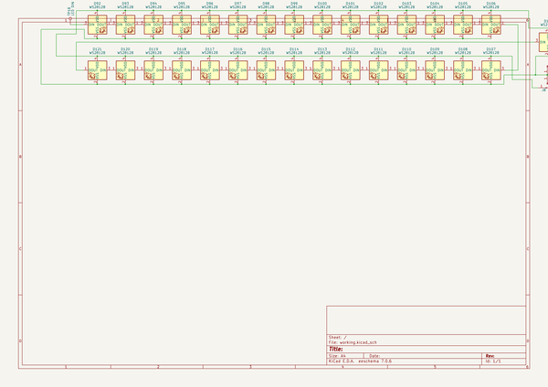
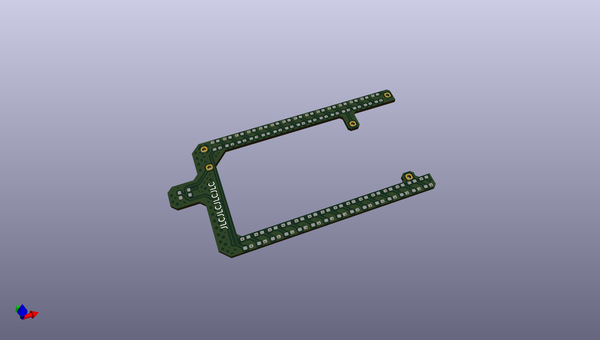
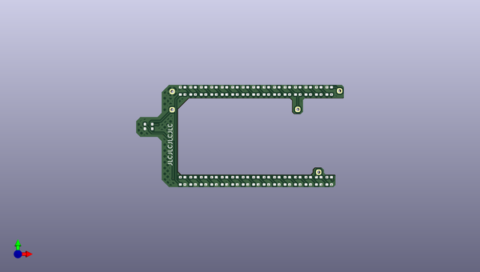
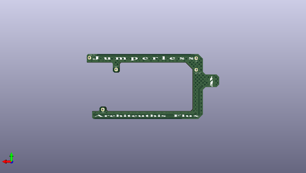

# jumperless
 
## summary 
* id: architeuthis_flux_jumperless_ledboardrev3
* user: architeuthis_flux
* name: jumperless
* board: ledboardrev3
* repo: https://github.com/Architeuthis-Flux/Jumperless
* src_file_repo_kicad_pcb: Hardware/KiCAD/LED Board Rev 3/LEDboardRev3.kicad_pcb
* src_file_repo_kicad_pcb_link: https://github.com/Architeuthis-Flux/Jumperless/tree/main/Hardware/KiCAD/LED Board Rev 3/LEDboardRev3.kicad_pcb
* src_file_repo_kicad_sch: Hardware/KiCAD/LED Board Rev 3/LEDboardRev3.kicad_sch
* src_file_repo_kicad_sch_link: https://github.com/Architeuthis-Flux/Jumperless/tree/main/Hardware/KiCAD/LED Board Rev 3/LEDboardRev3.kicad_sch

* src_file_repo_sch: 
* src_file_repo_sch_link: https://github.com/Architeuthis-Flux/Jumperless/tree/main/
* full details link: https://github.com/oomlout/oomlout_oomp_project_bot_v_2/tree/main/projects/architeuthis_flux_jumperless_ledboardrev3/current_version/working  

## schematic  
  
[schematic (pdf)](working_schematic.pdf) 

## pcb  
 
  
  
  
[board (pdf)](working.pdf)  

## working_bom
| Id | Designator | Footprint | Quantity | Designation | Supplier and ref |  | None | 
| --- | --- | --- | --- | --- | --- | --- | --- | 
| 1 | D116,D119,D98,D106,D99,D95,D108,D109,D118,D115,D112,D110,D101,D94,D96,D111,D117,D105,D93,D114,D122,D107,D103,D97,D92,D104,D120,D100,D113,D102,D121 | ws2812c-2020-noSolk | 31 | WS2812B |  |  | [''] | 
| 2 | J10,J9 | PINHEADER-1x1_vertical | 2 | GND |  |  | [''] | 
| 3 | TP19 | PINHEADER-1x1_vertical | 1 | LED OUT |  |  | [''] | 
| 4 | TP18 | PINHEADER-1x1_vertical | 1 | LED IN |  |  | [''] | 
| 5 | J8 | PINHEADER-1x1_vertical | 1 | 5V |  |  | [''] | 

## bom_schematic
| Ref | Qnty | Value | Cmp name | Footprint | Description | Vendor | DNP | 
| --- | --- | --- | --- | --- | --- | --- | --- | 
| D92, D93, D94, D95, D96, D97, D98, D99, D100, D101, D102, D103, D104, D105, D106, D107, D108, D109, D110, D111, D112, D113, D114, D115, D116, D117, D118, D119, D120, D121, D122 | 31 | WS2812B | WS2812B_43 | JumperlessFootprints:ws2812c-2020-noSolk | RGB LED with integrated controller |  |  | 
| J8, J14 | 2 | 5V | Conn_01x01_Pin | JumperlessFootprints:PINHEADER-1x1_vertical | Generic connector, single row, 01x01, script generated |  |  | 
| J9, J10 | 2 | GND | Conn_01x01_Pin | JumperlessFootprints:PINHEADER-1x1_vertical | Generic connector, single row, 01x01, script generated |  |  | 
| TP15 | 1 | LED DOUT | TestPoint | JumperlessFootprints:TestPoint_Pad_D1.0mm | test point |  |  | 
| TP18 | 1 | LED DIN | TestPoint | JumperlessFootprints:PINHEADER-1x1_vertical | test point |  |  | 
| TP19, TP21 | 2 | LED DOUT | TestPoint | JumperlessFootprints:PINHEADER-1x1_vertical | test point |  |  | 

