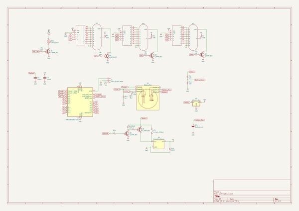
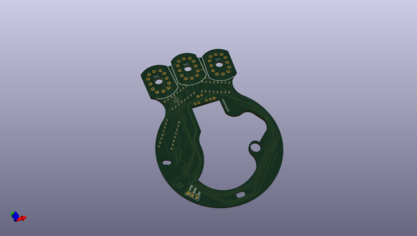
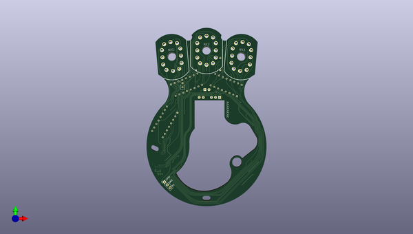
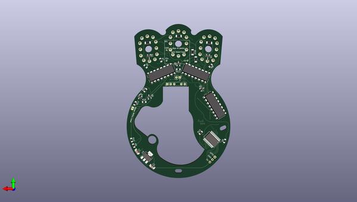

# rota
 
## summary 
* id: architeuthis_flux_rota_rotaduck
* user: architeuthis_flux
* name: rota
* board: rotaduck
* repo: https://github.com/Architeuthis-Flux/Rota
* src_file_repo_kicad_pcb: RotaDuck/Hardware/Rotaduck.kicad_pcb
* src_file_repo_kicad_pcb_link: https://github.com/Architeuthis-Flux/Rota/tree/main/RotaDuck/Hardware/Rotaduck.kicad_pcb
* src_file_repo_kicad_sch: RotaDuck/Hardware/Rotaduck.kicad_sch
* src_file_repo_kicad_sch_link: https://github.com/Architeuthis-Flux/Rota/tree/main/RotaDuck/Hardware/Rotaduck.kicad_sch

* src_file_repo_sch: 
* src_file_repo_sch_link: https://github.com/Architeuthis-Flux/Rota/tree/main/
* full details link: https://github.com/oomlout/oomlout_oomp_project_bot_v_2/tree/main/projects/architeuthis_flux_rota_rotaduck/current_version/working  

## schematic  
  
[schematic (pdf)](working_schematic.pdf) 

## pcb  
 
  
  
  
[board (pdf)](working.pdf)  

## working_bom
| Id | Designator | Footprint | Quantity | Designation | Supplier and ref |  | None | 
| --- | --- | --- | --- | --- | --- | --- | --- | 
| 1 | NX3,NX2,NX1 | nixies-us-IN-12-DSUB | 3 | IN-12BNOHOLE |  |  | [''] | 
| 2 | J1 | PinHeader_1x03_P2.54mm_Vertical | 1 | Conn_01x03_Male |  |  | [''] | 
| 3 | NE1 | PinHeader_1x02_P2.54mm_Vertical | 1 | Lamp_Neon |  |  | [''] | 
| 4 | R16,R11,R13 | R_0805_2012Metric_Pad1.20x1.40mm_HandSolder | 3 | 1K |  |  | [''] | 
| 5 | C1,C2 | C_1206_3216Metric_Pad1.33x1.80mm_HandSolder | 2 | 100uF |  |  | [''] | 
| 6 | U1 | PinHeader_1x06_P2.54mm_Vertical | 1 | Rotary_Dial |  |  | [''] | 
| 7 | R10,R15,R12,R9,R6,R8,R5,R7 | R_0805_2012Metric_Pad1.20x1.40mm_HandSolder | 8 | 10K |  |  | [''] | 
| 8 | U2 | SSOP-28_5.3x10.2mm_P0.65mm | 1 | AVR128DB28x-xSS |  |  | [''] | 
| 9 | Q1,Q4,Q5,Q3,Q2 | SOT-23 | 5 | Q_NPN_BEC |  |  | [''] | 
| 10 | M1,M3,M2 | DIP_16_SmallPads | 3 | 74141DIP16 |  |  | [''] | 
| 11 | R14 | R_1206_3216Metric_Pad1.30x1.75mm_HandSolder | 1 | 220K |  |  | [''] | 
| 12 | JP1 | SolderJumper-2_P1.3mm_Open_RoundedPad1.0x1.5mm | 1 | Jumper_2_Open |  |  | [''] | 
| 13 | M4 | Nixie_HV_Module_Small | 1 | Nixie_HV_Module |  |  | [''] | 
| 14 | U3 | SOT-223-3_TabPin2 | 1 | AZ1117-5.0 |  |  | [''] | 
| 15 | R1,R4,R3,R2 | R_1206_3216Metric_Pad1.30x1.75mm_HandSolder | 4 | 10K |  |  | [''] | 
| 16 | BT1 | PinHeader_1x02_P2.54mm_Vertical | 1 | Battery_Cell |  |  | [''] | 
| 17 | Q6 | SOT-23 | 1 | Q_PNP_BEC |  |  | [''] | 

## bom_schematic
| Ref | Qnty | Value | Cmp name | Footprint | Description | Vendor | DNP | 
| --- | --- | --- | --- | --- | --- | --- | --- | 
| BT1 | 1 | Battery_Cell | Battery_Cell | Connector_PinHeader_2.54mm:PinHeader_1x02_P2.54mm_Vertical | Single-cell battery |  |  | 
| C1, C2 | 2 | 100uF | C | Capacitor_SMD:C_1206_3216Metric_Pad1.33x1.80mm_HandSolder | Unpolarized capacitor |  |  | 
| J1 | 1 | Conn_01x03_Male | Conn_01x03_Male | Connector_PinHeader_2.54mm:PinHeader_1x03_P2.54mm_Vertical | Generic connector, single row, 01x03, script generated (kicad-library-utils/schlib/autogen/connector/) |  |  | 
| JP1 | 1 | Jumper_2_Open | Jumper_2_Open | Jumper:SolderJumper-2_P1.3mm_Open_RoundedPad1.0x1.5mm | Jumper, 2-pole, open |  |  | 
| M1, M2, M3 | 3 | 74141DIP16 | 74141DIP16 | Package_DIP:DIP-16_W7.62mm |  |  |  | 
| M4 | 1 | Nixie_HV_Module | Nixie_HV_Module | Module:Nixie_HV_Module_Small |  |  |  | 
| NE1 | 1 | Lamp_Neon | Lamp_Neon | Connector_PinHeader_2.54mm:PinHeader_1x02_P2.54mm_Vertical | Neon lamp |  |  | 
| NX1, NX2, NX3 | 3 | IN-12BNOHOLE | IN-12BNOHOLE | nixies-us:nixies-us-IN-12-DSUB |  |  |  | 
| Q1, Q2, Q3, Q4, Q5 | 5 | Q_NPN_BEC | Q_NPN_BEC | Package_TO_SOT_SMD:SOT-23 | NPN transistor, base/emitter/collector |  |  | 
| Q6 | 1 | Q_PNP_BEC | Q_PNP_BEC | Package_TO_SOT_SMD:SOT-23 | PNP transistor, base/emitter/collector |  |  | 
| R1 | 1 | 47K | R_Small_US | Resistor_SMD:R_1206_3216Metric_Pad1.30x1.75mm_HandSolder | Resistor, small US symbol |  |  | 
| R2, R3, R4 | 3 | 10K | R_Small_US | Resistor_SMD:R_1206_3216Metric_Pad1.30x1.75mm_HandSolder | Resistor, small US symbol |  |  | 
| R5, R6, R7, R8, R9, R10, R12, R15 | 8 | 10K | R_Small_US | Resistor_SMD:R_0805_2012Metric_Pad1.20x1.40mm_HandSolder | Resistor, small US symbol |  |  | 
| R11, R13, R16 | 3 | 1K | R_Small_US | Resistor_SMD:R_0805_2012Metric_Pad1.20x1.40mm_HandSolder | Resistor, small US symbol |  |  | 
| R14 | 1 | 220K | R_Small_US | Resistor_SMD:R_1206_3216Metric_Pad1.30x1.75mm_HandSolder | Resistor, small US symbol |  |  | 
| U1 | 1 | Rotary_Dial | Rotary_Dial | Connector_PinHeader_2.54mm:PinHeader_1x06_P2.54mm_Vertical |  |  |  | 
| U2 | 1 | AVR128DB28x-xSS | AVR128DB28x-xSS | Package_SO:SSOP-28_5.3x10.2mm_P0.65mm | 24MHz, 128kB Flash, 16kB SRAM, EEPROM with Op Amps and Multi-Voltage I/O, SSOP-28 |  |  | 
| U3 | 1 | AZ1117-5.0 | AZ1117-5.0 | Package_TO_SOT_SMD:SOT-223-3_TabPin2 | 1A 20V Fixed LDO Linear Regulator, 5.0V, SOT-89/SOT-223/TO-220/TO-252/TO-263 |  |  | 

