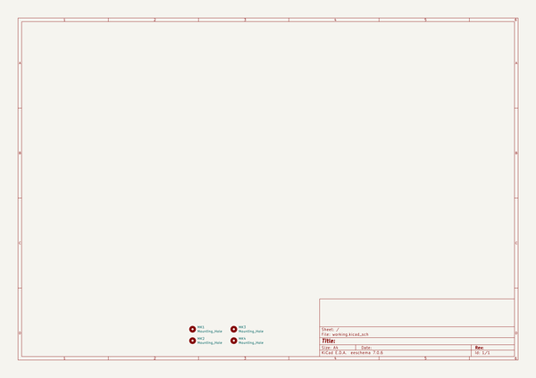

# kicad_library
 
## summary 
* id: ashtonchase_kicad_library_1593k_enclosure
* user: ashtonchase
* name: kicad_library
* board: 1593k_enclosure
* repo: https://github.com/ashtonchase/kicad-library
* src_file_repo_kicad_pcb: template/1593K_Enclosure/1593K_Enclosure.kicad_pcb
* src_file_repo_kicad_pcb_link: https://github.com/ashtonchase/kicad-library/tree/master/template/1593K_Enclosure/1593K_Enclosure.kicad_pcb

* src_file_repo_sch: template/1593K_Enclosure/1593K_Enclosure.sch
* src_file_repo_sch_link: https://github.com/ashtonchase/kicad-library/tree/master/template/1593K_Enclosure/1593K_Enclosure.sch
* full details link: https://github.com/oomlout/oomlout_oomp_project_bot_v_2/tree/main/projects/ashtonchase_kicad_library_1593k_enclosure/current_version/working  

## schematic  
  
[schematic (pdf)](working_schematic.pdf) 

## pcb  
 
  
  
  
[board (pdf)](working.pdf)  

## working_bom
| Id | Designator | Footprint | Quantity | Designation | Supplier and ref |  | None | 
| --- | --- | --- | --- | --- | --- | --- | --- | 
| 1 | MK1,MK2,MK3,MK4 | MountingHole_3.2mm_M3_ISO14580 | 4 | MountingHole_3.2mm_M3_ISO14580 |  |  | [''] | 

## bom_schematic
| Ref | Qnty | Value | Cmp name | Footprint | Description | Vendor | DNP | 
| --- | --- | --- | --- | --- | --- | --- | --- | 
| MK1, MK2, MK3, MK4 | 4 | Mounting_Hole | Mounting_Hole | Mounting_Holes:MountingHole_3.2mm_M3_ISO7380 | Mounting Hole without connection |  |  | 

## mounting_holes
| x | y | package | value | ref | size | 
| --- | --- | --- | --- | --- | --- | 
| 0.0 | 28.0 | MountingHole_3.2mm_M3_ISO14580 | MountingHole_3.2mm_M3_ISO14580 | MK1 | m3 | 
| 28.0 | 28.0 | MountingHole_3.2mm_M3_ISO14580 | MountingHole_3.2mm_M3_ISO14580 | MK2 | m3 | 
| 0.0 | 0.0 | MountingHole_3.2mm_M3_ISO14580 | MountingHole_3.2mm_M3_ISO14580 | MK3 | m3 | 
| 28.0 | 0.0 | MountingHole_3.2mm_M3_ISO14580 | MountingHole_3.2mm_M3_ISO14580 | MK4 | m3 | 

