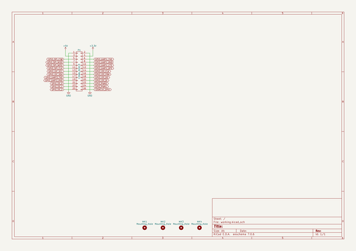
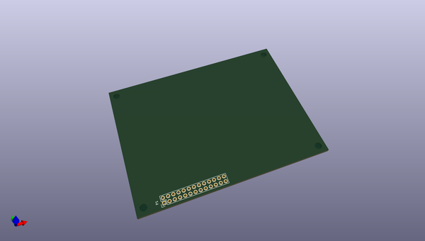
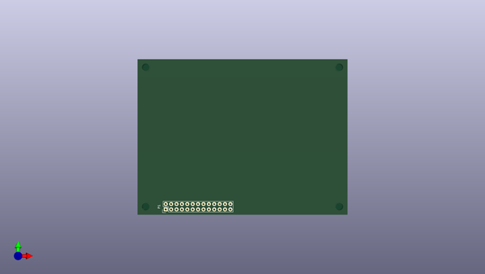
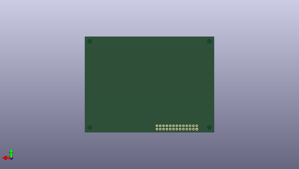

# kicad_library
 
## summary 
* id: ashtonchase_kicad_library_minnowboard_ls_lure
* user: ashtonchase
* name: kicad_library
* board: minnowboard_ls_lure
* repo: https://github.com/ashtonchase/kicad-library
* src_file_repo_kicad_pcb: template/minnowboard-ls-lure/minnowboard-ls-lure.kicad_pcb
* src_file_repo_kicad_pcb_link: https://github.com/ashtonchase/kicad-library/tree/master/template/minnowboard-ls-lure/minnowboard-ls-lure.kicad_pcb

* src_file_repo_sch: template/minnowboard-ls-lure/minnowboard-ls-lure.sch
* src_file_repo_sch_link: https://github.com/ashtonchase/kicad-library/tree/master/template/minnowboard-ls-lure/minnowboard-ls-lure.sch
* full details link: https://github.com/oomlout/oomlout_oomp_project_bot_v_2/tree/main/projects/ashtonchase_kicad_library_minnowboard_ls_lure/current_version/working  

## schematic  
  
[schematic (pdf)](working_schematic.pdf) 

## pcb  
 
  
  
  
[board (pdf)](working.pdf)  

## working_bom
| Id | Designator | Footprint | Quantity | Designation | Supplier and ref |  | None | 
| --- | --- | --- | --- | --- | --- | --- | --- | 
| 1 | P1 | Pin_Header_Straight_2x13 | 1 | CONN_02X13 |  |  | [''] | 
| 2 | MK2,MK1,MK4,MK3 | MountingHole_3-5mm | 4 | Mounting_Hole |  |  | [''] | 

## bom_schematic
| Ref | Qnty | Value | Cmp name | Footprint | Description | Vendor | DNP | 
| --- | --- | --- | --- | --- | --- | --- | --- | 
| MK1, MK2, MK3, MK4 | 4 | Mounting_Hole | Mounting_Hole | Mounting_Holes:MountingHole_3-5mm |  |  |  | 
| P1 | 1 | CONN_02X13 | CONN_02X13 | Pin_Headers:Pin_Header_Straight_2x13 |  |  |  | 

## mounting_holes
| x | y | package | value | ref | size | 
| --- | --- | --- | --- | --- | --- | 
| 0.0 | 0.0 | MountingHole_3-5mm | Mounting_Hole | MK1 | m3 | 
| 91.44 | 0.0 | MountingHole_3-5mm | Mounting_Hole | MK2 | m3 | 
| 91.44 | 66.04 | MountingHole_3-5mm | Mounting_Hole | MK3 | m3 | 
| 0.0 | 66.04 | MountingHole_3-5mm | Mounting_Hole | MK4 | m3 | 

