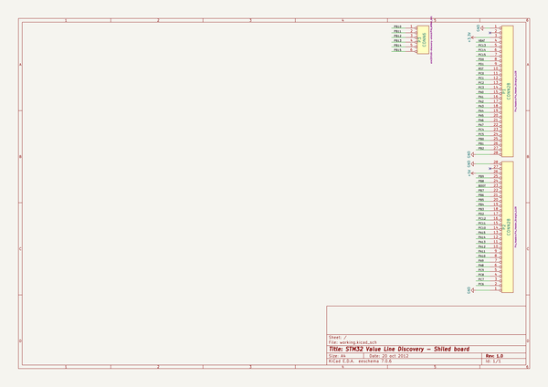
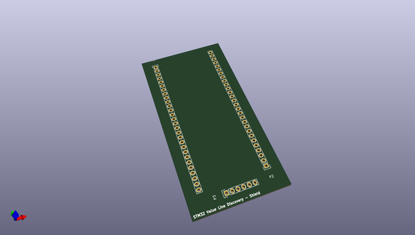
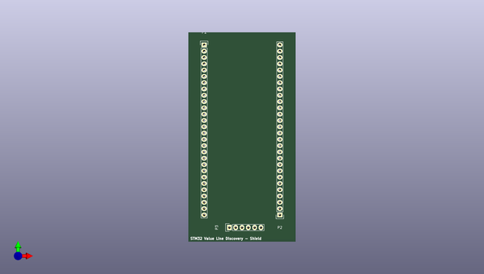

# kicad_library
 
## summary 
* id: ashtonchase_kicad_library_stm32f100_discovery_shield
* user: ashtonchase
* name: kicad_library
* board: stm32f100_discovery_shield
* repo: https://github.com/ashtonchase/kicad-library
* src_file_repo_kicad_pcb: template/stm32f100-discovery-shield/stm32f100-discovery-shield.kicad_pcb
* src_file_repo_kicad_pcb_link: https://github.com/ashtonchase/kicad-library/tree/master/template/stm32f100-discovery-shield/stm32f100-discovery-shield.kicad_pcb

* src_file_repo_sch: template/stm32f100-discovery-shield/stm32f100-discovery-shield.sch
* src_file_repo_sch_link: https://github.com/ashtonchase/kicad-library/tree/master/template/stm32f100-discovery-shield/stm32f100-discovery-shield.sch
* full details link: https://github.com/oomlout/oomlout_oomp_project_bot_v_2/tree/main/projects/ashtonchase_kicad_library_stm32f100_discovery_shield/current_version/working  

## schematic  
  
[schematic (pdf)](working_schematic.pdf) 

## pcb  
 
  
  
  
[board (pdf)](working.pdf)  

## working_bom
| Id | Designator | Footprint | Quantity | Designation | Supplier and ref |  | None | 
| --- | --- | --- | --- | --- | --- | --- | --- | 
| 1 | P3 | Pin_Header_Straight_1x06 | 1 | CONN6 |  |  | [''] | 
| 2 | P1,P2 | Pin_Header_Straight_1x28 | 2 | CONN28 |  |  | [''] | 

## bom_schematic
| Ref | Qnty | Value | Cmp name | Footprint | Description | Vendor | DNP | 
| --- | --- | --- | --- | --- | --- | --- | --- | 
| P1, P2 | 2 | CONN28 | CONN28 | Pin_Headers:Pin_Header_Straight_1x28 | Symbole general de connexion |  |  | 
| P3 | 1 | CONN6 | CONN6 | stm32f100-discovery-shield:PIN_ARRAY_6X1 | Symbole general de connexion |  |  | 

