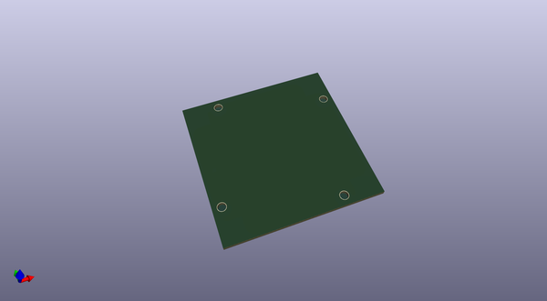
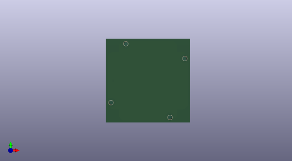
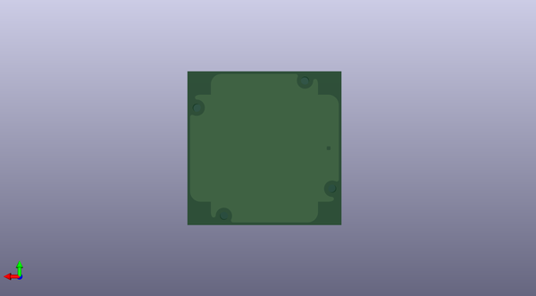

# kicad_libs
 
## summary 
* id: ashtonchase_kicad_libs_nema23_stepper
* user: ashtonchase
* name: kicad_libs
* board: nema23_stepper
* repo: https://github.com/ashtonchase/kicad_libs
* src_file_repo_kicad_pcb: Templates/NEMA23_Stepper/Nema23_stepper.kicad_pcb
* src_file_repo_kicad_pcb_link: https://github.com/ashtonchase/kicad_libs/tree/master/Templates/NEMA23_Stepper/Nema23_stepper.kicad_pcb

* src_file_repo_sch: 
* src_file_repo_sch_link: https://github.com/ashtonchase/kicad_libs/tree/master/
* full details link: https://github.com/oomlout/oomlout_oomp_project_bot_v_2/tree/main/projects/ashtonchase_kicad_libs_nema23_stepper/current_version/working  

## pcb  
 
  
  
  
[board (pdf)](working.pdf)  

## working_bom
| Id | Designator | Footprint | Quantity | Designation | Supplier and ref |  | None | 
| --- | --- | --- | --- | --- | --- | --- | --- | 
| 1 | REF**,REF**,REF**,REF** | 3mm_NPTH | 4 | 3mm_NPTH |  |  | [''] | 

