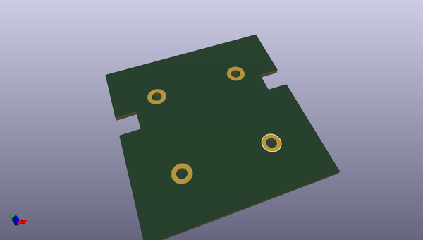
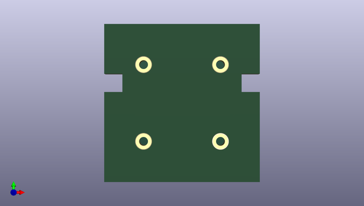
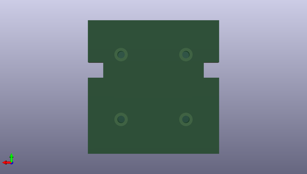

# kicad_templates
 
## summary 
* id: ashtonchase_kicad_templates_1593k_enclosure
* user: ashtonchase
* name: kicad_templates
* board: 1593k_enclosure
* repo: https://github.com/ashtonchase/kicad_templates
* src_file_repo_kicad_pcb: 1593K_Enclosure/1593K.kicad_pcb
* src_file_repo_kicad_pcb_link: https://github.com/ashtonchase/kicad_templates/tree/master/1593K_Enclosure/1593K.kicad_pcb

* src_file_repo_sch: 1593K_Enclosure/1593K.sch
* src_file_repo_sch_link: https://github.com/ashtonchase/kicad_templates/tree/master/1593K_Enclosure/1593K.sch
* full details link: https://github.com/oomlout/oomlout_oomp_project_bot_v_2/tree/main/projects/ashtonchase_kicad_templates_1593k_enclosure/current_version/working  

## schematic  
  
[schematic (pdf)](working_schematic.pdf) 

## pcb  
 
  
  
  
[board (pdf)](working.pdf)  

## working_bom
| Id | Designator | Footprint | Quantity | Designation | Supplier and ref |  | None | 
| --- | --- | --- | --- | --- | --- | --- | --- | 
| 1 | REF** | 1593K_FULL | 1 | 1593K_FULL |  |  | [''] | 

## bom_schematic
no data

