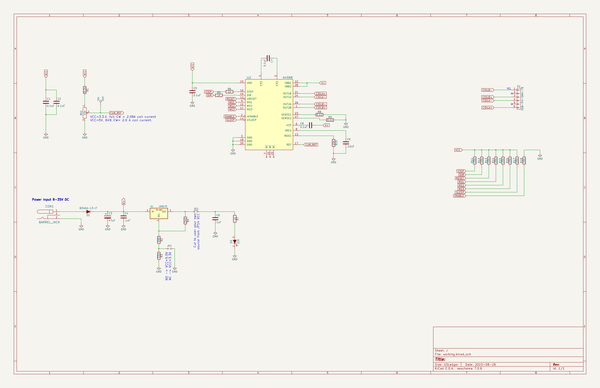
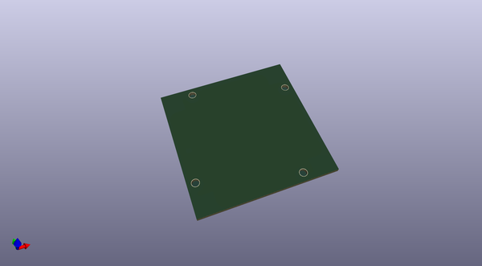
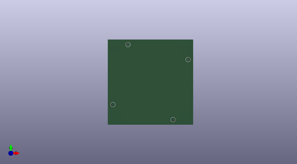

# nema23_driver
 
## summary 
* id: ashtonchase_nema23_driver_nema23stepper
* user: ashtonchase
* name: nema23_driver
* board: nema23stepper
* repo: https://github.com/ashtonchase/nema23_driver
* src_file_repo_kicad_pcb: hardware/kicad/NEMA23Stepper.kicad_pcb
* src_file_repo_kicad_pcb_link: https://github.com/ashtonchase/nema23_driver/tree/master/hardware/kicad/NEMA23Stepper.kicad_pcb

* src_file_repo_sch: hardware/kicad/NEMA23Stepper.sch
* src_file_repo_sch_link: https://github.com/ashtonchase/nema23_driver/tree/master/hardware/kicad/NEMA23Stepper.sch
* full details link: https://github.com/oomlout/oomlout_oomp_project_bot_v_2/tree/main/projects/ashtonchase_nema23_driver_nema23stepper/current_version/working  

## schematic  
  
[schematic (pdf)](working_schematic.pdf) 

## pcb  
 
  
  
  
[board (pdf)](working.pdf)  

## working_bom
| Id | Designator | Footprint | Quantity | Designation | Supplier and ref |  | None | 
| --- | --- | --- | --- | --- | --- | --- | --- | 
| 1 | REF**,REF**,REF**,REF** | 3mm_NPTH | 4 | 3mm_NPTH |  |  | [''] | 

## bom_schematic
| Ref | Qnty | Value | Cmp name | Footprint | Description | Vendor | DNP | 
| --- | --- | --- | --- | --- | --- | --- | --- | 
| C1, C2, C5, C7, C8 | 5 | 0.1uF | C |  |  |  |  | 
| C3 | 1 | 47uF | CP |  |  |  |  | 
| C4 | 1 | .1uF | C |  |  |  |  | 
| C6 | 1 | 1uF | C |  |  |  |  | 
| C9 | 1 | .22uF | C |  |  |  |  | 
| CON1 | 1 | BARREL_JACK | BARREL_JACK |  |  |  |  | 
| D1 | 1 | B340A-13-F | D |  |  |  |  | 
| D2 | 1 | LED | LED |  |  |  |  | 
| JP1 | 1 | Jumper_NO_Small | Jumper_NO_Small |  |  |  |  | 
| JP2 | 1 | Jumper_NC_Small | Jumper_NC_Small |  |  |  |  | 
| P1 | 1 | S6B-PH-SM4-TB | CONN_01X06 | S6B-PH-SM4-TB |  |  |  | 
| R1 | 1 | 8.2k | R |  |  |  |  | 
| R2 | 1 | 390 | R |  |  |  |  | 
| R3 | 1 | 330 | R |  |  |  |  | 
| R4 | 1 | 240 | R |  |  |  |  | 
| R5, R6, R7 | 3 | 1k | R |  |  |  |  | 
| R8, R9 | 2 | 0.11 | R |  |  |  |  | 
| R10, R11, R12, R13, R14, R15, R16, R17, R18 | 9 | 20k | R |  |  |  |  | 
| RV1 | 1 | 10k | POT |  |  |  |  | 
| TP1 | 1 | TEST | TEST |  |  |  |  | 
| U1 | 1 | LM317S | LM317S | TO-263 |  |  |  | 
| U2 | 1 | A4988 | A4988 |  |  |  |  | 

