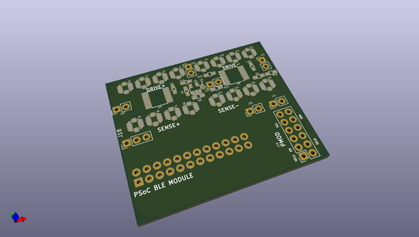
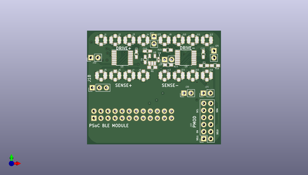
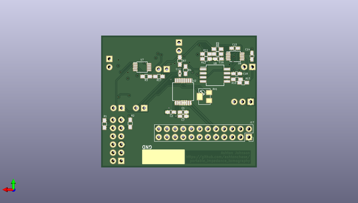

# portable_impedance_tomography
 
## summary 
* id: ashtonchase_portable_impedance_tomography_portable_imedance
* user: ashtonchase
* name: portable_impedance_tomography
* board: portable_imedance
* repo: https://github.com/ashtonchase/portable_impedance_tomography
* src_file_repo_kicad_pcb: hardware/kicad_project/portable_imedance.kicad_pcb
* src_file_repo_kicad_pcb_link: https://github.com/ashtonchase/portable_impedance_tomography/tree/master/hardware/kicad_project/portable_imedance.kicad_pcb

* src_file_repo_sch: 
* src_file_repo_sch_link: https://github.com/ashtonchase/portable_impedance_tomography/tree/master/
* full details link: https://github.com/oomlout/oomlout_oomp_project_bot_v_2/tree/main/projects/ashtonchase_portable_impedance_tomography_portable_imedance/current_version/working  

## pcb  
 
  
  
  
[board (pdf)](working.pdf)  

## working_bom
| Id | Designator | Footprint | Quantity | Designation | Supplier and ref |  | None | 
| --- | --- | --- | --- | --- | --- | --- | --- | 
| 1 | C5,C20 | C_0603_HandSoldering | 2 | 0.1u |  |  | [''] | 
| 2 | C6,C10,C15,C16 | C_0603_HandSoldering | 4 | 1u |  |  | [''] | 
| 3 | C8 | C_0402 | 1 | 10n |  |  | [''] | 
| 4 | J1,J2,J3,J4,J5,J6,J7,J8,J9,J10,J11,J12,J13,J14,J15,J16 | Molex_Microcoaxial_RF | 16 | UMC |  |  | [''] | 
| 5 | J19 | Socket_Strip_Straight_2x06_Pitch2.54mm | 1 | Conn_02x06_Odd_Even |  |  | [''] | 
| 6 | R6,R5,R15,R16,R10,R3 | R_0603_HandSoldering | 6 | 1k |  |  | [''] | 
| 7 | R14,R4,R13,R17 | R_0603_HandSoldering | 4 | 0 |  |  | [''] | 
| 8 | U3,U9 | TSSOP-16_4.4x5mm_Pitch0.65mm | 2 | ADG1209 |  |  | [''] | 
| 9 | U5 | TSOT-23-5 | 1 | LD3985G25R_TSOT23 |  |  | [''] | 
| 10 | J20,J21,J22,J23,J24,J25 | Socket_Strip_Straight_1x02_Pitch2.54mm | 6 | Conn_01x02 |  |  | [''] | 
| 11 | J18 | Socket_Strip_Straight_1x03_Pitch2.54mm | 1 | Conn_01x03 |  |  | [''] | 
| 12 | C1,C2 | C_0603_HandSoldering | 2 | 0.1uF |  |  | [''] | 
| 13 | C3 | C_0603_HandSoldering | 1 | 10uF |  |  | [''] | 
| 14 | C13 | C_0402 | 1 | 33n |  |  | [''] | 
| 15 | C14,C18 | C_0603_HandSoldering | 2 | 100n |  |  | [''] | 
| 16 | J17 | Socket_Strip_Straight_2x12_Pitch2.54mm | 1 | Conn_02x12_Odd_Even |  |  | [''] | 
| 17 | R1,R2 | R_0603_HandSoldering | 2 | 4.7k |  |  | [''] | 
| 18 | R7 | R_0603_HandSoldering | 1 | 75k |  |  | [''] | 
| 19 | R8,R9 | R_0603_HandSoldering | 2 | 1M |  |  | [''] | 
| 20 | R11 | R_0603_HandSoldering | 1 | 75 |  |  | [''] | 
| 21 | R12 | R_0603_HandSoldering | 1 | 10k |  |  | [''] | 
| 22 | U2 | SSOP-16_5.3x6.2mm_Pitch0.65mm | 1 | AD5933 |  |  | [''] | 
| 23 | U6,U7 | TSSOP-10_3x3mm_Pitch0.5mm | 2 | OPA2836 |  |  | [''] | 
| 24 | U8 | SO-8_5.3x6.2mm_Pitch1.27mm | 1 | AD8130 |  |  | [''] | 
| 25 | RV1 | Potentiometer_Trimmer_Bourns_3214W | 1 | 20K |  |  | [''] | 

