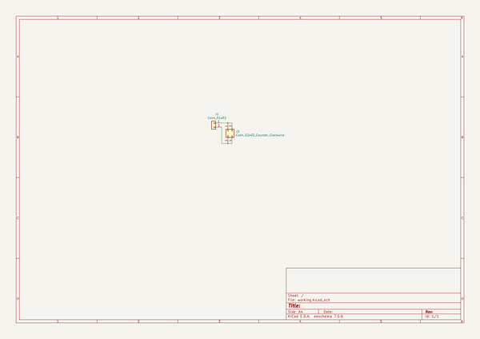
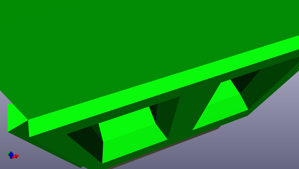
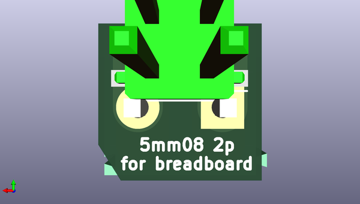

# 5mm08_2p_for_breadboard
 
## summary 
* id: asukiaaa_5mm08_2p_for_breadboard_5mm08_2p_for_breadboard
* user: asukiaaa
* name: 5mm08_2p_for_breadboard
* board: 5mm08_2p_for_breadboard
* repo: https://github.com/asukiaaa/5mm08_2p_for_breadboard
* src_file_repo_kicad_pcb: 5mm08_2p_for_breadboard.kicad_pcb
* src_file_repo_kicad_pcb_link: https://github.com/asukiaaa/5mm08_2p_for_breadboard/tree/master/5mm08_2p_for_breadboard.kicad_pcb
* src_file_repo_kicad_sch: 5mm08_2p_for_breadboard.kicad_sch
* src_file_repo_kicad_sch_link: https://github.com/asukiaaa/5mm08_2p_for_breadboard/tree/master/5mm08_2p_for_breadboard.kicad_sch

* src_file_repo_sch: 
* src_file_repo_sch_link: https://github.com/asukiaaa/5mm08_2p_for_breadboard/tree/master/
* full details link: https://github.com/oomlout/oomlout_oomp_project_bot_v_2/tree/main/projects/asukiaaa_5mm08_2p_for_breadboard_5mm08_2p_for_breadboard/current_version/working  

## schematic  
  
[schematic (pdf)](working_schematic.pdf) 

## pcb  
 
  
  
  
[board (pdf)](working.pdf)  

## working_bom
| Id | Designator | Footprint | Quantity | Designation | Supplier and ref |  | None | 
| --- | --- | --- | --- | --- | --- | --- | --- | 
| 1 | J1 | TerminalBlock_Phoenix_MKDS-1,5-2-5.08_1x02_P5.08mm_Horizontal | 1 | Conn_01x02 |  |  | [''] | 
| 2 | J2 | PinHeader_2x02_P2.54mm_Vertical_SMD | 1 | Conn_02x02_Counter_Clockwise |  |  | [''] | 

## bom_schematic
| Ref | Qnty | Value | Cmp name | Footprint | Description | Vendor | DNP | 
| --- | --- | --- | --- | --- | --- | --- | --- | 
| J1 | 1 | Conn_01x02 | Conn_01x02 | TerminalBlock_Phoenix:TerminalBlock_Phoenix_MKDS-1,5-2-5.08_1x02_P5.08mm_Horizontal | Generic connector, single row, 01x02, script generated (kicad-library-utils/schlib/autogen/connector/) |  |  | 
| J2 | 1 | Conn_02x02_Counter_Clockwise | Conn_02x02_Odd_Even | Connector_PinHeader_2.54mm:PinHeader_2x02_P2.54mm_Vertical_SMD | Generic connector, double row, 02x02, odd/even pin numbering scheme (row 1 odd numbers, row 2 even numbers), script generated (kicad-library-utils/schlib/autogen/connector/) |  |  | 

