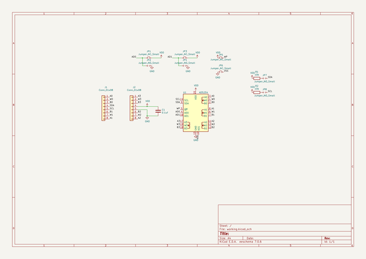

# ad5254breakout
 
## summary 
* id: asukiaaa_ad5254breakout_ad5254breakout
* user: asukiaaa
* name: ad5254breakout
* board: ad5254breakout
* repo: https://github.com/asukiaaa/AD5254Breakout
* src_file_repo_kicad_pcb: AD5254Breakout.kicad_pcb
* src_file_repo_kicad_pcb_link: https://github.com/asukiaaa/AD5254Breakout/tree/master/AD5254Breakout.kicad_pcb
* src_file_repo_kicad_sch: AD5254Breakout.kicad_sch
* src_file_repo_kicad_sch_link: https://github.com/asukiaaa/AD5254Breakout/tree/master/AD5254Breakout.kicad_sch

* src_file_repo_sch: 
* src_file_repo_sch_link: https://github.com/asukiaaa/AD5254Breakout/tree/master/
* full details link: https://github.com/oomlout/oomlout_oomp_project_bot_v_2/tree/main/projects/asukiaaa_ad5254breakout_ad5254breakout/current_version/working  

## schematic  
  
[schematic (pdf)](working_schematic.pdf) 

## pcb  
 
  
  
  
[board (pdf)](working.pdf)  

## working_bom
| Id | Designator | Footprint | Quantity | Designation | Supplier and ref |  | None | 
| --- | --- | --- | --- | --- | --- | --- | --- | 
| 1 | J1,J2 | PinHeader_1x08_P2.54mm_Vertical_without_lines | 2 | Conn_01x08 |  |  | [''] | 
| 2 | U1 | TSSOP-20_4.4x6.5mm_P0.65mm | 1 | AD5254 |  |  | [''] | 
| 3 | R1,R2 | R_0402_1005Metric | 2 | 10k |  |  | [''] | 
| 4 | C1 | C_0402_1005Metric | 1 | 0.1uf |  |  | [''] | 

## bom_schematic
| Ref | Qnty | Value | Cmp name | Footprint | Description | Vendor | DNP | 
| --- | --- | --- | --- | --- | --- | --- | --- | 
| C1 | 1 | 0.1uf | C | Capacitor_SMD:C_0402_1005Metric | Unpolarized capacitor |  |  | 
| J1, J2 | 2 | Conn_01x08 | Conn_01x08 | footprints:PinHeader_1x08_P2.54mm_Vertical_without_lines | Generic connector, single row, 01x08, script generated (kicad-library-utils/schlib/autogen/connector/) |  |  | 
| JP1, JP3, JP5, JP6 | 4 | Jumper_NC_Small | Jumper_NC_Small-Device | Jumper:SolderJumper-2_P1.3mm_Bridged_RoundedPad1.0x1.5mm |  |  |  | 
| JP2, JP4, JP7, JP8 | 4 | Jumper_NO_Small | Jumper_NO_Small-Device | Jumper:SolderJumper-2_P1.3mm_Open_RoundedPad1.0x1.5mm |  |  |  | 
| R1, R2 | 2 | 10k | R | Resistor_SMD:R_0402_1005Metric | Resistor |  |  | 
| U1 | 1 | AD5254 | AD5254-Potentiometer_Digital | Package_SO:TSSOP-20_4.4x6.5mm_P0.65mm |  |  |  | 

