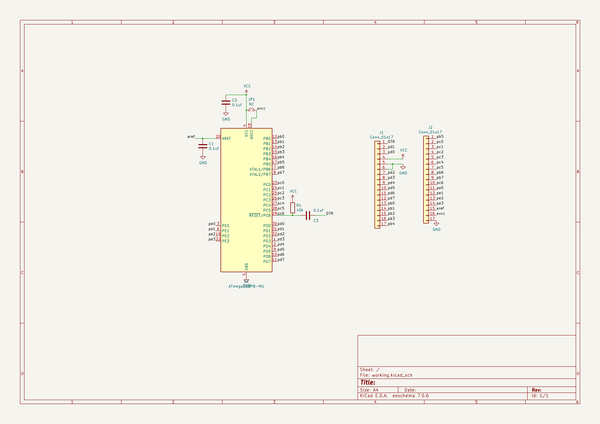
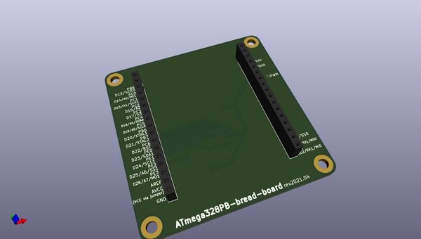
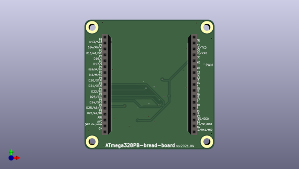
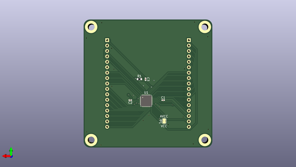

# atmega328pb_bread_board
 
## summary 
* id: asukiaaa_atmega328pb_bread_board_atmega328pb_bread_board
* user: asukiaaa
* name: atmega328pb_bread_board
* board: atmega328pb_bread_board
* repo: https://github.com/asukiaaa/ATmega328PB-bread-board
* src_file_repo_kicad_pcb: ATmega328PB-bread-board.kicad_pcb
* src_file_repo_kicad_pcb_link: https://github.com/asukiaaa/ATmega328PB-bread-board/tree/master/ATmega328PB-bread-board.kicad_pcb

* src_file_repo_sch: ATmega328PB-bread-board.sch
* src_file_repo_sch_link: https://github.com/asukiaaa/ATmega328PB-bread-board/tree/master/ATmega328PB-bread-board.sch
* full details link: https://github.com/oomlout/oomlout_oomp_project_bot_v_2/tree/main/projects/asukiaaa_atmega328pb_bread_board_atmega328pb_bread_board/current_version/working  

## schematic  
  
[schematic (pdf)](working_schematic.pdf) 

## pcb  
 
  
  
  
[board (pdf)](working.pdf)  

## working_bom
| Id | Designator | Footprint | Quantity | Designation | Supplier and ref |  | None | 
| --- | --- | --- | --- | --- | --- | --- | --- | 
| 1 | J1,J2 | PinSocket_1x17_P2.54mm_Vertical | 2 | Conn_01x17 |  |  | [''] | 
| 2 | C1,C2,C3 | C_0402_1005Metric | 3 | 0.1uf |  |  | [''] | 
| 3 | U1 | QFN-32-1EP_5x5mm_P0.5mm_EP3.1x3.1mm | 1 | ATmega328PB-MU |  |  | [''] | 
| 4 | R1 | R_0603_1608Metric | 1 | 10k |  |  | [''] | 

## bom_schematic
| Ref | Qnty | Value | Cmp name | Footprint | Description | Vendor | DNP | 
| --- | --- | --- | --- | --- | --- | --- | --- | 
| C1, C2, C3 | 3 | 0.1uf | C-Device-ATmega328PB-bread-board-rescue | Capacitor_SMD:C_0402_1005Metric |  |  |  | 
| J1, J2 | 2 | Conn_01x17 | Conn_01x17-Connector_Generic-ATmega328PB-bread-board-rescue | Connector_PinSocket_2.54mm:PinSocket_1x17_P2.54mm_Vertical |  |  |  | 
| JP1 | 1 | NC | Jumper_NC_Small-Device-ATmega328PB-bread-board-rescue | Jumper:SolderJumper-2_P1.3mm_Bridged_RoundedPad1.0x1.5mm |  |  |  | 
| R1 | 1 | 10k | R | Resistor_SMD:R_0603_1608Metric | Resistor |  |  | 
| U1 | 1 | ATmega328PB-MU | ATmega328PB-MU-MCU_Microchip_ATmega-ATmega328PB-bread-board-rescue | Package_DFN_QFN:QFN-32-1EP_5x5mm_P0.5mm_EP3.1x3.1mm |  |  |  | 

