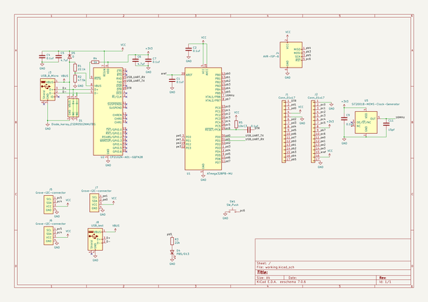

# atmega328pb_usb_bread_board
 
## summary 
* id: asukiaaa_atmega328pb_usb_bread_board_atmega328pb_usb_bread_board
* user: asukiaaa
* name: atmega328pb_usb_bread_board
* board: atmega328pb_usb_bread_board
* repo: https://github.com/asukiaaa/ATmega328PB-usb-bread-board
* src_file_repo_kicad_pcb: ATmega328PB-usb-bread-board.kicad_pcb
* src_file_repo_kicad_pcb_link: https://github.com/asukiaaa/ATmega328PB-usb-bread-board/tree/master/ATmega328PB-usb-bread-board.kicad_pcb

* src_file_repo_sch: ATmega328PB-usb-bread-board.sch
* src_file_repo_sch_link: https://github.com/asukiaaa/ATmega328PB-usb-bread-board/tree/master/ATmega328PB-usb-bread-board.sch
* full details link: https://github.com/oomlout/oomlout_oomp_project_bot_v_2/tree/main/projects/asukiaaa_atmega328pb_usb_bread_board_atmega328pb_usb_bread_board/current_version/working  

## schematic  
  
[schematic (pdf)](working_schematic.pdf) 

## pcb  
 
  
  
  
[board (pdf)](working.pdf)  

## working_bom
| Id | Designator | Footprint | Quantity | Designation | Supplier and ref |  | None | 
| --- | --- | --- | --- | --- | --- | --- | --- | 
| 1 | J1,J2 | PinSocket_1x17_P2.54mm_Vertical | 2 | Conn_01x17 |  |  | [''] | 
| 2 | D4 | LED_0603_1608Metric_Pad1.05x0.95mm_HandSolder | 1 | PB5/D13 |  |  | [''] | 
| 3 | J3 | USB_Micro-B_Molex-105017-0001 | 1 | USB_B_Micro |  |  | [''] | 
| 4 | J5,J6,J7 | NS-Tech_Grove_1x04_P2mm_Vertical | 3 | Grove-I2C-connector |  |  | [''] | 
| 5 | SW1 | SW_Push_TVAF06 | 1 | SW_Push |  |  | [''] | 
| 6 | C1,C2,C3,C7,C9,C4 | C_0402_1005Metric | 6 | 0.1uf |  |  | [''] | 
| 7 | U1 | QFN-32-1EP_5x5mm_P0.5mm_EP3.1x3.1mm | 1 | ATmega328PB-MU |  |  | [''] | 
| 8 | R1 | R_0603_1608Metric | 1 | 22.1k |  |  | [''] | 
| 9 | R2 | R_0603_1608Metric | 1 | 47.5k |  |  | [''] | 
| 10 | U2 | QFN-28-1EP_5x5mm_P0.5mm_EP3.35x3.35mm | 1 | CP2102N-A01-GQFN28 |  |  | [''] | 
| 11 | D5 | D_SOD-123F | 1 | D |  |  | [''] | 
| 12 | J4 | 2x03_P2.54mm_ISP_Pads | 1 | AVR-ISP-6 |  |  | [''] | 
| 13 | R3 | R_0603_1608Metric | 1 | 22k |  |  | [''] | 
| 14 | C6,C5 | C_0402_1005Metric | 2 | 4.7uf |  |  | [''] | 
| 15 | R4 | R_0603_1608Metric | 1 | 1k |  |  | [''] | 
| 16 | U5 | SOT-23-5 | 1 | SiT2001B-MEMS-Clock-Generator |  |  | [''] | 
| 17 | D1 | OnSemi_UDFN-6_1.2x1.0mm_P0.4mm | 1 | Diode_4array_ESDR0502NMUTBG |  |  | [''] | 
| 18 | R5 | R_0603_1608Metric | 1 | 10k |  |  | [''] | 
| 19 | C11 | C_0603_1608Metric | 1 | 15pf |  |  | [''] | 
| 20 | J8 | 2x02_P2.54mm_USB_Pads | 1 | USB_test |  |  | [''] | 

## bom_schematic
| Ref | Qnty | Value | Cmp name | Footprint | Description | Vendor | DNP | 
| --- | --- | --- | --- | --- | --- | --- | --- | 
| C1, C2, C3, C4, C7, C9 | 6 | 0.1uf | C | Capacitor_SMD:C_0402_1005Metric | Unpolarized capacitor |  |  | 
| C5, C6 | 2 | 4.7uf | C | Capacitor_SMD:C_0402_1005Metric | Unpolarized capacitor |  |  | 
| C11 | 1 | 15pf | C | Capacitor_SMD:C_0603_1608Metric | Unpolarized capacitor |  |  | 
| D1 | 1 | Diode_4array_ESDR0502NMUTBG | Diode_4array_ESDR0502NMUTBG-my-kicad-symbols | my-kicad-footprints:OnSemi_UDFN-6_1.2x1.0mm_P0.4mm |  |  |  | 
| D4 | 1 | PB5/D13 | LED | LED_SMD:LED_0603_1608Metric_Pad1.05x0.95mm_HandSolder | Light emitting diode |  |  | 
| D5 | 1 | D | D | Diode_SMD:D_SOD-123F | Diode |  |  | 
| J1, J2 | 2 | Conn_01x17 | Conn_01x17 | Connector_PinSocket_2.54mm:PinSocket_1x17_P2.54mm_Vertical | Generic connector, single row, 01x17, script generated (kicad-library-utils/schlib/autogen/connector/) |  |  | 
| J3 | 1 | USB_B_Micro | USB_B_Micro-Connector-ATmega328PB-usb-bread-board-rescue | Connector_USB:USB_Micro-B_Molex-105017-0001 |  |  |  | 
| J4 | 1 | AVR-ISP-6 | AVR-ISP-6 | my-kicad-footprints:2x03_P2.54mm_ISP_Pads | Atmel 6-pin ISP connector |  |  | 
| J5, J6, J7 | 3 | Grove-I2C-connector | Grove-I2C-connector-my-kicad-symbols | Connector:NS-Tech_Grove_1x04_P2mm_Vertical |  |  |  | 
| J8 | 1 | USB_test | USB_A | my-kicad-footprints:2x02_P2.54mm_USB_Pads | USB Type A connector |  |  | 
| R1 | 1 | 22.1k | R | Resistor_SMD:R_0603_1608Metric | Resistor |  |  | 
| R2 | 1 | 47.5k | R | Resistor_SMD:R_0603_1608Metric | Resistor |  |  | 
| R3 | 1 | 22k | R | Resistor_SMD:R_0603_1608Metric | Resistor |  |  | 
| R4 | 1 | 1k | R | Resistor_SMD:R_0603_1608Metric | Resistor |  |  | 
| R5 | 1 | 10k | R | Resistor_SMD:R_0603_1608Metric | Resistor |  |  | 
| SW1 | 1 | SW_Push | SW_Push | my-kicad-footprints:SW_Push_TVAF06 | Push button switch, generic, two pins |  |  | 
| U1 | 1 | ATmega328PB-MU | ATmega328PB-MU-MCU_Microchip_ATmega-ATmega328PB-usb-bread-board-rescue | Package_DFN_QFN:QFN-32-1EP_5x5mm_P0.5mm_EP3.1x3.1mm |  |  |  | 
| U2 | 1 | CP2102N-A01-GQFN28 | CP2102N-A01-GQFN28-Interface_USB-ATmega328PB-usb-bread-board-rescue | Package_DFN_QFN:QFN-28-1EP_5x5mm_P0.5mm_EP3.35x3.35mm |  |  |  | 
| U5 | 1 | SiT2001B-MEMS-Clock-Generator | SiT2001B-MEMS-Clock-Generator-my-kicad-symbols | Package_TO_SOT_SMD:SOT-23-5 |  |  |  | 

