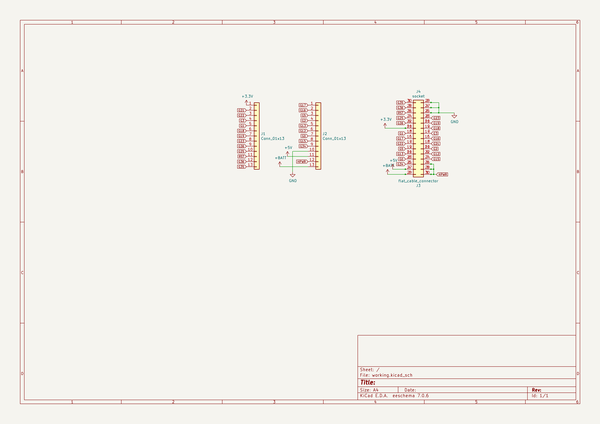

# cavityform5stack
 
## summary 
* id: asukiaaa_cavityform5stack_bottom_pcb
* user: asukiaaa
* name: cavityform5stack
* board: bottom_pcb
* repo: https://github.com/asukiaaa/CavityForM5Stack
* src_file_repo_kicad_pcb: bottom_pcb/bottom_pcb.kicad_pcb
* src_file_repo_kicad_pcb_link: https://github.com/asukiaaa/CavityForM5Stack/tree/master/bottom_pcb/bottom_pcb.kicad_pcb

* src_file_repo_sch: bottom_pcb/bottom_pcb.sch
* src_file_repo_sch_link: https://github.com/asukiaaa/CavityForM5Stack/tree/master/bottom_pcb/bottom_pcb.sch
* full details link: https://github.com/oomlout/oomlout_oomp_project_bot_v_2/tree/main/projects/asukiaaa_cavityform5stack_bottom_pcb/current_version/working  

## schematic  
  
[schematic (pdf)](working_schematic.pdf) 

## pcb  
 
  
  
  
[board (pdf)](working.pdf)  

## working_bom
| Id | Designator | Footprint | Quantity | Designation | Supplier and ref |  | None | 
| --- | --- | --- | --- | --- | --- | --- | --- | 
| 1 | J1,J2 | PinSocket_1x13_P2.54mm_Vertical_without_silks | 2 | Conn_01x13 |  |  | [''] | 
| 2 | REF** | center_hole | 1 | center_hole |  |  | [''] | 
| 3 | J3 | Hirose_FH12-30S-0.5SH_1x30-1MP_P0.50mm_Horizontal | 1 | flat_cable_connector |  |  | [''] | 
| 4 | J4 | PinSocket_2x15_P2.54mm_Vertical_SMD_just_for_M5Stack_bottom_pcb | 1 | socket |  |  | [''] | 

## bom_schematic
| Ref | Qnty | Value | Cmp name | Footprint | Description | Vendor | DNP | 
| --- | --- | --- | --- | --- | --- | --- | --- | 
| J1, J2 | 2 | Conn_01x13 | Conn_01x13 | footprints:PinSocket_1x13_P2.54mm_Vertical_without_silks | Generic connector, single row, 01x13, script generated (kicad-library-utils/schlib/autogen/connector/) |  |  | 
| J3 | 1 | flat_cable_connector | Conn_02x15_Odd_Even | Connector_FFC-FPC:Hirose_FH12-30S-0.5SH_1x30-1MP_P0.50mm_Horizontal | Generic connector, double row, 02x15, odd/even pin numbering scheme (row 1 odd numbers, row 2 even numbers), script generated (kicad-library-utils/schlib/autogen/connector/) |  |  | 
| J4 | 1 | socket | Conn_02x15_Odd_Even | footprints:PinSocket_2x15_P2.54mm_Vertical_SMD_just_for_M5Stack_bottom_pcb | Generic connector, double row, 02x15, odd/even pin numbering scheme (row 1 odd numbers, row 2 even numbers), script generated (kicad-library-utils/schlib/autogen/connector/) |  |  | 

