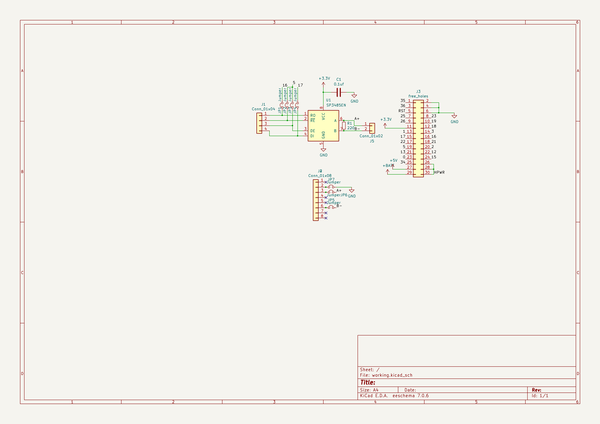

# denturers485forcavityform5stack
 
## summary 
* id: asukiaaa_denturers485forcavityform5stack_denturers485
* user: asukiaaa
* name: denturers485forcavityform5stack
* board: denturers485
* repo: https://github.com/asukiaaa/DentureRS485ForCavityForM5Stack
* src_file_repo_kicad_pcb: dentureRS485.kicad_pcb
* src_file_repo_kicad_pcb_link: https://github.com/asukiaaa/DentureRS485ForCavityForM5Stack/tree/master/dentureRS485.kicad_pcb

* src_file_repo_sch: dentureRS485.sch
* src_file_repo_sch_link: https://github.com/asukiaaa/DentureRS485ForCavityForM5Stack/tree/master/dentureRS485.sch
* full details link: https://github.com/oomlout/oomlout_oomp_project_bot_v_2/tree/main/projects/asukiaaa_denturers485forcavityform5stack_denturers485/current_version/working  

## schematic  
  
[schematic (pdf)](working_schematic.pdf) 

## pcb  
 
  
  
  
[board (pdf)](working.pdf)  

## working_bom
| Id | Designator | Footprint | Quantity | Designation | Supplier and ref |  | None | 
| --- | --- | --- | --- | --- | --- | --- | --- | 
| 1 | corner1,corner2,corner3,corner4 | outer_corner | 4 | outer_corner |  |  | [''] | 
| 2 | J2 | PinHeader_1x08_P1.27mm_Vertical | 1 | Conn_01x08 |  |  | [''] | 
| 3 | U1 | SOIC-8_3.9x4.9mm_P1.27mm | 1 | SP3485EN |  |  | [''] | 
| 4 | C1 | C_0603_1608Metric | 1 | 0.1uf |  |  | [''] | 
| 5 | R1 | R_0603_1608Metric | 1 | 220 |  |  | [''] | 
| 6 | J5 | PinHeader_1x02_P1.27mm_Vertical | 1 | Conn_01x02 |  |  | [''] | 
| 7 | J1 | PinHeader_1x04_P1.27mm_Vertical | 1 | Conn_01x04 |  |  | [''] | 
| 8 | J3 | Pads_1x30_P1.27mm_Vertical | 1 | free_holes |  |  | [''] | 
| 9 | J4 | LAN_RJ45_Neltron_Industrial_7810-8P8C | 1 | Conn_01x08 |  |  | [''] | 

## bom_schematic
| Ref | Qnty | Value | Cmp name | Footprint | Description | Vendor | DNP | 
| --- | --- | --- | --- | --- | --- | --- | --- | 
| C1 | 1 | 0.1uf | C | Capacitor_SMD:C_0603_1608Metric | Unpolarized capacitor |  |  | 
| J1 | 1 | Conn_01x04 | Conn_01x04 | Connector_PinHeader_1.27mm:PinHeader_1x04_P1.27mm_Vertical | Generic connector, single row, 01x04, script generated (kicad-library-utils/schlib/autogen/connector/) |  |  | 
| J2 | 1 | Conn_01x08 | Conn_01x08 | Connector_PinHeader_1.27mm:PinHeader_1x08_P1.27mm_Vertical | Generic connector, single row, 01x08, script generated (kicad-library-utils/schlib/autogen/connector/) |  |  | 
| J3 | 1 | free_holes | Conn_02x15_Odd_Even | footprints:Pads_1x30_P1.27mm_Vertical | Generic connector, double row, 02x15, odd/even pin numbering scheme (row 1 odd numbers, row 2 even numbers), script generated (kicad-library-utils/schlib/autogen/connector/) |  |  | 
| J4 | 1 | Conn_01x08 | Conn_01x08 | my-kicad-footprints:LAN_RJ45_Neltron_Industrial_7810-8P8C | Generic connector, single row, 01x08, script generated (kicad-library-utils/schlib/autogen/connector/) |  |  | 
| J5 | 1 | Conn_01x02 | Conn_01x02 | Connector_PinHeader_1.27mm:PinHeader_1x02_P1.27mm_Vertical | Generic connector, single row, 01x02, script generated (kicad-library-utils/schlib/autogen/connector/) |  |  | 
| JP1, JP2, JP3, JP4, JP5, JP6, JP7 | 7 | Jumper | Jumper_NC_Small-Device-dentureRS485-rescue | Jumper:SolderJumper-2_P1.3mm_Bridged_RoundedPad1.0x1.5mm |  |  |  | 
| R1 | 1 | 220 | R_Small | Resistor_SMD:R_0603_1608Metric | Resistor, small symbol |  |  | 
| U1 | 1 | SP3485EN | SP3485EN | Package_SO:SOIC-8_3.9x4.9mm_P1.27mm | Industrial 3.3V Low Power Half-Duplex RS-485 Transceiver 10Mbps, SOIC-8 |  |  | 

