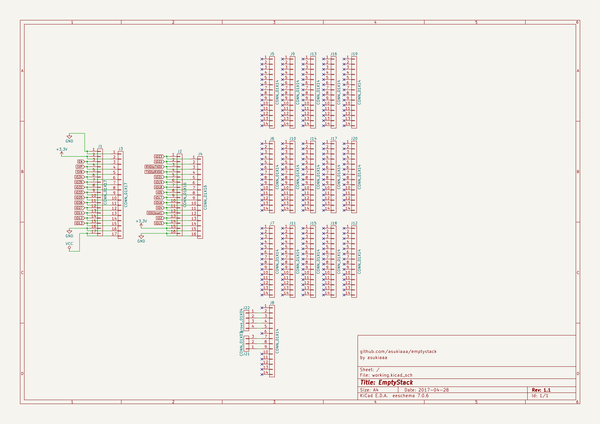
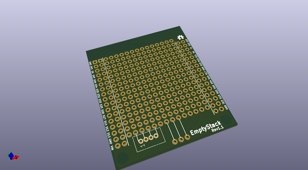
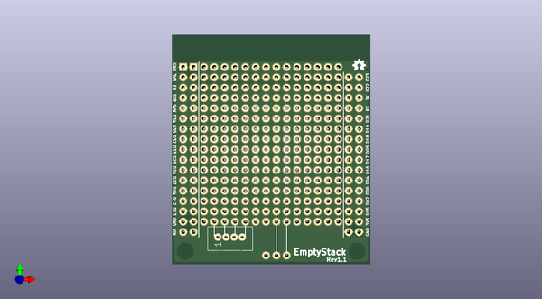
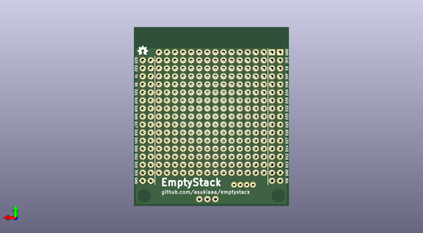

# emptystack
 
## summary 
* id: asukiaaa_emptystack_emptystack
* user: asukiaaa
* name: emptystack
* board: emptystack
* repo: https://github.com/asukiaaa/emptystack
* src_file_repo_kicad_pcb: emptystack.kicad_pcb
* src_file_repo_kicad_pcb_link: https://github.com/asukiaaa/emptystack/tree/master/emptystack.kicad_pcb

* src_file_repo_sch: emptystack.sch
* src_file_repo_sch_link: https://github.com/asukiaaa/emptystack/tree/master/emptystack.sch
* full details link: https://github.com/oomlout/oomlout_oomp_project_bot_v_2/tree/main/projects/asukiaaa_emptystack_emptystack/current_version/working  

## schematic  
  
[schematic (pdf)](working_schematic.pdf) 

## pcb  
 
  
  
  
[board (pdf)](working.pdf)  

## working_bom
| Id | Designator | Footprint | Quantity | Designation | Supplier and ref |  | None | 
| --- | --- | --- | --- | --- | --- | --- | --- | 
| 1 | G***,G*** | osh-logo-3p4mm | 2 | LOGO |  |  | [''] | 
| 2 | J1,J3 | Pin_Header_Straight_1x17_Pitch2.54mm | 2 | CONN_01X17 |  |  | [''] | 
| 3 | J2,J4 | Pin_Header_Straight_1x16_Pitch2.54mm | 2 | CONN_01X16 |  |  | [''] | 
| 4 | J5,J6,J7,J8,J9,J10,J11,J12,J13,J14,J15,J16,J17,J18,J19,J20 | Pin_Header_Straight_1x14_Pitch2.54mm | 16 | CONN_01X14 |  |  | [''] | 
| 5 | J22 | Grove_1x04 | 1 | grove_01X04 |  |  | [''] | 
| 6 | J21 | Pin_Header_Straight_1x03_Pitch2.54mm | 1 | CONN_01X03 |  |  | [''] | 

## bom_schematic
| Ref | Qnty | Value | Cmp name | Footprint | Description | Vendor | DNP | 
| --- | --- | --- | --- | --- | --- | --- | --- | 
| J1, J3 | 2 | CONN_01X17 | CONN_01X17 | common:Pin_Header_Straight_1x17_Pitch2.54mm |  |  |  | 
| J2, J4 | 2 | CONN_01X16 | CONN_01X16 | common:Pin_Header_Straight_1x16_Pitch2.54mm |  |  |  | 
| J5, J6, J7, J8, J9, J10, J11, J12, J13, J14, J15, J16, J17, J18, J19, J20 | 16 | CONN_01X14 | CONN_01X14 | common:Pin_Header_Straight_1x14_Pitch2.54mm |  |  |  | 
| J21 | 1 | CONN_01X03 | CONN_01X03 | common:Pin_Header_Straight_1x03_Pitch2.54mm |  |  |  | 
| J22 | 1 | grove_01X04 | CONN_01X04 | Connectors:Grove_1x04 |  |  |  | 

