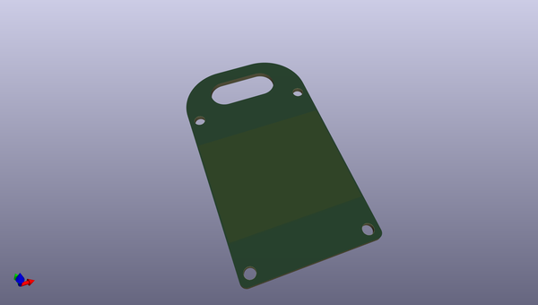
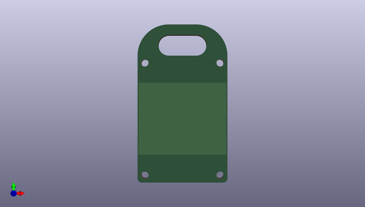
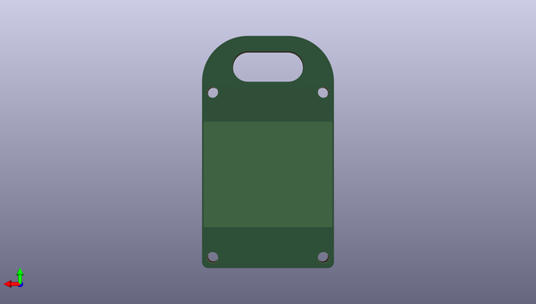

# esp32bb
 
## summary 
* id: asukiaaa_esp32bb_bottom_pcb
* user: asukiaaa
* name: esp32bb
* board: bottom_pcb
* repo: https://github.com/asukiaaa/esp32bb
* src_file_repo_kicad_pcb: bottom_pcb/bottom_pcb.kicad_pcb
* src_file_repo_kicad_pcb_link: https://github.com/asukiaaa/esp32bb/tree/master/bottom_pcb/bottom_pcb.kicad_pcb

* src_file_repo_sch: bottom_pcb/bottom_pcb.sch
* src_file_repo_sch_link: https://github.com/asukiaaa/esp32bb/tree/master/bottom_pcb/bottom_pcb.sch
* full details link: https://github.com/oomlout/oomlout_oomp_project_bot_v_2/tree/main/projects/asukiaaa_esp32bb_bottom_pcb/current_version/working  

## schematic  
  
[schematic (pdf)](working_schematic.pdf) 

## pcb  
 
  
  
  
[board (pdf)](working.pdf)  

## working_bom
no data

## bom_schematic
no data

