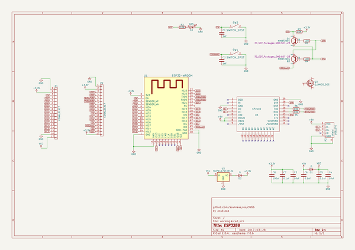
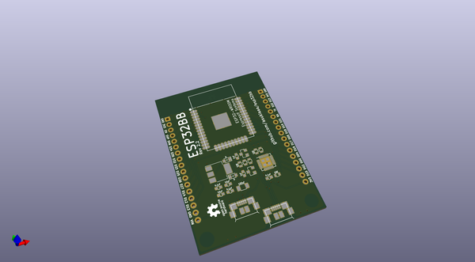
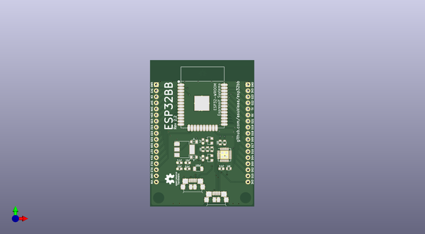
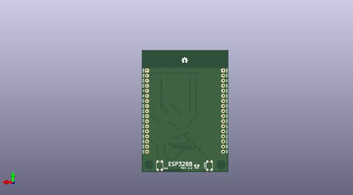

# esp32bb
 
## summary 
* id: asukiaaa_esp32bb_esp32bb
* user: asukiaaa
* name: esp32bb
* board: esp32bb
* repo: https://github.com/asukiaaa/esp32bb
* src_file_repo_kicad_pcb: main_pcb/esp32bb.kicad_pcb
* src_file_repo_kicad_pcb_link: https://github.com/asukiaaa/esp32bb/tree/master/main_pcb/esp32bb.kicad_pcb

* src_file_repo_sch: main_pcb/esp32bb.sch
* src_file_repo_sch_link: https://github.com/asukiaaa/esp32bb/tree/master/main_pcb/esp32bb.sch
* full details link: https://github.com/oomlout/oomlout_oomp_project_bot_v_2/tree/main/projects/asukiaaa_esp32bb_esp32bb/current_version/working  

## schematic  
  
[schematic (pdf)](working_schematic.pdf) 

## pcb  
 
  
  
  
[board (pdf)](working.pdf)  

## working_bom
| Id | Designator | Footprint | Quantity | Designation | Supplier and ref |  | None | 
| --- | --- | --- | --- | --- | --- | --- | --- | 
| 1 | C2,C1 | C_0603 | 2 | 1nf |  |  | [''] | 
| 2 | C3,C4 | C_0603 | 2 | 10uf |  |  | [''] | 
| 3 | C5,C6,C7 | C_0603 | 3 | 0.1uf |  |  | [''] | 
| 4 | D1,D2 | D_0805 | 2 | D |  |  | [''] | 
| 5 | P3,P3 | USB_MICRO_B-HIROSE-ZX62R-B-5P | 2 | USB_OTG |  |  | [''] | 
| 6 | U1 | ESP32-WROOM | 1 | ESP32-WROOM |  |  | [''] | 
| 7 | Q1,Q2 | SOT-23 | 2 | MMBT3904 |  |  | [''] | 
| 8 | R4,R1,R3,R2 | R_0603 | 4 | 10K |  |  | [''] | 
| 9 | R5,R6 | R_0603 | 2 | 100 |  |  | [''] | 
| 10 | C8 | C_1206 | 1 | 100uf |  |  | [''] | 
| 11 | U3 | QFN-28-1EP_5x5mm_Pitch0.5mm | 1 | CP2102 |  |  | [''] | 
| 12 | U2 | SOT-223 | 1 | NCP1117ST33T3G |  |  | [''] | 
| 13 | G*** | osh-logo-3p4mm | 1 | LOGO |  |  | [''] | 
| 14 | P1,P2 | Pin_Header_Straight_1x17_Pitch2.54mm | 2 | CONN_01X17 |  |  | [''] | 
| 15 | SW1,SW2 | SKRPACE010 | 2 | SWITCH_SPST |  |  | [''] | 
| 16 | D3 | LED_0603 | 1 | D05 |  |  | [''] | 

## bom_schematic
| Ref | Qnty | Value | Cmp name | Footprint | Description | Vendor | DNP | 
| --- | --- | --- | --- | --- | --- | --- | --- | 
| C1, C2 | 2 | 1nf | C-esp32bb-rescue | Capacitors_SMD:C_0603 |  |  |  | 
| C3, C4 | 2 | 10uf | C-esp32bb-rescue | Capacitors_SMD:C_0603 |  |  |  | 
| C5, C6, C7 | 3 | 0.1uf | C-esp32bb-rescue | Capacitors_SMD:C_0603 |  |  |  | 
| C8 | 1 | 100uf | C-esp32bb-rescue | Capacitors_SMD:C_1206 |  |  |  | 
| D1, D2 | 2 | D | D-esp32bb-rescue | common:D_0805 |  |  |  | 
| D3 | 1 | D05 | LED-esp32bb-rescue | LEDs:LED_0603 |  |  |  | 
| P1, P2 | 2 | CONN_01X17 | CONN_01X17-esp32bb-rescue | common:Pin_Header_Straight_1x17_Pitch2.54mm |  |  |  | 
| P3 | 1 | USB_OTG | USB_OTG-RESCUE-esp32bb-esp32bb-rescue | usb_micro_b:USB_MICRO_B-HIROSE-ZX62R-B-5P |  |  |  | 
| Q1, Q2 | 2 | MMBT3904 | MMBT3904-esp32bb-rescue | TO_SOT_Packages_SMD:SOT-23 |  |  |  | 
| Q3 | 1 | Q_NMOS_DGS | Q_NMOS_DGS |  | N-MOSFET transistor, drain/gate/source |  |  | 
| R1, R2, R3, R4 | 4 | 10K | R-esp32bb-rescue | Resistors_SMD:R_0603 |  |  |  | 
| R5, R6 | 2 | 100 | R-esp32bb-rescue | Resistors_SMD:R_0603 |  |  |  | 
| SW1, SW2 | 2 | SWITCH_SPST | SWITCH_SPST-esp32bb-rescue | switch:SKRPACE010 |  |  |  | 
| U1 | 1 | ESP32-WROOM | ESP32-WROOM-esp32bb-rescue | ESP32-footprints-Lib:ESP32-WROOM |  |  |  | 
| U2 | 1 | NCP1117ST33T3G | NCP1117ST33T3G-esp32bb-rescue | TO_SOT_Packages_SMD:SOT-223 |  |  |  | 
| U3 | 1 | CP2102 | CP2102-esp32bb-rescue | Housings_DFN_QFN:QFN-28-1EP_5x5mm_Pitch0.5mm |  |  |  | 

