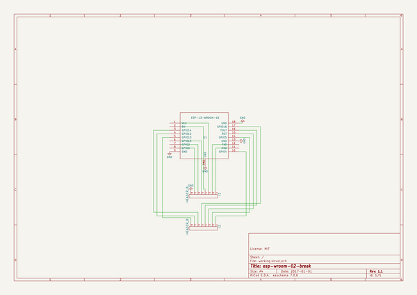
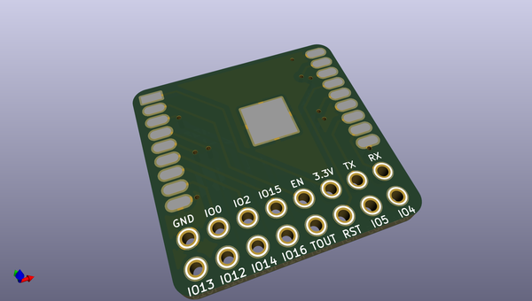
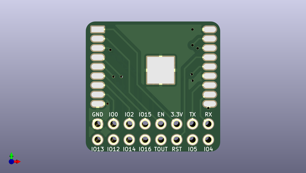
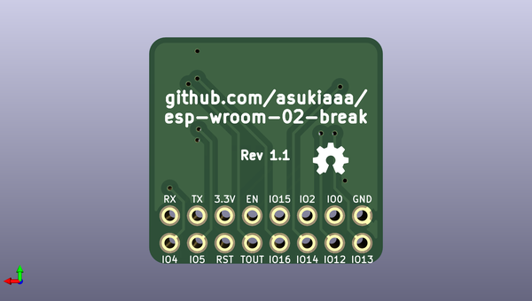

# esp_wroom_02_break
 
## summary 
* id: asukiaaa_esp_wroom_02_break_wroom_break
* user: asukiaaa
* name: esp_wroom_02_break
* board: wroom_break
* repo: https://github.com/asukiaaa/esp-wroom-02-break
* src_file_repo_kicad_pcb: wroom_break.kicad_pcb
* src_file_repo_kicad_pcb_link: https://github.com/asukiaaa/esp-wroom-02-break/tree/master/wroom_break.kicad_pcb

* src_file_repo_sch: wroom_break.sch
* src_file_repo_sch_link: https://github.com/asukiaaa/esp-wroom-02-break/tree/master/wroom_break.sch
* full details link: https://github.com/oomlout/oomlout_oomp_project_bot_v_2/tree/main/projects/asukiaaa_esp_wroom_02_break_wroom_break/current_version/working  

## schematic  
  
[schematic (pdf)](working_schematic.pdf) 

## pcb  
 
  
  
  
[board (pdf)](working.pdf)  

## working_bom
| Id | Designator | Footprint | Quantity | Designation | Supplier and ref |  | None | 
| --- | --- | --- | --- | --- | --- | --- | --- | 
| 1 | J1,J2 | Pin_Header_Straight_1x08_small | 2 | HEADER_8 |  |  | [''] | 
| 2 | U1 | ESP-13-WROOM-02 | 1 | ESP-13-WROOM-02 |  |  | [''] | 
| 3 | G*** | oshw-3p4mm | 1 | LOGO |  |  | [''] | 

## bom_schematic
| Ref | Qnty | Value | Cmp name | Footprint | Description | Vendor | DNP | 
| --- | --- | --- | --- | --- | --- | --- | --- | 
| J1, J2 | 2 | HEADER_8 | HEADER_8 | simple_headers:Pin_Header_Straight_1x08_small |  |  |  | 
| U1 | 1 | ESP-13-WROOM-02 | ESP-13-WROOM-02 | ESP8266:ESP-13-WROOM-02 |  |  |  | 

