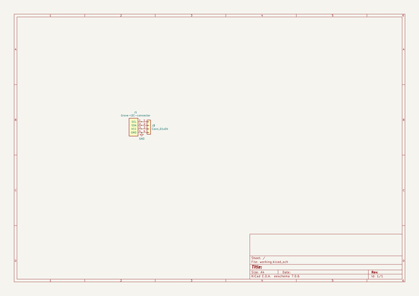
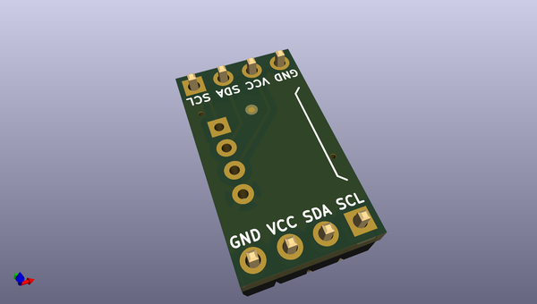
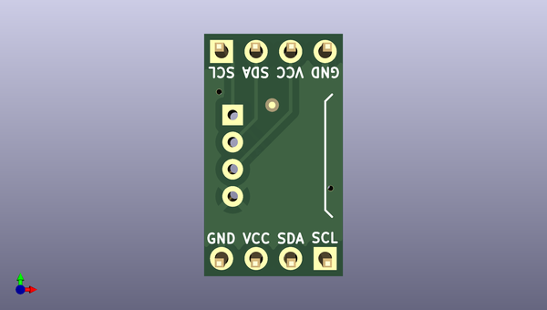
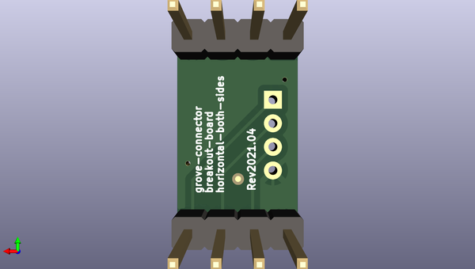

# grove_connector_breakout_board
 
## summary 
* id: asukiaaa_grove_connector_breakout_board_horizontal_both_sides
* user: asukiaaa
* name: grove_connector_breakout_board
* board: horizontal_both_sides
* repo: https://github.com/asukiaaa/grove-connector-breakout-board
* src_file_repo_kicad_pcb: horizontal-both-sides/horizontal-both-sides.kicad_pcb
* src_file_repo_kicad_pcb_link: https://github.com/asukiaaa/grove-connector-breakout-board/tree/master/horizontal-both-sides/horizontal-both-sides.kicad_pcb
* src_file_repo_kicad_sch: horizontal-both-sides/horizontal-both-sides.kicad_sch
* src_file_repo_kicad_sch_link: https://github.com/asukiaaa/grove-connector-breakout-board/tree/master/horizontal-both-sides/horizontal-both-sides.kicad_sch

* src_file_repo_sch: 
* src_file_repo_sch_link: https://github.com/asukiaaa/grove-connector-breakout-board/tree/master/
* full details link: https://github.com/oomlout/oomlout_oomp_project_bot_v_2/tree/main/projects/asukiaaa_grove_connector_breakout_board_horizontal_both_sides/current_version/working  

## schematic  
  
[schematic (pdf)](working_schematic.pdf) 

## pcb  
 
  
  
  
[board (pdf)](working.pdf)  

## working_bom
| Id | Designator | Footprint | Quantity | Designation | Supplier and ref |  | None | 
| --- | --- | --- | --- | --- | --- | --- | --- | 
| 1 | J1 | NS-Tech_Grove_1x04_P2mm_Horizontal_silk_inside | 1 | Grove-I2C-connector |  |  | [''] | 
| 2 | fid1,fid2 | Fiducial_0.5mm_Mask1mm | 2 | Fiducial_0.5mm_Mask1mm |  |  | [''] | 
| 3 | J2,J3 | PinHeader_1x04_P2.54mm_Vertical_silk_inside | 2 | Conn_01x04 |  |  | [''] | 

## bom_schematic
| Ref | Qnty | Value | Cmp name | Footprint | Description | Vendor | DNP | 
| --- | --- | --- | --- | --- | --- | --- | --- | 
| J1 | 1 | Grove-I2C-connector | Grove-I2C-connector | my-kicad-footprints:NS-Tech_Grove_1x04_P2mm_Horizontal_silk_inside |  |  |  | 
| J2, J3 | 2 | Conn_01x04 | Conn_01x04 | my-kicad-footprints:PinHeader_1x04_P2.54mm_Vertical_silk_inside | Generic connector, single row, 01x04, script generated (kicad-library-utils/schlib/autogen/connector/) |  |  | 

