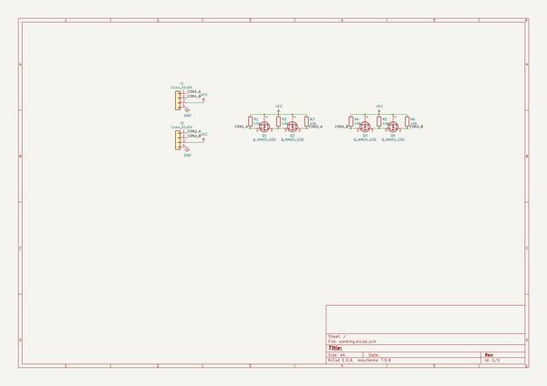

# grovesignalrepeater
 
## summary 
* id: asukiaaa_grovesignalrepeater_grovesignalrepeater
* user: asukiaaa
* name: grovesignalrepeater
* board: grovesignalrepeater
* repo: https://github.com/asukiaaa/GroveSignalRepeater
* src_file_repo_kicad_pcb: GroveSignalRepeater.kicad_pcb
* src_file_repo_kicad_pcb_link: https://github.com/asukiaaa/GroveSignalRepeater/tree/master/GroveSignalRepeater.kicad_pcb

* src_file_repo_sch: GroveSignalRepeater.sch
* src_file_repo_sch_link: https://github.com/asukiaaa/GroveSignalRepeater/tree/master/GroveSignalRepeater.sch
* full details link: https://github.com/oomlout/oomlout_oomp_project_bot_v_2/tree/main/projects/asukiaaa_grovesignalrepeater_grovesignalrepeater/current_version/working  

## schematic  
  
[schematic (pdf)](working_schematic.pdf) 

## pcb  
 
  
  
  
[board (pdf)](working.pdf)  

## working_bom
| Id | Designator | Footprint | Quantity | Designation | Supplier and ref |  | None | 
| --- | --- | --- | --- | --- | --- | --- | --- | 
| 1 | J1,J2 | NS-Tech_Grove_1x04_P2mm_Horizontal | 2 | Conn_01x04 |  |  | [''] | 
| 2 | Q1,Q2,Q3,Q4 | SOT-23 | 4 | Q_NMOS_GSD |  |  | [''] | 
| 3 | R1,R2,R3,R4,R5,R6 | R_0603_1608Metric | 6 | 10k |  |  | [''] | 

## bom_schematic
| Ref | Qnty | Value | Cmp name | Footprint | Description | Vendor | DNP | 
| --- | --- | --- | --- | --- | --- | --- | --- | 
| J1, J2 | 2 | Conn_01x04 | Conn_01x04 | my-kicad-footprints:NS-Tech_Grove_1x04_P2mm_Horizontal | Generic connector, single row, 01x04, script generated (kicad-library-utils/schlib/autogen/connector/) |  |  | 
| Q1, Q2, Q3, Q4 | 4 | Q_NMOS_GSD | Q_NMOS_GSD | Package_TO_SOT_SMD:SOT-23 | N-MOSFET transistor, gate/source/drain |  |  | 
| R1, R2, R3, R4, R5, R6 | 6 | 10k | R | Resistor_SMD:R_0603_1608Metric | Resistor |  |  | 

