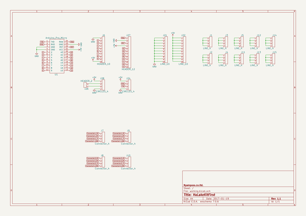
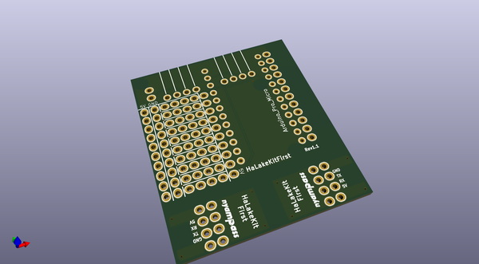
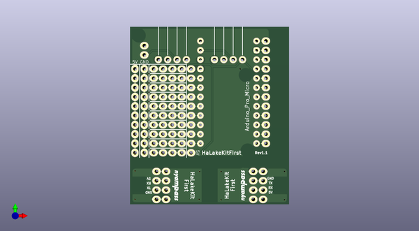
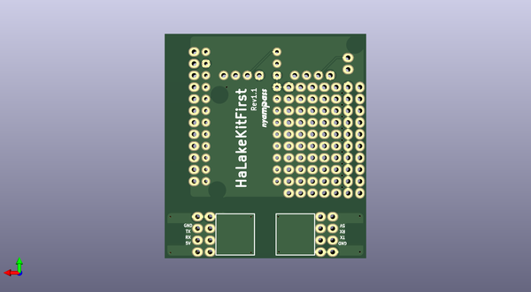

# halakekit_first_break
 
## summary 
* id: asukiaaa_halakekit_first_break_halakekit_first_break
* user: asukiaaa
* name: halakekit_first_break
* board: halakekit_first_break
* repo: https://github.com/asukiaaa/halakekit_first_break
* src_file_repo_kicad_pcb: halakekit_first_break.kicad_pcb
* src_file_repo_kicad_pcb_link: https://github.com/asukiaaa/halakekit_first_break/tree/master/halakekit_first_break.kicad_pcb

* src_file_repo_sch: halakekit_first_break.sch
* src_file_repo_sch_link: https://github.com/asukiaaa/halakekit_first_break/tree/master/halakekit_first_break.sch
* full details link: https://github.com/oomlout/oomlout_oomp_project_bot_v_2/tree/main/projects/asukiaaa_halakekit_first_break_halakekit_first_break/current_version/working  

## schematic  
  
[schematic (pdf)](working_schematic.pdf) 

## pcb  
 
  
  
  
[board (pdf)](working.pdf)  

## working_bom
| Id | Designator | Footprint | Quantity | Designation | Supplier and ref |  | None | 
| --- | --- | --- | --- | --- | --- | --- | --- | 
| 1 | J21,J22 | Pin_Header_Straight_1x10 | 2 | LINE_10 |  |  | [''] | 
| 2 | J26 | Pin_Header_Straight_1x02 | 1 | HEADER_2 |  |  | [''] | 
| 3 | J27 | Pin_Header_Straight_1x12 | 1 | HEADER_12 |  |  | [''] | 
| 4 | U1 | Arduino Pro Micro | 1 | Arduino_Pro_Micro |  |  | [''] | 
| 5 | G***,G***,G*** | nyampass_logo_8p4mm | 3 | LOGO |  |  | [''] | 
| 6 | J1,J2,J3,J4,J5,J11,J12,J13,J14,J15 | Pin_Header_Connect_1x04 | 10 | LINE_4 |  |  | [''] | 
| 7 | J6 | Pin_Header_Straight_1x10 | 1 | HEADER_10 |  |  | [''] | 
| 8 | J9,J10,J7,J8 | Pin_Header_Straight_1x04 | 4 | Connector_4 |  |  | [''] | 
| 9 | J24,J28 | Pin_Header_Circle_1x04 | 2 | CIRCLES_4 |  |  | [''] | 

## bom_schematic
| Ref | Qnty | Value | Cmp name | Footprint | Description | Vendor | DNP | 
| --- | --- | --- | --- | --- | --- | --- | --- | 
| J1, J2, J3, J4, J5, J11, J12, J13, J14, J15 | 10 | LINE_4 | HEADER_4 | simple_headers:Pin_Header_Connect_1x04 |  |  |  | 
| J6 | 1 | HEADER_10 | HEADER_10 | simple_headers:Pin_Header_Straight_1x10 |  |  |  | 
| J7, J8, J9, J10 | 4 | Connector_4 | HEADER_4 | simple_headers:Pin_Header_Straight_1x04 |  |  |  | 
| J21, J22 | 2 | LINE_10 | HEADER_10 | simple_headers:Pin_Header_Straight_1x10 |  |  |  | 
| J24, J28 | 2 | CIRCLES_4 | HEADER_4 | simple_headers:Pin_Header_Circle_1x04 |  |  |  | 
| J26 | 1 | HEADER_2 | HEADER_2 | simple_headers:Pin_Header_Straight_1x02 |  |  |  | 
| J27 | 1 | HEADER_12 | HEADER_12 | simple_headers:Pin_Header_Straight_1x12 |  |  |  | 
| U1 | 1 | Arduino_Pro_Micro | Arduino_Pro_Micro | arduino_pro_micro:Arduino Pro Micro |  |  |  | 

