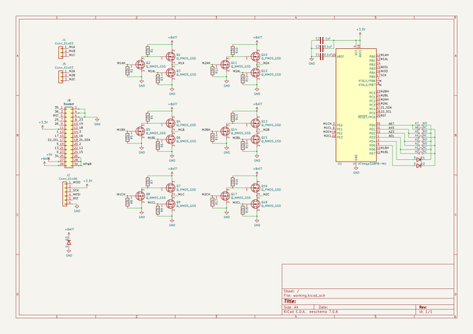
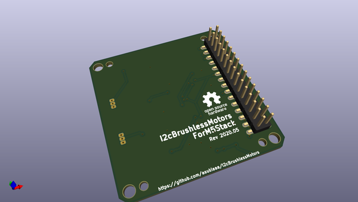
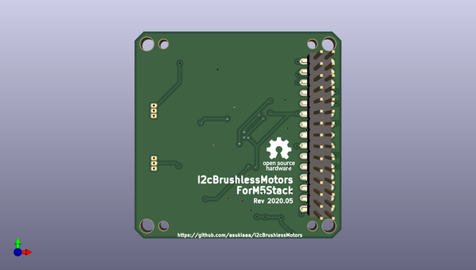
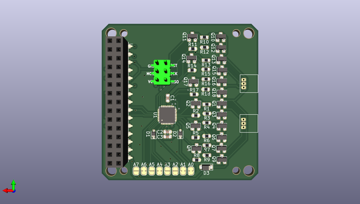

# i2cbrushlessmotors
 
## summary 
* id: asukiaaa_i2cbrushlessmotors_i2cbrushlessmotors
* user: asukiaaa
* name: i2cbrushlessmotors
* board: i2cbrushlessmotors
* repo: https://github.com/asukiaaa/I2cBrushlessMotors
* src_file_repo_kicad_pcb: pcb/I2cBrushlessMotors.kicad_pcb
* src_file_repo_kicad_pcb_link: https://github.com/asukiaaa/I2cBrushlessMotors/tree/master/pcb/I2cBrushlessMotors.kicad_pcb

* src_file_repo_sch: pcb/I2cBrushlessMotors.sch
* src_file_repo_sch_link: https://github.com/asukiaaa/I2cBrushlessMotors/tree/master/pcb/I2cBrushlessMotors.sch
* full details link: https://github.com/oomlout/oomlout_oomp_project_bot_v_2/tree/main/projects/asukiaaa_i2cbrushlessmotors_i2cbrushlessmotors/current_version/working  

## schematic  
  
[schematic (pdf)](working_schematic.pdf) 

## pcb  
 
  
  
  
[board (pdf)](working.pdf)  

## working_bom
| Id | Designator | Footprint | Quantity | Designation | Supplier and ref |  | None | 
| --- | --- | --- | --- | --- | --- | --- | --- | 
| 1 | J3 | PinHeader_2x15_P2.54mm_M5Stack | 1 | Header |  |  | [''] | 
| 2 | J4 | PinSocket_2x15_P2.54mm_Vertical_SMD_just_for_M5Stack_bottom | 1 | Socket |  |  | [''] | 
| 3 | C1,C3 | C_0603_1608Metric | 2 | 0.1uf |  |  | [''] | 
| 4 | J2 | 2x03_P2.54mm_Pads | 1 | Conn_01x06 |  |  | [''] | 
| 5 | R3,R2,R1,R5,R8,R4,R7,R6,R9,R11,R14,R17,R10,R13,R16,R12,R15,R18 | R_0603_1608Metric | 18 | 10k |  |  | [''] | 
| 6 | J1,J5 | Molex_1x03_P1.25mm_Vertical | 2 | Conn_01x03 |  |  | [''] | 
| 7 | Q1,Q4,Q7,Q10,Q13,Q16 | SOT-23 | 6 | Q_PMOS_GSD |  |  | [''] | 
| 8 | Q2,Q3,Q5,Q8,Q6,Q9,Q11,Q14,Q17,Q12,Q15,Q18 | SOT-23 | 12 | Q_NMOS_GSD |  |  | [''] | 
| 9 | U1 | QFN-32-1EP_5x5mm_P0.5mm_EP3.1x3.1mm | 1 | ATmega328PB-MU |  |  | [''] | 
| 10 | C2 | C_0603_1608Metric | 1 | 1uf |  |  | [''] | 
| 11 | D1,D2 | D_SOD-323 | 2 | D |  |  | [''] | 
| 12 | D3 | D_SOD-123F | 1 | D |  |  | [''] | 

## bom_schematic
| Ref | Qnty | Value | Cmp name | Footprint | Description | Vendor | DNP | 
| --- | --- | --- | --- | --- | --- | --- | --- | 
| A0, A1, A4, A6 | 4 | NC | Jumper_NC_Small-Device | Jumper:SolderJumper-2_P1.3mm_Bridged_RoundedPad1.0x1.5mm |  |  |  | 
| A2, A3, A5, A7 | 4 | NO | Jumper_NO_Small-Device | Jumper:SolderJumper-2_P1.3mm_Open_RoundedPad1.0x1.5mm |  |  |  | 
| C1, C3 | 2 | 0.1uf | C | Capacitor_SMD:C_0603_1608Metric | Unpolarized capacitor |  |  | 
| C2 | 1 | 1uf | C | Capacitor_SMD:C_0603_1608Metric | Unpolarized capacitor |  |  | 
| D1, D2 | 2 | D | D | Diode_SMD:D_SOD-323 | Diode |  |  | 
| D3 | 1 | D | D | Diode_SMD:D_SOD-123F | Diode |  |  | 
| J1, J5 | 2 | Conn_01x03 | Conn_01x03 | footprints:Molex_1x03_P1.25mm_Vertical | Generic connector, single row, 01x03, script generated (kicad-library-utils/schlib/autogen/connector/) |  |  | 
| J2 | 1 | Conn_01x06 | Conn_01x06 | footprints:2x03_P2.54mm_Pads | Generic connector, single row, 01x06, script generated (kicad-library-utils/schlib/autogen/connector/) |  |  | 
| J3 | 1 | Header | Conn_02x15_Odd_Even | footprints:PinHeader_2x15_P2.54mm_M5Stack | Generic connector, double row, 02x15, odd/even pin numbering scheme (row 1 odd numbers, row 2 even numbers), script generated (kicad-library-utils/schlib/autogen/connector/) |  |  | 
| J4 | 1 | Socket | Conn_02x15_Odd_Even | footprints:PinSocket_2x15_P2.54mm_Vertical_SMD_just_for_M5Stack_bottom | Generic connector, double row, 02x15, odd/even pin numbering scheme (row 1 odd numbers, row 2 even numbers), script generated (kicad-library-utils/schlib/autogen/connector/) |  |  | 
| Q1, Q4, Q7, Q10, Q13, Q16 | 6 | Q_PMOS_GSD | Q_PMOS_GSD | Package_TO_SOT_SMD:SOT-23 | P-MOSFET transistor, gate/source/drain |  |  | 
| Q2, Q3, Q5, Q6, Q8, Q9, Q11, Q12, Q14, Q15, Q17, Q18 | 12 | Q_NMOS_GSD | Q_NMOS_GSD | Package_TO_SOT_SMD:SOT-23 | N-MOSFET transistor, gate/source/drain |  |  | 
| R1, R2, R3, R4, R5, R6, R7, R8, R9, R10, R11, R12, R13, R14, R15, R16, R17, R18 | 18 | 10k | R | Resistor_SMD:R_0603_1608Metric | Resistor |  |  | 
| U1 | 1 | ATmega328PB-MU | ATmega328PB-MU-MCU_Microchip_ATmega | Package_DFN_QFN:QFN-32-1EP_5x5mm_P0.5mm_EP3.1x3.1mm |  |  |  | 

