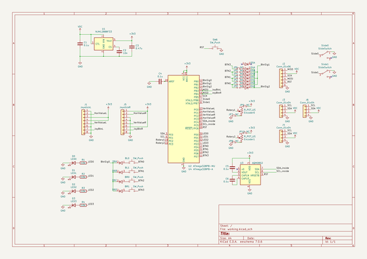

# i2ccontrolpanel
 
## summary 
* id: asukiaaa_i2ccontrolpanel_i2ccontrolpanel
* user: asukiaaa
* name: i2ccontrolpanel
* board: i2ccontrolpanel
* repo: https://github.com/asukiaaa/I2cControlPanel
* src_file_repo_kicad_pcb: I2cControlPanel.kicad_pcb
* src_file_repo_kicad_pcb_link: https://github.com/asukiaaa/I2cControlPanel/tree/master/I2cControlPanel.kicad_pcb
* src_file_repo_kicad_sch: I2cControlPanel.kicad_sch
* src_file_repo_kicad_sch_link: https://github.com/asukiaaa/I2cControlPanel/tree/master/I2cControlPanel.kicad_sch

* src_file_repo_sch: 
* src_file_repo_sch_link: https://github.com/asukiaaa/I2cControlPanel/tree/master/
* full details link: https://github.com/oomlout/oomlout_oomp_project_bot_v_2/tree/main/projects/asukiaaa_i2ccontrolpanel_i2ccontrolpanel/current_version/working  

## schematic  
  
[schematic (pdf)](working_schematic.pdf) 

## pcb  
 
  
  
  
[board (pdf)](working.pdf)  

## working_bom
| Id | Designator | Footprint | Quantity | Designation | Supplier and ref |  | None | 
| --- | --- | --- | --- | --- | --- | --- | --- | 
| 1 | D0 | D_0603_1608Metric_Pad1.05x0.95mm_HandSolder | 1 | LED0 |  |  | [''] | 
| 2 | D1 | D_0603_1608Metric_Pad1.05x0.95mm_HandSolder | 1 | LED1 |  |  | [''] | 
| 3 | D2 | D_0603_1608Metric_Pad1.05x0.95mm_HandSolder | 1 | LED2 |  |  | [''] | 
| 4 | J3,J6 | NS-Tech_Grove_1x04_P2mm_Horizontal | 2 | Conn_01x04 |  |  | [''] | 
| 5 | J4 | TerminalBlock_bornier-4_P5.08mm | 1 | Conn_01x04 |  |  | [''] | 
| 6 | BL0,BL1,BR0,BR1 | SW_Center_PUSH-12mm | 4 | SW_Push |  |  | [''] | 
| 7 | U3 | AQM0802A-RN-GBW | 1 | AQM0802 |  |  | [''] | 
| 8 | JP0,JP1,JP2,JP3,JP4,JP5 | SolderJumper-2_P1.3mm_Open_RoundedPad1.0x1.5mm | 6 | NO |  |  | [''] | 
| 9 | JP6,JP7,JP8,JP9,JP10 | SolderJumper-2_P1.3mm_Bridged_RoundedPad1.0x1.5mm | 5 | NC |  |  | [''] | 
| 10 | J1 | PS4tJoystick | 1 | JoystickL |  |  | [''] | 
| 11 | J5 | PS4tJoystick | 1 | JoystickR |  |  | [''] | 
| 12 | Encoder0,Encoder1 | RoteryEncoderWithPowerLabel | 2 | R_POT_US |  |  | [''] | 
| 13 | Slide0,Slide1 | SlideSwitch_SS12D01G4_2posi_1line | 2 | SlideSwitch |  |  | [''] | 
| 14 | D3 | D_0603_1608Metric_Pad1.05x0.95mm_HandSolder | 1 | LED3 |  |  | [''] | 
| 15 | SW6 | SW_PUSH_6mm | 1 | SW_Push |  |  | [''] | 
| 16 | C1,C4,C5,C6 | C_0402_1005Metric | 4 | 0.1u |  |  | [''] | 
| 17 | C2 | C_0603_1608Metric | 1 | 10n |  |  | [''] | 
| 18 | C3 | C_0402_1005Metric | 1 | 0.47u |  |  | [''] | 
| 19 | J2 | 2x03_P2.54mm_Pads | 1 | Conn_01x06 |  |  | [''] | 
| 20 | R1,R2,R3,R4 | R_0603_1608Metric | 4 | 10k |  |  | [''] | 
| 21 | U2 | QFN-32-1EP_5x5mm_P0.5mm_EP3.1x3.1mm | 1 | ATmega328PB-MU |  |  | [''] | 
| 22 | U1 | SOT-23-5 | 1 | NJM12888F33 |  |  | [''] | 
| 23 | D4,D5,D6 | SC-74-5_1.6x2.9mm_P0.95mm | 3 | 1SS309 |  |  | [''] | 
| 24 | U4 | TQFP-32_7x7mm_P0.8mm_short_inner | 1 | ATmega328PB-A |  |  | [''] | 

## bom_schematic
| Ref | Qnty | Value | Cmp name | Footprint | Description | Vendor | DNP | 
| --- | --- | --- | --- | --- | --- | --- | --- | 
| BL0, BL1 | 2 | SW_Push | SW_Push | footprints:SW_Center_PUSH-12mm | Push button switch, generic, two pins |  |  | 
| BR0, BR1 | 2 | SW_Push | SW_Push | footprints:SW_Center_PUSH-12mm | Push button switch, generic, two pins |  |  | 
| C1, C4, C5, C6 | 4 | 0.1u | C | Capacitor_SMD:C_0402_1005Metric | Unpolarized capacitor |  |  | 
| C2 | 1 | 10n | C | Capacitor_SMD:C_0603_1608Metric | Unpolarized capacitor |  |  | 
| C3 | 1 | 0.47u | C | Capacitor_SMD:C_0402_1005Metric | Unpolarized capacitor |  |  | 
| D0 | 1 | LED0 | LED | Diode_SMD:D_0603_1608Metric_Pad1.05x0.95mm_HandSolder | Light emitting diode |  |  | 
| D1 | 1 | LED1 | LED | Diode_SMD:D_0603_1608Metric_Pad1.05x0.95mm_HandSolder | Light emitting diode |  |  | 
| D2 | 1 | LED2 | LED | Diode_SMD:D_0603_1608Metric_Pad1.05x0.95mm_HandSolder | Light emitting diode |  |  | 
| D3 | 1 | LED3 | LED | Diode_SMD:D_0603_1608Metric_Pad1.05x0.95mm_HandSolder | Light emitting diode |  |  | 
| D4, D5, D6 | 3 | 1SS309 | Diode_4array_1SS309 | asukiaaa-kicad-footprints:SC-74-5_1.6x2.9mm_P0.95mm |  |  |  | 
| Encoder0, Encoder1 | 2 | R_POT_US | R_POT_US-Device | asukiaaa-kicad-footprints:RoteryEncoderWithPowerLabel |  |  |  | 
| J1 | 1 | JoystickL | Conn_01x08 | asukiaaa-kicad-footprints:PS4tJoystick | Generic connector, single row, 01x08, script generated (kicad-library-utils/schlib/autogen/connector/) |  |  | 
| J2 | 1 | Conn_01x06 | Conn_01x06 | asukiaaa-kicad-footprints:2x03_P2.54mm_Pads | Generic connector, single row, 01x06, script generated (kicad-library-utils/schlib/autogen/connector/) |  |  | 
| J3, J6 | 2 | Conn_01x04 | Conn_01x04 | footprints:NS-Tech_Grove_1x04_P2mm_Horizontal | Generic connector, single row, 01x04, script generated (kicad-library-utils/schlib/autogen/connector/) |  |  | 
| J4 | 1 | Conn_01x04 | Conn_01x04 | TerminalBlock:TerminalBlock_bornier-4_P5.08mm | Generic connector, single row, 01x04, script generated (kicad-library-utils/schlib/autogen/connector/) |  |  | 
| J5 | 1 | JoystickR | Conn_01x08 | asukiaaa-kicad-footprints:PS4tJoystick | Generic connector, single row, 01x08, script generated (kicad-library-utils/schlib/autogen/connector/) |  |  | 
| JP0, JP1, JP2, JP3, JP4, JP5 | 6 | NO | Jumper_NO_Small-Device | Jumper:SolderJumper-2_P1.3mm_Open_RoundedPad1.0x1.5mm |  |  |  | 
| JP6, JP7, JP8, JP9, JP10 | 5 | NC | Jumper_NC_Small-Device | Jumper:SolderJumper-2_P1.3mm_Bridged_RoundedPad1.0x1.5mm |  |  |  | 
| R1, R2, R3, R4 | 4 | 10k | R | Resistor_SMD:R_0603_1608Metric | Resistor |  |  | 
| Slide0, Slide1 | 2 | SlideSwitch | SW_SPDT | asukiaaa-kicad-footprints:SlideSwitch_SS12D01G4_2posi_1line | Switch, single pole double throw |  |  | 
| SW6 | 1 | SW_Push | SW_Push | Button_Switch_THT:SW_PUSH_6mm | Push button switch, generic, two pins |  |  | 
| U1 | 1 | NJM12888F33 | NJM12888F33 | Package_TO_SOT_SMD:SOT-23-5 | http://akizukidenshi.com/catalog/g/gI-10675/ |  |  | 
| U2 | 1 | ATmega328PB-MU | ATmega328PB-MU-MCU_Microchip_ATmega | Package_DFN_QFN:QFN-32-1EP_5x5mm_P0.5mm_EP3.1x3.1mm |  |  |  | 
| U3 | 1 | AQM0802 | AQM0802 | asukiaaa-kicad-footprints:AQM0802A-RN-GBW |  |  |  | 
| U4 | 1 | ATmega328PB-A | ATmega328PB-A | asukiaaa-kicad-footprints:TQFP-32_7x7mm_P0.8mm_short_inner | 20MHz, 32kB Flash, 2kB SRAM, 1kB EEPROM, TQFP-32 |  |  | 

