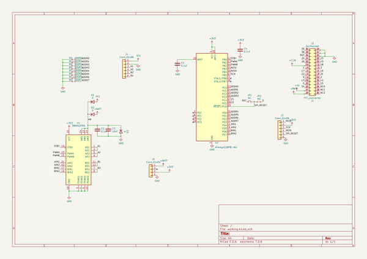

# i2cmotorsform5stack
 
## summary 
* id: asukiaaa_i2cmotorsform5stack_i2cmotorsform5stack
* user: asukiaaa
* name: i2cmotorsform5stack
* board: i2cmotorsform5stack
* repo: https://github.com/asukiaaa/I2cMotorsForM5Stack
* src_file_repo_kicad_pcb: pcb/I2cMotorsForM5Stack.kicad_pcb
* src_file_repo_kicad_pcb_link: https://github.com/asukiaaa/I2cMotorsForM5Stack/tree/master/pcb/I2cMotorsForM5Stack.kicad_pcb

* src_file_repo_sch: pcb/I2cMotorsForM5Stack.sch
* src_file_repo_sch_link: https://github.com/asukiaaa/I2cMotorsForM5Stack/tree/master/pcb/I2cMotorsForM5Stack.sch
* full details link: https://github.com/oomlout/oomlout_oomp_project_bot_v_2/tree/main/projects/asukiaaa_i2cmotorsform5stack_i2cmotorsform5stack/current_version/working  

## schematic  
  
[schematic (pdf)](working_schematic.pdf) 

## pcb  
 
  
  
  
[board (pdf)](working.pdf)  

## working_bom
| Id | Designator | Footprint | Quantity | Designation | Supplier and ref |  | None | 
| --- | --- | --- | --- | --- | --- | --- | --- | 
| 1 | J1 | Hirose_FH12-30S-0.5SH_1x30-1MP_P0.50mm_Horizontal | 1 | FFC_connector |  |  | [''] | 
| 2 | C1,C2,C4 | C_0603_1608Metric | 3 | 0.1uf |  |  | [''] | 
| 3 | U1 | SSOP-24_5.3x8.2mm_P0.65mm | 1 | TB6612FNG |  |  | [''] | 
| 4 | C3 | C_0805_2012Metric | 1 | 10uf |  |  | [''] | 
| 5 | J3 | 2x03_P2.54mm_Pads | 1 | Conn_01x06 |  |  | [''] | 
| 6 | D1,D2,D3 | D_SOD-123F | 3 | D |  |  | [''] | 
| 7 | J4 | TerminalBlock_bornier-6_P5.08mm | 1 | Conn_01x06 |  |  | [''] | 
| 8 | U2 | QFN-32-1EP_5x5mm_P0.5mm_EP3.1x3.1mm | 1 | ATmega328PB-MU |  |  | [''] | 
| 9 | J5 | NS-Tech_Grove_1x04_P2mm_Vertical | 1 | Conn_01x04 |  |  | [''] | 
| 10 | J2 | PinSocket_2x15_P2.54mm_Vertical_SMD_just_for_M5Stack_bottom | 1 | 2x15socket |  |  | [''] | 

## bom_schematic
| Ref | Qnty | Value | Cmp name | Footprint | Description | Vendor | DNP | 
| --- | --- | --- | --- | --- | --- | --- | --- | 
| ADDR0, ADDR2, ADDR3, ADDR5, ADDR7 | 5 | NO | Jumper_NO_Small-Device-I2cMotorsForM5Stack-rescue | Jumper:SolderJumper-2_P1.3mm_Open_RoundedPad1.0x1.5mm |  |  |  | 
| ADDR1, ADDR4, ADDR6 | 3 | NC | Jumper_NC_Small-Device-I2cMotorsForM5Stack-rescue | Jumper:SolderJumper-2_P1.3mm_Bridged_RoundedPad1.0x1.5mm |  |  |  | 
| C1, C2, C4 | 3 | 0.1uf | C | Capacitor_SMD:C_0603_1608Metric | Unpolarized capacitor |  |  | 
| C3 | 1 | 10uf | C | Capacitor_SMD:C_0805_2012Metric | Unpolarized capacitor |  |  | 
| D1, D2, D3 | 3 | D | D | Diode_SMD:D_SOD-123F | Diode |  |  | 
| J1 | 1 | FFC_connector | Conn_02x15_Odd_Even | Connector_FFC-FPC:Hirose_FH12-30S-0.5SH_1x30-1MP_P0.50mm_Horizontal | Generic connector, double row, 02x15, odd/even pin numbering scheme (row 1 odd numbers, row 2 even numbers), script generated (kicad-library-utils/schlib/autogen/connector/) |  |  | 
| J2 | 1 | 2x15socket | Conn_02x15_Odd_Even | my-kicad-footprints:PinSocket_2x15_P2.54mm_Vertical_SMD_just_for_M5Stack_bottom | Generic connector, double row, 02x15, odd/even pin numbering scheme (row 1 odd numbers, row 2 even numbers), script generated (kicad-library-utils/schlib/autogen/connector/) |  |  | 
| J3 | 1 | Conn_01x06 | Conn_01x06 | footprints:2x03_P2.54mm_Pads | Generic connector, single row, 01x06, script generated (kicad-library-utils/schlib/autogen/connector/) |  |  | 
| J4 | 1 | Conn_01x06 | Conn_01x06 | TerminalBlock:TerminalBlock_bornier-6_P5.08mm | Generic connector, single row, 01x06, script generated (kicad-library-utils/schlib/autogen/connector/) |  |  | 
| J5 | 1 | Conn_01x04 | Conn_01x04 | Connector:NS-Tech_Grove_1x04_P2mm_Vertical | Generic connector, single row, 01x04, script generated (kicad-library-utils/schlib/autogen/connector/) |  |  | 
| JP1 | 1 | NC | Jumper_NC_Small-Device-I2cMotorsForM5Stack-rescue | Jumper:SolderJumper-2_P1.3mm_Bridged_RoundedPad1.0x1.5mm |  |  |  | 
| JP2 | 1 | NO | Jumper_NO_Small-Device-I2cMotorsForM5Stack-rescue | Jumper:SolderJumper-2_P1.3mm_Open_RoundedPad1.0x1.5mm |  |  |  | 
| U1 | 1 | TB6612FNG | TB6612FNG-Driver_Motor-I2cMotorsForM5Stack-rescue | Package_SO:SSOP-24_5.3x8.2mm_P0.65mm |  |  |  | 
| U2 | 1 | ATmega328PB-MU | ATmega328PB-MU-MCU_Microchip_ATmega-I2cMotorsForM5Stack-rescue | Package_DFN_QFN:QFN-32-1EP_5x5mm_P0.5mm_EP3.1x3.1mm |  |  |  | 

