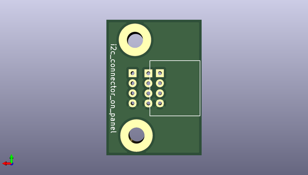

# iris_ohyama_ihk_t35_i2c_controller_pcb
 
## summary 
* id: asukiaaa_iris_ohyama_ihk_t35_i2c_controller_pcb_i2c_connector_on_panel
* user: asukiaaa
* name: iris_ohyama_ihk_t35_i2c_controller_pcb
* board: i2c_connector_on_panel
* repo: https://github.com/asukiaaa/IRIS-OHYAMA-IHK-T35-I2C-Controller-PCB
* src_file_repo_kicad_pcb: i2c_connector_on_panel/i2c_connector_on_panel.kicad_pcb
* src_file_repo_kicad_pcb_link: https://github.com/asukiaaa/IRIS-OHYAMA-IHK-T35-I2C-Controller-PCB/tree/master/i2c_connector_on_panel/i2c_connector_on_panel.kicad_pcb

* src_file_repo_sch: i2c_connector_on_panel/i2c_connector_on_panel.sch
* src_file_repo_sch_link: https://github.com/asukiaaa/IRIS-OHYAMA-IHK-T35-I2C-Controller-PCB/tree/master/i2c_connector_on_panel/i2c_connector_on_panel.sch
* full details link: https://github.com/oomlout/oomlout_oomp_project_bot_v_2/tree/main/projects/asukiaaa_iris_ohyama_ihk_t35_i2c_controller_pcb_i2c_connector_on_panel/current_version/working  

## schematic  
  
[schematic (pdf)](working_schematic.pdf) 

## pcb  
 
  
  
  
[board (pdf)](working.pdf)  

## working_bom
| Id | Designator | Footprint | Quantity | Designation | Supplier and ref |  | None | 
| --- | --- | --- | --- | --- | --- | --- | --- | 
| 1 | J2,J1 | NS-Tech_Grove_1x04_P2mm_Horizontal | 2 | Conn_01x04 |  |  | [''] | 
| 2 | J3 | NS-Tech_Grove_1x04_P2mm_Vertical | 1 | Conn_01x04 |  |  | [''] | 

## bom_schematic
| Ref | Qnty | Value | Cmp name | Footprint | Description | Vendor | DNP | 
| --- | --- | --- | --- | --- | --- | --- | --- | 
| J1, J2 | 2 | Conn_01x04 | Conn_01x04 | my-kicad-footprints:NS-Tech_Grove_1x04_P2mm_Horizontal | Generic connector, single row, 01x04, script generated (kicad-library-utils/schlib/autogen/connector/) |  |  | 
| J3 | 1 | Conn_01x04 | Conn_01x04 | Connector:NS-Tech_Grove_1x04_P2mm_Vertical | Generic connector, single row, 01x04, script generated (kicad-library-utils/schlib/autogen/connector/) |  |  | 

