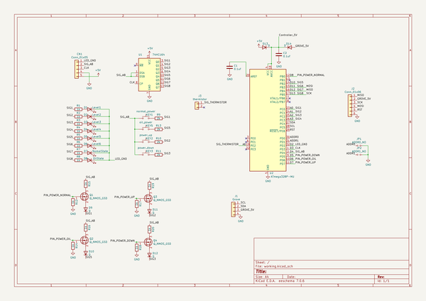
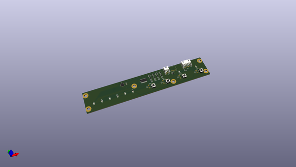
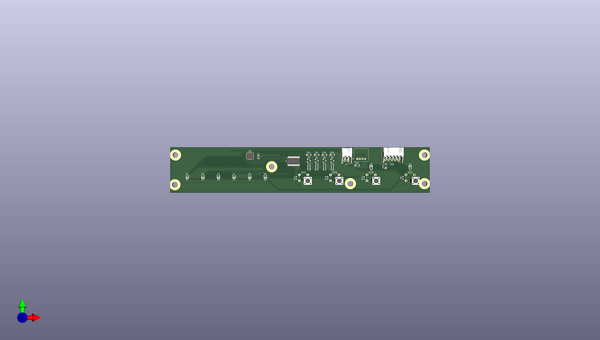
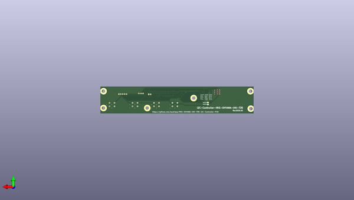

# iris_ohyama_ihk_t35_i2c_controller_pcb
 
## summary 
* id: asukiaaa_iris_ohyama_ihk_t35_i2c_controller_pcb_iris_ohyama_ihk_t35_i2c_controller
* user: asukiaaa
* name: iris_ohyama_ihk_t35_i2c_controller_pcb
* board: iris_ohyama_ihk_t35_i2c_controller
* repo: https://github.com/asukiaaa/IRIS-OHYAMA-IHK-T35-I2C-Controller-PCB
* src_file_repo_kicad_pcb: main_pcb/IRIS-OHYAMA-IHK-T35-I2C-Controller.kicad_pcb
* src_file_repo_kicad_pcb_link: https://github.com/asukiaaa/IRIS-OHYAMA-IHK-T35-I2C-Controller-PCB/tree/master/main_pcb/IRIS-OHYAMA-IHK-T35-I2C-Controller.kicad_pcb

* src_file_repo_sch: main_pcb/IRIS-OHYAMA-IHK-T35-I2C-Controller.sch
* src_file_repo_sch_link: https://github.com/asukiaaa/IRIS-OHYAMA-IHK-T35-I2C-Controller-PCB/tree/master/main_pcb/IRIS-OHYAMA-IHK-T35-I2C-Controller.sch
* full details link: https://github.com/oomlout/oomlout_oomp_project_bot_v_2/tree/main/projects/asukiaaa_iris_ohyama_ihk_t35_i2c_controller_pcb_iris_ohyama_ihk_t35_i2c_controller/current_version/working  

## schematic  
  
[schematic (pdf)](working_schematic.pdf) 

## pcb  
 
  
  
  
[board (pdf)](working.pdf)  

## working_bom
| Id | Designator | Footprint | Quantity | Designation | Supplier and ref |  | None | 
| --- | --- | --- | --- | --- | --- | --- | --- | 
| 1 | J3 | JST_XH_S2B-XH-A_1x02_P2.50mm_Horizontal | 1 | thermistor |  |  | [''] | 
| 2 | C1,C2 | C_0402_1005Metric | 2 | 0.1uf |  |  | [''] | 
| 3 | CN1 | JST_XH_S5B-XH-A_1x05_P2.50mm_Horizontal | 1 | Conn_01x05 |  |  | [''] | 
| 4 | D1 | LED_0603_1608Metric | 1 | Level1 |  |  | [''] | 
| 5 | D2 | LED_0603_1608Metric | 1 | Level2 |  |  | [''] | 
| 6 | D3 | LED_0603_1608Metric | 1 | Level3 |  |  | [''] | 
| 7 | D4 | LED_0603_1608Metric | 1 | Level4 |  |  | [''] | 
| 8 | D5 | LED_0603_1608Metric | 1 | Level5 |  |  | [''] | 
| 9 | D6 | LED_0603_1608Metric | 1 | Level6 |  |  | [''] | 
| 10 | D7 | LED_0603_1608Metric | 1 | NomalState |  |  | [''] | 
| 11 | D8 | LED_0603_1608Metric | 1 | OilState |  |  | [''] | 
| 12 | D9,D10,D11,D12,D13,D14 | D_SOD-123F | 6 | D |  |  | [''] | 
| 13 | J1 | NS-Tech_Grove_1x04_P2mm_Horizontal | 1 | Grove |  |  | [''] | 
| 14 | KEY1 | SW_PUSH_6mm_center_like_smd | 1 | normal_power |  |  | [''] | 
| 15 | KEY2 | SW_PUSH_6mm_center_like_smd | 1 | power_up |  |  | [''] | 
| 16 | KEY3 | SW_PUSH_6mm_center_like_smd | 1 | power_down |  |  | [''] | 
| 17 | KEY5 | SW_PUSH_6mm_center_like_smd | 1 | oil_power |  |  | [''] | 
| 18 | Q1,Q2,Q3,Q4 | SOT-23 | 4 | Q_NMOS_DGS |  |  | [''] | 
| 19 | R1,R2,R3,R4,R5,R6,R7,R8,R12,R14,R15,R16,R17,R18,R19,R20 | R_0603_1608Metric | 16 | 1k |  |  | [''] | 
| 20 | R9,R10,R11,R13 | R_0603_1608Metric | 4 | 2k |  |  | [''] | 
| 21 | U1 | SOP-14_4.4x9.2mm_P1.27mm | 1 | 74HC164 |  |  | [''] | 
| 22 | U2 | QFN-32-1EP_5x5mm_P0.5mm_EP3.1x3.1mm | 1 | ATmega328P-MU |  |  | [''] | 
| 23 | J2 | 2x03_P2.54mm_Pads | 1 | Conn_01x06 |  |  | [''] | 

## bom_schematic
| Ref | Qnty | Value | Cmp name | Footprint | Description | Vendor | DNP | 
| --- | --- | --- | --- | --- | --- | --- | --- | 
| C1, C2 | 2 | 0.1uf | C | Capacitor_SMD:C_0402_1005Metric | Unpolarized capacitor |  |  | 
| CN1 | 1 | Conn_01x05 | Conn_01x05 | Connector_JST:JST_XH_S5B-XH-A_1x05_P2.50mm_Horizontal | Generic connector, single row, 01x05, script generated (kicad-library-utils/schlib/autogen/connector/) |  |  | 
| D1 | 1 | Level1 | LED | LED_SMD:LED_0603_1608Metric | Light emitting diode |  |  | 
| D2 | 1 | Level2 | LED | LED_SMD:LED_0603_1608Metric | Light emitting diode |  |  | 
| D3 | 1 | Level3 | LED | LED_SMD:LED_0603_1608Metric | Light emitting diode |  |  | 
| D4 | 1 | Level4 | LED | LED_SMD:LED_0603_1608Metric | Light emitting diode |  |  | 
| D5 | 1 | Level5 | LED | LED_SMD:LED_0603_1608Metric | Light emitting diode |  |  | 
| D6 | 1 | Level6 | LED | LED_SMD:LED_0603_1608Metric | Light emitting diode |  |  | 
| D7 | 1 | NomalState | LED | LED_SMD:LED_0603_1608Metric | Light emitting diode |  |  | 
| D8 | 1 | OilState | LED | LED_SMD:LED_0603_1608Metric | Light emitting diode |  |  | 
| D9, D10, D11, D12, D13, D14 | 6 | D | D | Diode_SMD:D_SOD-123F | Diode |  |  | 
| J1 | 1 | Grove | Conn_01x04 | my-kicad-footprints:NS-Tech_Grove_1x04_P2mm_Horizontal | Generic connector, single row, 01x04, script generated (kicad-library-utils/schlib/autogen/connector/) |  |  | 
| J2 | 1 | Conn_01x06 | Conn_01x06 | my-kicad-footprints:2x03_P2.54mm_Pads | Generic connector, single row, 01x06, script generated (kicad-library-utils/schlib/autogen/connector/) |  |  | 
| J3 | 1 | thermistor | Conn_01x02 | Connector_JST:JST_XH_S2B-XH-A_1x02_P2.50mm_Horizontal | Generic connector, single row, 01x02, script generated (kicad-library-utils/schlib/autogen/connector/) |  |  | 
| JP1 | 1 | ADDR0_NO | Jumper_NO_Small-Device | Jumper:SolderJumper-2_P1.3mm_Open_RoundedPad1.0x1.5mm |  |  |  | 
| JP2 | 1 | ADDR1_NO | Jumper_NO_Small-Device | Jumper:SolderJumper-2_P1.3mm_Open_RoundedPad1.0x1.5mm |  |  |  | 
| KEY1 | 1 | normal_power | SW_Push | footprints:SW_PUSH_6mm_center_like_smd | Push button switch, generic, two pins |  |  | 
| KEY2 | 1 | power_up | SW_Push | footprints:SW_PUSH_6mm_center_like_smd | Push button switch, generic, two pins |  |  | 
| KEY3 | 1 | power_down | SW_Push | footprints:SW_PUSH_6mm_center_like_smd | Push button switch, generic, two pins |  |  | 
| KEY5 | 1 | oil_power | SW_Push | footprints:SW_PUSH_6mm_center_like_smd | Push button switch, generic, two pins |  |  | 
| Q1, Q2, Q3, Q4 | 4 | Q_NMOS_GSD | Q_NMOS_GSD | Package_TO_SOT_SMD:SOT-23 | N-MOSFET transistor, gate/source/drain |  |  | 
| R1, R2, R3, R4, R5, R6, R7, R8, R12, R14, R15, R16, R17, R18, R19, R20 | 16 | 1k | R | Resistor_SMD:R_0603_1608Metric | Resistor |  |  | 
| R9, R10, R11, R13 | 4 | 2k | R | Resistor_SMD:R_0603_1608Metric | Resistor |  |  | 
| U1 | 1 | 74HC164 | 74HC164 | footprints:SOP-14_4.4x9.2mm_P1.27mm | 8-bit serial-in parallel-out shift register |  |  | 
| U2 | 1 | ATmega328P-MU | ATmega328PB-MU-MCU_Microchip_ATmega | Package_DFN_QFN:QFN-32-1EP_5x5mm_P0.5mm_EP3.1x3.1mm |  |  |  | 

