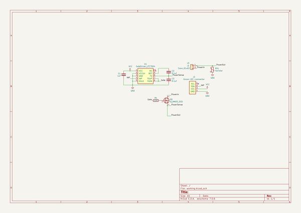
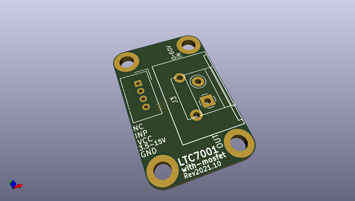
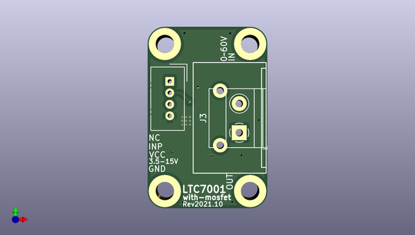
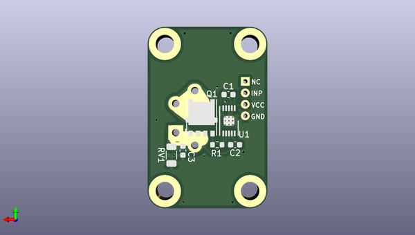

# ltc7004_with_mosfet
 
## summary 
* id: asukiaaa_ltc7004_with_mosfet_ltc7004_with_mosfet
* user: asukiaaa
* name: ltc7004_with_mosfet
* board: ltc7004_with_mosfet
* repo: https://github.com/asukiaaa/LTC7004-with-mosfet
* src_file_repo_kicad_pcb: LTC7004-with-MOSFET.kicad_pcb
* src_file_repo_kicad_pcb_link: https://github.com/asukiaaa/LTC7004-with-mosfet/tree/master/LTC7004-with-MOSFET.kicad_pcb

* src_file_repo_sch: LTC7004-with-MOSFET.sch
* src_file_repo_sch_link: https://github.com/asukiaaa/LTC7004-with-mosfet/tree/master/LTC7004-with-MOSFET.sch
* full details link: https://github.com/oomlout/oomlout_oomp_project_bot_v_2/tree/main/projects/asukiaaa_ltc7004_with_mosfet_ltc7004_with_mosfet/current_version/working  

## schematic  
  
[schematic (pdf)](working_schematic.pdf) 

## pcb  
 
  
  
  
[board (pdf)](working.pdf)  

## working_bom
| Id | Designator | Footprint | Quantity | Designation | Supplier and ref |  | None | 
| --- | --- | --- | --- | --- | --- | --- | --- | 
| 1 | J1 | Terminal_9.52mm_1x02_1714971 | 1 | Conn_01x02 |  |  | [''] | 
| 2 | J2 | NS-Tech_Grove_1x04_P2mm_Vertical | 1 | Grove-I2C-connector |  |  | [''] | 
| 3 | J3 | TerminalBlock_Phoenix_MKDS-1,5-2-5.08_1x02_P5.08mm_Horizontal | 1 | Conn_01x02 |  |  | [''] | 
| 4 | C1 | C_0603_1608Metric | 1 | 1uf |  |  | [''] | 
| 5 | C2,C3 | C_0603_1608Metric | 2 | 0.1uf |  |  | [''] | 
| 6 | Q1 | DFN5 | 1 | Q_NMOS_SGD |  |  | [''] | 
| 7 | U1 | GateDriver_LTC7004 | 1 | GateDriver_LTC7004 |  |  | [''] | 
| 8 | R1 | R_0603_1608Metric | 1 | 100 |  |  | [''] | 
| 9 | RV1 | R_1206_3216Metric | 1 | Varistor |  |  | [''] | 

## bom_schematic
| Ref | Qnty | Value | Cmp name | Footprint | Description | Vendor | DNP | 
| --- | --- | --- | --- | --- | --- | --- | --- | 
| C1 | 1 | 1uf | C | Capacitor_SMD:C_0603_1608Metric | Unpolarized capacitor |  |  | 
| C2, C3 | 2 | 0.1uf | C | Capacitor_SMD:C_0603_1608Metric | Unpolarized capacitor |  |  | 
| J1 | 1 | Conn_01x02 | Conn_01x02 | my-kicad-footprints:Terminal_9.52mm_1x02_1714971 | Generic connector, single row, 01x02, script generated (kicad-library-utils/schlib/autogen/connector/) |  |  | 
| J2 | 1 | Grove-I2C-connector | Grove-I2C-connector-my-kicad-symbols | Connector:NS-Tech_Grove_1x04_P2mm_Vertical |  |  |  | 
| J3 | 1 | Conn_01x02 | Conn_01x02 | TerminalBlock_Phoenix:TerminalBlock_Phoenix_MKDS-1,5-2-5.08_1x02_P5.08mm_Horizontal | Generic connector, single row, 01x02, script generated (kicad-library-utils/schlib/autogen/connector/) |  |  | 
| Q1 | 1 | Q_NMOS_SGD | Q_NMOS_SGD | my-kicad-footprints:DFN5 | N-MOSFET transistor, source/gate/drain |  |  | 
| R1 | 1 | 100 | R | Resistor_SMD:R_0603_1608Metric | Resistor |  |  | 
| RV1 | 1 | Varistor | Varistor | Resistor_SMD:R_1206_3216Metric | Voltage dependent resistor |  |  | 
| U1 | 1 | GateDriver_LTC7004 | GateDriver_LTC7004-my-kicad-symbols | my-kicad-footprints:GateDriver_LTC7004 |  |  |  | 

