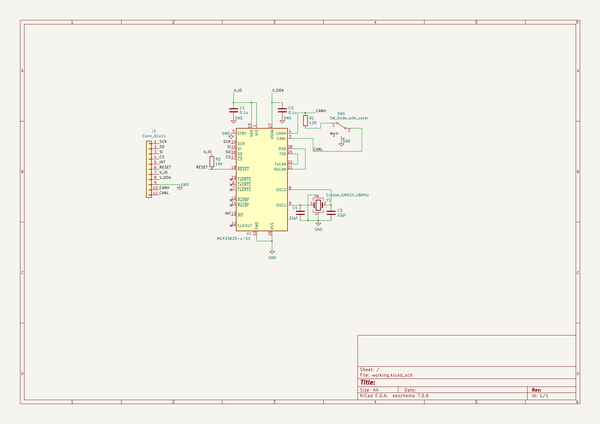

# mcp25625_breakout
 
## summary 
* id: asukiaaa_mcp25625_breakout_mcp25625_breakout
* user: asukiaaa
* name: mcp25625_breakout
* board: mcp25625_breakout
* repo: https://github.com/asukiaaa/MCP25625-breakout
* src_file_repo_kicad_pcb: mcp25625-breakout.kicad_pcb
* src_file_repo_kicad_pcb_link: https://github.com/asukiaaa/MCP25625-breakout/tree/master/mcp25625-breakout.kicad_pcb
* src_file_repo_kicad_sch: mcp25625-breakout.kicad_sch
* src_file_repo_kicad_sch_link: https://github.com/asukiaaa/MCP25625-breakout/tree/master/mcp25625-breakout.kicad_sch

* src_file_repo_sch: 
* src_file_repo_sch_link: https://github.com/asukiaaa/MCP25625-breakout/tree/master/
* full details link: https://github.com/oomlout/oomlout_oomp_project_bot_v_2/tree/main/projects/asukiaaa_mcp25625_breakout_mcp25625_breakout/current_version/working  

## schematic  
  
[schematic (pdf)](working_schematic.pdf) 

## pcb  
 
  
  
  
[board (pdf)](working.pdf)  

## working_bom
| Id | Designator | Footprint | Quantity | Designation | Supplier and ref |  | None | 
| --- | --- | --- | --- | --- | --- | --- | --- | 
| 1 | C1,C2 | C_0402_1005Metric | 2 | 0.1u |  |  | [''] | 
| 2 | J1 | PinHeader_1x11_P2.54mm_Vertical_witout_silk | 1 | Conn_01x11 |  |  | [''] | 
| 3 | R1 | R_0402_1005Metric | 1 | 120 |  |  | [''] | 
| 4 | U1 | SSOP-28_5.3x10.2mm_P0.65mm | 1 | MCP25625-x-SS |  |  | [''] | 
| 5 | SW1 | slide_switch_smd | 1 | SW_Slide_with_cover |  |  | [''] | 
| 6 | C4,C3 | C_0402_1005Metric | 2 | 22pf |  |  | [''] | 
| 7 | Y1 | Crystal_SMD_SeikoEpson_FA238-4Pin_3.2x2.5mm | 1 | Crystal_GND24_16MHz |  |  | [''] | 
| 8 | R2 | R_0402_1005Metric | 1 | 10k |  |  | [''] | 

## bom_schematic
| Ref | Qnty | Value | Cmp name | Footprint | Description | Vendor | DNP | 
| --- | --- | --- | --- | --- | --- | --- | --- | 
| C1, C2 | 2 | 0.1u | C | Capacitor_SMD:C_0402_1005Metric | Unpolarized capacitor |  |  | 
| C3, C4 | 2 | 22pf | C | Capacitor_SMD:C_0402_1005Metric | Unpolarized capacitor |  |  | 
| J1 | 1 | Conn_01x11 | Conn_01x11 | asukiaaa-kicad-footprints:PinHeader_1x11_P2.54mm_Vertical_witout_silk | Generic connector, single row, 01x11, script generated (kicad-library-utils/schlib/autogen/connector/) |  |  | 
| R1 | 1 | 120 | R | Resistor_SMD:R_0402_1005Metric | Resistor |  |  | 
| R2 | 1 | 10k | R | Resistor_SMD:R_0402_1005Metric | Resistor |  |  | 
| SW1 | 1 | SW_Slide_with_cover | SW_Slide_with_cover | asukiaaa-kicad-footprints:slide_switch_smd | Switch, single pole double throw |  |  | 
| U1 | 1 | MCP25625-x-SS | MCP25625-x-SS | Package_SO:SSOP-28_5.3x10.2mm_P0.65mm | Stand-Alone CAN Controller with SPI Interface and integated Transceiver, SSOP-28 |  |  | 
| Y1 | 1 | Crystal_GND24_16MHz | Crystal_GND24 | Crystal:Crystal_SMD_SeikoEpson_FA238-4Pin_3.2x2.5mm | Four pin crystal, GND on pins 2 and 4 |  |  | 

