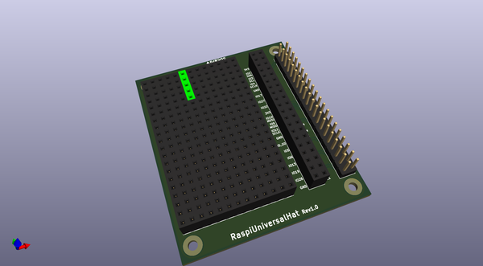
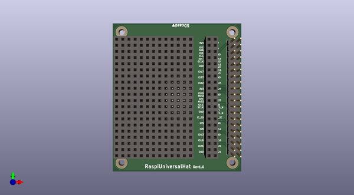
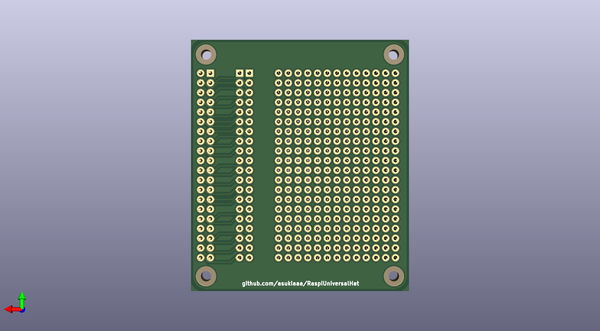

# raspiuniversalhat
 
## summary 
* id: asukiaaa_raspiuniversalhat_raspiuniversalhat
* user: asukiaaa
* name: raspiuniversalhat
* board: raspiuniversalhat
* repo: https://github.com/asukiaaa/RaspiUniversalHat
* src_file_repo_kicad_pcb: RaspiUniversalHat.kicad_pcb
* src_file_repo_kicad_pcb_link: https://github.com/asukiaaa/RaspiUniversalHat/tree/master/RaspiUniversalHat.kicad_pcb

* src_file_repo_sch: RaspiUniversalHat.sch
* src_file_repo_sch_link: https://github.com/asukiaaa/RaspiUniversalHat/tree/master/RaspiUniversalHat.sch
* full details link: https://github.com/oomlout/oomlout_oomp_project_bot_v_2/tree/main/projects/asukiaaa_raspiuniversalhat_raspiuniversalhat/current_version/working  

## schematic  
  
[schematic (pdf)](working_schematic.pdf) 

## pcb  
 
  
  
  
[board (pdf)](working.pdf)  

## working_bom
| Id | Designator | Footprint | Quantity | Designation | Supplier and ref |  | None | 
| --- | --- | --- | --- | --- | --- | --- | --- | 
| 1 | J9,J10,J12,J13,J15,J16,J17,J18,J19,J21,J22,J23,J24,J25,J26,J27,J28,J29,J30,J32,J33,J34,J35,J36,J37,J38,J39,J40,J41,J42,J43,J44,J45,J46,J47,J48,J49,J50,J51,J52,J53,J54,J55,J57,J58,J59,J61,J62,J63,J64,J4,J5 | NoMarkedPinSocket_1x05_P2.54mm | 52 | Conn_01x05 |  |  | [''] | 
| 2 | J1 | PinHeader_2x20_P2.54mm_Vertical | 1 | Raspberry_Pi_2_3 |  |  | [''] | 
| 3 | J2,J3 | PinSocket_1x20_P2.54mm_Vertical | 2 | Conn_01x20 |  |  | [''] | 

## bom_schematic
no data

