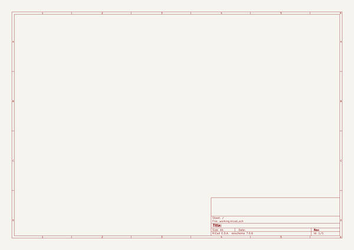

# relay_jacks
 
## summary 
* id: asukiaaa_relay_jacks_relay_jacks
* user: asukiaaa
* name: relay_jacks
* board: relay_jacks
* repo: https://github.com/asukiaaa/relay_jacks
* src_file_repo_kicad_pcb: pcb/relay_jacks.kicad_pcb
* src_file_repo_kicad_pcb_link: https://github.com/asukiaaa/relay_jacks/tree/master/pcb/relay_jacks.kicad_pcb

* src_file_repo_sch: pcb/relay_jacks.sch
* src_file_repo_sch_link: https://github.com/asukiaaa/relay_jacks/tree/master/pcb/relay_jacks.sch
* full details link: https://github.com/oomlout/oomlout_oomp_project_bot_v_2/tree/main/projects/asukiaaa_relay_jacks_relay_jacks/current_version/working  

## schematic  
  
[schematic (pdf)](working_schematic.pdf) 

## pcb  
 
  
  
  
[board (pdf)](working.pdf)  

## working_bom
| Id | Designator | Footprint | Quantity | Designation | Supplier and ref |  | None | 
| --- | --- | --- | --- | --- | --- | --- | --- | 
| 1 | D1,D3,D5 | LED_0603_1608Metric | 3 | LED |  |  | [''] | 
| 2 | D2,D4,D6 | D_SOD-523 | 3 | DIODE |  |  | [''] | 
| 3 | J2 | PinSocket_1x03_P2.54mm_Vertical | 1 | Conn_01x03 |  |  | [''] | 
| 4 | J3,J4 | PinSocket_1x02_P2.54mm_Vertical | 2 | Conn_01x02 |  |  | [''] | 
| 5 | Q1,Q2,Q3 | SOT-23 | 3 | Q_NMOS_GSD |  |  | [''] | 
| 6 | R1,R2,R3,R4,R5,R6 | R_0603_1608Metric | 6 | 1k |  |  | [''] | 
| 7 | J1,J5,J6 | Jack_3.5mm_Switronic_ST-005-G_horizontal | 3 | AudioJack3_Ground |  |  | [''] | 
| 8 | K1,K2,K3 | Relay_SPDT_HsinDa_Y14 | 3 | Y14x-1C-xxDS |  |  | [''] | 

## bom_schematic
no data

